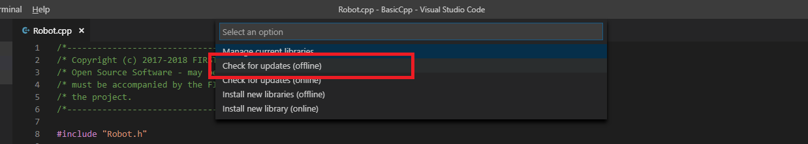

# Phoenix Installation Instructions - FRC BETA 2019 (C++/Java)

## 1) Install all NI and WPI Beta Software

## 2) Install Phoenix on your PC
### Windows
For Windows, run the latest Windows EXE found on TeamForge.  
This will look very similar to previous installers - make sure you have the relevent component selected for your programming language.

### Linux
For Linux users, unzip the Linux zip found on TeamForge into USERHOME\frc2019.

## 3) Open Your Robot Program in VsCode
Either create or open an existing robot project in vscode.  Follow the WPI Screensteps instructions on how to do this.

## 4) Add Phoenix to Your Robot Project
This has a couple steps to it:
### A) Right-Click on "build.gradle" in the project tree, then select "Manage Vendor Libraries".
Note: if "Manage Vendor Libraries" is **missing** then you likely are using 2018 Alpha VS.  Ensure you are using **2019 Beta VS**.

### B) At the top of your screen, a menu will appear.  Select "Install new libraries (offline)".

### C) The menu will now display a list of vendor libraries you can install.  Check "CTRE Phoenix", then click "OK"

## You will now be able to use CTRE Phoenix libraries in your robot project!  You can verify your installation using [these steps](#verify-your-phoenix-installation-c++java)
------------------------------------

# Verify Your Phoenix Installation (C++/Java)
The offline files for vscode are typically installed in 

- C:\Users\Public\frc2019\vendordeps\Phoenix.json (File used by vscode to include Phoenix in your project)
- C:\Users\Public\frc2019\maven\com\ctre\frcbeta\phoenix (multiple maven-style library files)  

Your drive letter may be different than "C:".

After running the Phoenix Installer, the instructions to [add](#4-add-phoenix-to-your-robot-project) or [update](#3-update-the-phoenix-version-in-your-robot-project) Phoenix in your robot project must be followed.

Teams can verify Phoenix is in their robot project by checking for the existence of vendordeps/Phoenix.json in the project directory.

------------------------------------
# Updating Phoenix (C++/Java)
If you already have a beta version of Phoenix installed and you want to update to a newer version, follow these steps.

## 1) Install the latest version of Phoenix on your PC
Follow Step 2 from the [new install instructions](#2-install-phoenix-on-your-pc)

## 2) Open you robot program

## 3) Update the Phoenix version in your robot project
### A) Right-Click on "build.gradle" in the project tree, then select "Manage Vendor Libraries".

### B) At the top of your screen, a menu will appear.  Select "Check for updates (offline)".

### C) The menu will now display a list of vendor libraries you can update.  Check "CTRE Phoenix", then click "OK"

------------------------------------
# Phoenix Installation Instructions - FRC BETA 2019 (LabVIEW)
## 1) Install LabVIEW per the 2019 beta instructions.

## 2) Install the Latest version of Phoenix Framework (at least v5.9.1)  
This will look very similar to previous installers - make sure you have the relevent component selected for your programming language.

## 3) Use Phoenix Diagnostics Client to install the Phoenix Diagnostics Server onto the roboRIO.

### Your LabVIEW Code WILL NOT RUN if you do not do this step.
This is similar to previous years' requirement to install the web-based configuration plug-in with LifeBoat.

### a) Open Phoenix Diagnostics
### b) Connect to the roboRIO via USB
### c) Click 'Update Binaries'

------------------------------------
# NEW: CTRE Phoenix Diagnostics Client
## This is the open-source replacement for the CAN-plugin in the Web-Based Configuration Tool.

The source and latest release can be found here...

https://github.com/CrossTheRoadElec/Phoenix-diagnostics-client

### More Documentation Coming Soon!
