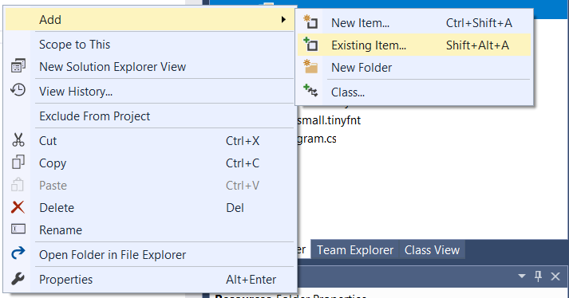
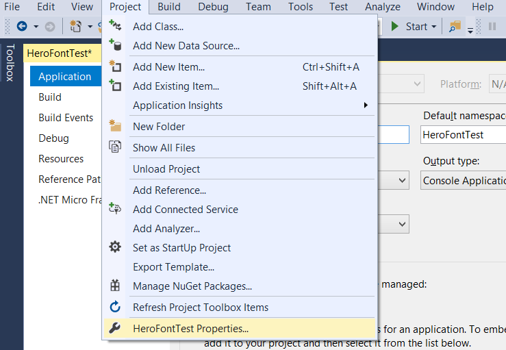
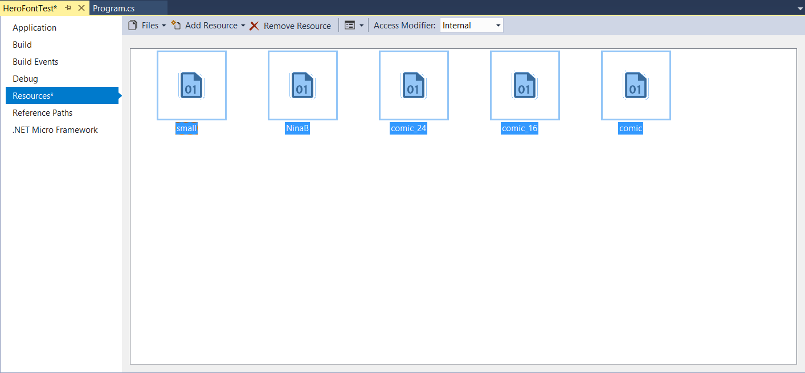
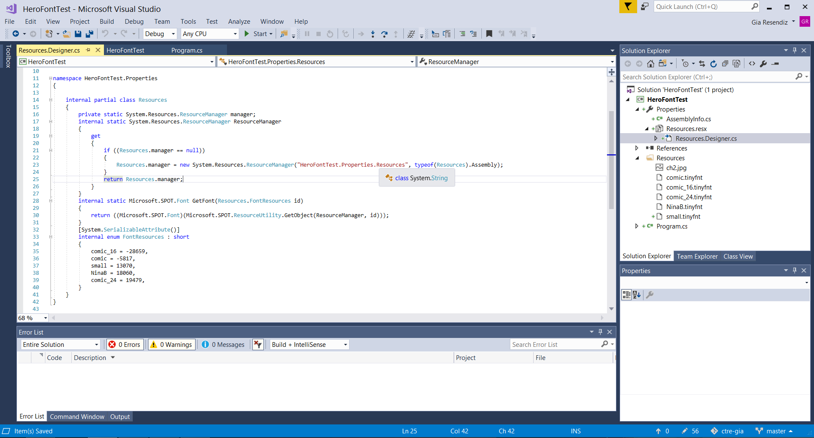

# Adding Fonts to a HERO project
The HERO development board supports .tinyfnt file types, which may then be used to customize the text outputted on the Display Module. This README will go over the steps of finding a font and importing it into your C# HERO project.

## Getting your Font
As of right now, there are currently two methods of attaining your desired font.

The first would be to find your font in our list of supported/created .tinyfnt fonts, which can be found under the GitHub Repo, [CrossTheRoadElec/Phoenix-netmf-fonts](https://github.com/CrossTheRoadElec/Phoenix-netmf-fonts).

The second option would be to create your own .tinyfnt file using any tiny font conversion tool you find. We found that the [Tiny Font Tool GUI](http://informatix.miloush.net/microframework/Utilities/TinyFontTool.aspx) by Jan Kučera is a lightweight program with many customization options, such as various typefaces and sizes, that provides a preview.

**Tiny Font Tool GUI**


When creating a font, we suggest labeling the file according to the customization. We add the file size to the end of the file name along with the typeface. For example, a SWComp font in Bold Oblique with the size of 24 would be SWComp_BO24.tinyfnt. Feel free to contribute any fonts that have been converted to the proper format.

## Creating a location for you file in project
Resources can be added to your project however way you like. We generally create a resource folder for easy organization and transportation between multiple projects.

**Right click on your project and navigate to New Folder. Then create a folder called Resources in Visual Studio.**


## Adding files to your project
Regardless of creating a Resource Folder as suggested or settling with storing your .tinyfnt files in the same folder as your source files, we must now add the files. You can add the files through the File Explorer or by dragging your files into your project in Visual Studio. **Note:** If you are adding files through the File Explorer, you will need to use the add existing item function in Visual Studio as seen in the image below.

**Right click on your folder or project and navigate to add Existing Item... [Or multiple items]**


## Add/Create a Resource File
After your files have been added into the project and can be found in the Solution Explorer, navigate to Resource's in Project Properties.

###### 1). Navigate to Project Properties
  

###### 2). Create a Resource file


###### 3). Drag .tinyfnt files into the Resource's window, which will then organize the files into categories.


###### 4). Save! (CTRL + S) This will update the Resource file with your added Files.


###### 5). You should now have the ablity to create font objects.
```C#
    /* Display Module fonts */
    static Font _smallFont = Properties.Resources.GetFont(Properties.Resources.FontResources.small);
    static Font _bigFont = Properties.Resources.GetFont(Properties.Resources.FontResources.NinaB);
    static Font _smlComic = Properties.Resources.GetFont(Properties.Resources.FontResources.comic);
    static Font _medComic = Properties.Resources.GetFont(Properties.Resources.FontResources.comic_16);
    static Font _bigComic = Properties.Resources.GetFont(Properties.Resources.FontResources.comic_24);
```

###### 6.) Use the fonts with Display Module.
```C#
    _first = _DisplayModule.AddLabelSprite(_smallFont, CTRE.Gadgeteer.Module.DisplayModule.Color.Red, 0, 0, 160, 10);
    _second = _DisplayModule.AddLabelSprite(_bigFont, CTRE.Gadgeteer.Module.DisplayModule.Color.Orange, 0, 20, 160, 15);
    _third = _DisplayModule.AddLabelSprite(_smlComic, CTRE.Gadgeteer.Module.DisplayModule.Color.Yellow, 0, 40, 160, 19);
    _fourth = _DisplayModule.AddLabelSprite(_medComic, CTRE.Gadgeteer.Module.DisplayModule.Color.Green, 0, 60, 160, 22);
    _fifth = _DisplayModule.AddLabelSprite(_bigComic, CTRE.Gadgeteer.Module.DisplayModule.Color.Blue, 10, 10, 100, 33);

    _first.SetFont(_bigComic);
```
