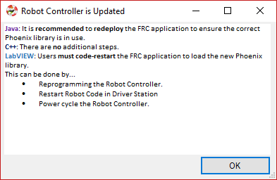
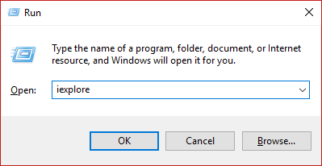
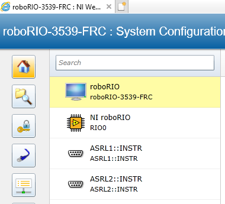
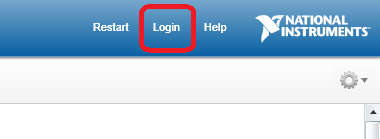

# Phoenix Framework


The software framework for all CTR-Electronics robot components.

See what control components make sense for your robotic needs at [CTR-Electronics](https://www.ctr-electronics.com).

---

API Docs [Java](http://www.ctr-electronics.com/downloads/api/java/html/index.html) [C++](http://www.ctr-electronics.com/downloads/api/cpp/html/index.html) | [2018 Documentation](https://github.com/CrossTheRoadElec/Phoenix-Documentation/blob/master/README.md) | Examples: [Java/C++](https://github.com/CrossTheRoadElec/Phoenix-Examples-Languages)/[LabVIEW](https://github.com/CrossTheRoadElec/Phoenix-Examples-LabVIEW) | [Migration Guide](https://github.com/CrossTheRoadElec/Phoenix-Documentation/blob/master/Migration%20Guide.md) | [Create an issue](https://github.com/CrossTheRoadElec/Phoenix-Documentation/issues) | [Store](https://ctr-electronics.com)

---
## Table of Contents

- [Purpose of this guide](#purpose-of-this-guide)
- [Looking for the migration guide?](#looking-for-the-migration-guide)
- [Initial Hardware Testing](#initial-hardware-testing)
- [Before you write any software!](#before-you-write-any-software)
  - [Installing Phoenix Framework onto PC](#installing-phoenix-framework-onto-pc)
    - [Download the Installer](#download-the-installer)
    - [Running the Installer](#running-the-installer)
    - [Phoenix Framework for Non-Windows Machines](#phoenix-framework-for-non-windows-machines)
  - [Installing Phoenix Framework onto your FRC robot](#installing-phoenix-framework-onto-your-frc-robot)
  - [Install Internet Explorer 11](#installing-internet-explorer-11)
  - [Test the Phoenix Install in Eclipse](#test-the-phoenix-install-in-eclipse)
  - [Test the Phoenix Install in LabVIEW](#test-the-phoenix-install-in-labview)
- [Everything is installed, can I write software now?](#everything-is-installed-can-i-write-software-now)
  - [Check the web-based configuration](#check-the-web-based-configuration)
  - [Set your device IDs](#set-your-device-ids)
  - [Update your CAN Devices](#update-your-can-devices)
  - [Pick the device names](#pick-the-device-names)
  - [Self-Test the hardware](#self-test-the-hardware)
  - [Add Javadoc if using Java](#add-javadoc-if-using-java)
- [Where is the API?](#where-is-the-api)
  - [Java - How to intellisense/What to import ](#java---how-to-intellisensewhat-to-import)
  - [C++ - How to intellisense/What header ](#c---how-to-intellisensewhat-header)
  - [LabVIEW - Where are the VIs? ](#labview---where-are-the-vis)
    - [Motor Controller VIs - What are MC and E-MC?](#motor-controller-vis---what-are-mc-and-e-mc)
- [Hardware Object Model](#hardware-object-model)
  - [Motor Controllers](#motor-controllers)
    - [Where to begin?](#where-to-begin)
    - [Factory Default the Configuration Parameters](#factory-default-the-configuration-parameters)
    - [Open-Loop (No Sensor) Control](#open-loop-no-sensor-control)
      - [Pick your direction](#pick-your-direction)
      - [Pick your neutral mode](#pick-your-neutral-mode)
      - [Current limiting](#current-limiting)
      - [Ramping](#ramping)
      - [Follower](#follower)
    - [Setup Limit Switches](#setup-limit-switches)
      - [Limit Switch Source](#limit-switch-source)
      - [Limit Switch Override Enable](#limit-switch-override-enable)
    - [Closed-Loop (Using Sensor) Control](#closed-loop-using-sensor-control)
      - [Sensors](#sensors)
        - [Why bother with sensors?](#why-bother-with-sensors)
        - [How do I choose the sensor?](#how-do-i-choose-the-sensor)
        - [How do I know the sensor works?](#how-do-i-know-the-sensor-works)
        - [Sensor phase and why it matters](#sensor-phase-and-why-it-matters)
        - [What are the units?](#what-are-the-units-of-my-sensor)
        - [Setup the soft limits](#setup-the-soft-limits)
      - [Closed-loop Ramping](#closed-loop-ramping)
      - [Closed-Loop/Firmware Control Modes](#closed-loopfirmware-control-modes)
        - [Position closed-loop walkthrough](#position-closed-loop-walkthrough)
        - [Current closed-loop walkthrough](#current-closed-loop-walkthrough)
      - [I want to process the sensor myself.  How do I do that?](#i-want-to-process-the-sensor-myself-how-do-i-do-that)
    - [Current limiting](#current-limiting)
  - [Multi-purpose/Sensor Devices](#multi-purposesensor-devices)
    - [Pigeon IMU](#pigeon-imu)
    - [CANifier](#canifier)
  - [Common Device API](#common-device-api)
      - [Error handling](#error-handling)
        - [Did my device reset?](#did-my-device-reset)
      - [Configuration Parameters](#configuration-parameters)
        - [Configuration Parameters - What is timeout for](#configuration-parameters---what-is-timeout-for)
- [Software Object Model](#software-object-model)
  - [WPILib SpeedController/Drivetrain Objects](#wpilib-speedcontrollerdrivetrain-objects)
    - [WPILib: Java/C++](#wpilib-javac)
    - [WPILib: LabVIEW](#wpilib-labview)
- [Driver Station](#driver-station)
  - [What do I do when I see errors in Driver Station?](#what-do-i-do-when-i-see-errors-in-driver-station)
  - [Driver Station says the firmware is too old](#driver-station-says-the-firmware-is-too-old)
  - [Driver Station says the firmware could not be retrieved and to check the firmware and ID](#driver-station-says-the-firmware-could-not-be-retrieved-and-to-check-the-firmware-and-id)
- [CRF Firmware Versions](#crf-firmware-versions)
- [Errata](#errata)

## **Purpose of this guide**
To provide a top-to-bottom walk through of how to integrate CTRE's many hardware products into your robot's software.  This includes supporting FRC teams for this season's game POWERUP.  The software libraries for CTRE devices are bundled into the Phoenix Framework, which supports FRC-C++/Java/LabVIEW and HERO-C#.

## **What is new / Kickoff**
The Phoenix framework provides the following new feature...
- Advanced Current limiting (Peak Current vs Continuous Current with Peak timeout).
- Support for the new Victor SPX.
- Talon SRX and Victor SPX deadband can be change from 4% to (0.1%  - 25%) for all control modes.
- New follower features (Victor SPX follows Talon SRX, vice versa)
- Support for CANifier (PWM input/ PWM output/ Common-Anode LED Strip/ Digital IO / Quadrature)
- Remote Limit Switches.  Victor SPX and Talon SRX can use other CANifiers/Victor SPXs/Talon SRXs for forward/reverse limit switch.
- API changes to accommodate upcoming Cascaded-PID-Loop and Pigeon-integration in Talon SRX.
- API changes to accommodate targeting heading during Motion Magic and Motion Profiling.
- WPI_TalonSRX and WPI_VictorSPX classes that drop into WPILIB's various objects.  This allows clean implementation of the various WPILIB wrappers.
- Increase in Talon SRX/ Victor SPX number of closed-loop slots (from two to four).
- Robot Builder support for all devices above.
- Support for all three FRC languages.
- Motor controller configuration parameters can be defaulted with B/C press-and-hold on boot.
- SetInvert applies "all the way" down to the firmware for all control modes.  You can also SetInvert() without breaking Sensor phase.
- Documentation is now on GitHub to allow for greater collaboration, along with example repositories.

## **What is coming next / Post Kickoff**
Shortly after Kickoff will be an additional update to support...
- Remote sensor selection for closed looping off of sensors on other CAN devices.
- Pigeon IMU integration into Talon closed-loops (MotionMagicArc and MotionProfileArc).
- Various upper level objects (Gearbox/Drivetrain/Servo objects with unit scaling).

## **Looking for the migration guide?**
The migration guide is can be found [here](https://github.com/CrossTheRoadElec/Phoenix-Documentation/blob/master/Migration%20Guide.md).


## **Initial Hardware Testing**
For your competition team to have the best chance of success, hardware components should be tested as soon as they are received.  This is generally done by...
- Powering up the device and confirming LED states.
- Ensuring hardware shows up in the web-based config if wired to CAN Bus.
- Drive outputs / drive motor in both directions (if motor controller).
- Factory default using the B/C calibration button to default persistent settings.
This is explained in the sections below, but it is worth pointing out how important this step is.  It is in your team's best interest to test ALL purchased robot components immediately and in isolation.
- Robot replacement components should be in a state of readiness.  Otherwise a replacement during competition can yield erroneous behavior.
- Many robot components (in general) have fixed warranty periods, and replacements must be done within them.
- Confirming devices are functional before handing them to students ensures best chance of success.

## **Before you write any software!**
Follow the sections below in order.  Otherwise you will see compiler errors for missing calls/VIs.  This is also necessary for the roboRIO Web-based configuration.

### Installing Phoenix Framework onto PC
The Phoenix Framework installer is the Windows Executable Installer that provides all software and API Libraries required to support CTRE products.

**FRC Teams:** Phoenix Framework should be installed after all other FRC software, including LabVIEW and/or Eclipse and the Driver Station update.  See the [FRC Screensteps](http://wpilib.screenstepslive.com/s/currentCS) for instructions on FRC Software.

If your computer is not running a Windows operating system, see the [non-windows](#phoenix-framework-for-non-windows-machines) section.
#### Download the Installer
The installer can be found [here](http://www.ctr-electronics.com/control-system/hro.html#product_tabs_technical_resources).
Download and unzip the latest version of the CTRE Phoenix Framework Installer.

This page also contains some installer archives, so if you need an older version you can find it here as well.

**FRC Teams:** For the 2018 competition season, the minimum installer version that will work with the current control system is version 5.1.1.1.
#### Running the Installer
**Note:** You will need administrative privileges to run the installer.

Run the executable that was downloaded in the previous step.  If Windows prompts with an "unpublished" dialog box, press "More Info" and "Allow App to Run".


At a minimum, you must select the components for the programming language you are using.


After the installation is finished, you must restart any programming environment you are using (Eclipse or LabVIEW).
#### Phoenix Framework for Non-Windows Machines
A zip file containing the Phoenix Framework libraries is available [here](http://www.ctr-electronics.com/control-system/hro.html#product_tabs_technical_resources).

Download the latest non-windows zip file and follow the README it contains to install the Phoenix API.

### Installing Phoenix Framework onto your FRC robot
It is necessary to install Phoenix onto your roboRIO in order to use the Web-Based Configuration Page.

Additionally, LabVIEW teams must install Phoenix on the roboRIO for their robot programs using Phoenix to run properly.

Open the Phoenix LifeBoat utility and select the "roboRIO Upgrade" tab.
Follow the instructions on the tab to install Phoenix on your roboRIO.


When the upgrade is complete, a prompt will appear instructing LabVIEW teams restart their application.
Java teams are also asked to redeploy their application to ensure the correct Phoenix library is installed (development PC vs robot controller).


### Installing Internet Explorer 11
Internet Explorer 11 is necessary to use the roboRIO web-based configuration.  
In the future, CTRE will be replacing this interface, but for the time being this is the primary means of checking the presence of your CAN devices.  This also allows for field-upgrade, device ID setting, etc.

**Windows 7** and **Windows 10** already have Internet Explorer 11 installed.  

It can be manually installed here...
https://support.microsoft.com/en-us/help/17621/internet-explorer-downloads

To test if Internet Explorer 11 is already installed, try running "iexplore" in the Windows start menu.
Press Windows Key + 'R' to open Run window.  Type "iexplore" and press enter.



### Test the Phoenix Install in Eclipse
The Eclipse files are typically installed in
- C:\Users\your-user-name\wpilib\user\cpp\lib (libCTRE_Phoenix)
- C:\Users\your-user-name\wpilib\user\java\lib (CTRE_Phoenix)

After the Phoenix Installer places these files, generally **Eclipse must be restarted**.  Otherwise the IDE may report that the classes/functions cannot be found.

C++ Teams can confirm that the library was installed and discovered correctly by monitoring the Console tab.


Java Teams can confirm that both jar files are discovered in the project tree.


### Test the Phoenix Install in LabVIEW
Testing the install can be done by opening LabVIEW and confirming the VIs are installed.  This can be done by opening an existing project or creating a new project, or opening a single VI in LabVIEW.  Whatever the simplest method to getting to the LabVIEW palette.

Instructions for checking the palette can be found [here](#labview---where-are-the-vis)
The file locations are also explained for manually review of the VIs.

## **Everything is installed, can I write software now?**
Nope, there is still more to do.  Follow each subsection to ensure device communication is healthy.  Otherwise troubleshooting your software will become unnecessarily difficult.

### Check the web-based configuration

A useful diagnostic feature in the FRC Control system is the roboRIO's Web-based Configuration and Monitoring page.  This provides diagnostic information on all discovered CTRE CAN devices.  CTRE devices can also be field-upgraded using this interface.  This feature is accessible by entering the mDNS name of your robot in a web browser, typically **roborio-XXXX-frc.local** where XXXX is the team number (no leading zeros for three digit team numbers).

When connected via **USB**, you can generally type **172.22.11.2** to quickly reach web-based config.


Because the interface uses Silverlight, the user must use Internet Explorer 11.  Instructions on installing Internet Explorer can be found  [here.](#installing-internet-explorer-11)

### Missing "CAN Interface"
If "CAN Interface" is missing, then the web-based config plugin is likely not installed.



Instructions for upgrading the roboRIO are [here](#installing-phoenix-framework-onto-your-frc-robot)

### Set your device IDs

A CTRE CAN Device can have a device ID from 0 to 62.  63 and above are not allowed.  If you select an invalid ID, you will get an immediate prompt.  


Two dissimilar CAN models can use the same device ID.  For example, Talon SRX 1 and Victor SPX 1 can coexist on the same CAN bus.  However two models must not use the same device ID.  Set the device ID of each device in isolation or use the web-based config to change the default ID from '0' to a unique number, then duplicate/close-reopen the internet explorer page to re-populate the device tree.

### Update your CAN Devices
You will need to be logged into the roboRIO Web-based configuration to update your CAN devices.
Username is "admin" with a blank password.



Select a CAN device in the device tree and press the "Update firmware button".  
#### Firmware (CRF) Location
Phoenix installs the Cross The Road Firmware Files (CRF) into two locations...
- C:\users\Public\Documents\FRC (or similar).
- C:\users\Public\Documents\Cross The Road Electronics\LifeBoat\HERO Firmware Files

Make sure when checking these folders that you are looking on the same computer you installed Phoenix.

Firmware files are named Product-Application-Version-Suffix.crf.

**Minimum Talon SRX firmware is 3.1.**  
Specific CRF Version information can be found [here](#crf-firmware-versions).

NOTE: Firmware versions are read as MAJOR-DOT-MINOR.
E.g. 1.23 => One-dot-twenty-three
E.g. 1.4 => One-dot-four
Therefore 1.23 is **newer** than 1.4.

### Pick the device names
Each device can be named uniquely to identify it's purpose or unique characteristics.  Feel free to change the contents of the name of a selected CAN device, and press Save.  If you clear the Name text entry and press save, the name will default to "Device (Device Number)"

### Self-Test the hardware
Press the self-test button to acquire a snapshot of the device's signals.  This can be used to determine various configuration information, sensor health, and reliability of the device.

## **Where is the API**

The API is available in several forms....
- The LabVIEW/C++/Java API source is available on GitHub.
- HTML documentation for C++/Java is generally available on ctr-electronics.com and on the developer's PC after Phoenix install.
- Eclipse supports intellisense/auto-coding features.

The following sections should be followed to ensure the best software-developing experience.

### Add Javadoc if using Java
Eclipse Java users will have to add the Javadoc manually whenever creating or working with a new project to fully utilize the intellisense when programming. Steps can be found below.

1. Using the Package Explorer in the Java view, navigate through your new project to the "Referenced Libraries" tab. From there, you will both find **CTRE_Phoenix.jar and CTRE_Phoenix-sources.jar.**


2. Right click on CTRE_Phoenix.jar and select preferences. From there, you will navigate to the "Java Source Attachment" window.


3. Click on the "Variable" button and Create a new variable by clicking on "New..."


4. From there you should see a "Edit Variable" window as seen below. Start off by using the exact name of "CTRE_Phoenix.sources". Then clicking on "File..", navigate to the CTRE_Phoenix-sources.jar file, which is generally found within C:\Users\'AccountName'\wpilib\user\java\lib


5. Now exit all windows by clicking on "OK". Verify that the Javadoc has been installed by hovering over any of the Phoenix Framework API which should bring up a small window with information about the API's functionality, parameters, return. It also grants the ability to go to the API's source location.


### Java - How to intellisense/What to import
The java libraries for the phoenix framework can be imported by starting the import with `import com.ctre.phoenix.` The line can be finished off by manually typing in the package wanted or by using intellisense. Intellisense can be brought up by pressing CTRL + Spacebar at the . (dot). This will show all the sub-packages, classes, and interfaces available within the current package as seen below.


If the Javadoc was installed properly, which was explained in the ["Add Javadoc if using Java"](#add-javadoc-if-using-java) section, you should have the ability to hover over the Phoenix Framework API and find it's functionality details, parameters and return.

### C++ - How to intellisense/What header
C++ modules simply need to include one header
```
#include "ctre/Phoenix.h"
```
This single header will include several of the Phoenix header files and brings several Phoenix namespaces into scope.  Advanced C++ programmers may wish to avoid including many namespaces, in which case they can probe the contents of the header and pick out what they need.

### LabVIEW - Where are the VIs?
The CTRE Palette is located in:
- WPI Robotics Library -> Third Party.


This palette can also be found in:
- WPI Robotics Library -> RobotDrive -> MotorControl -> CanMotor
- WPI Robotics Library -> Sensors -> Third Party
- WPI Robotics Library -> Actuators -> Third Party

#### Where are the VIs on disk?
The Phoenix VIs are installed inside a folder in the main installation directory.
This would be: "C:\Users\Public\Documents\Cross The Road Electronics".

If your Public Documents folder is on different drive, your drive letter may be different.

#### Motor Controller VIs - What are MC and E-MC?
There are two types of VI when it comes to CTRE/VEX motor controllers - Motor Controller (or "MC")   and Enhanced Motor Controller (or "E-MC")  .

 Motor Controller VIs work for all CTRE/VEX motor controllers.

 Enhanced Motor Controller VIs work only for motor controllers with a data port (currently Talon SRX).


## **Hardware Object Model**
### Motor Controllers
 CTRE/VEX provide two CAN/PWM motor controller options...
- [Victor SPX](http://www.ctr-electronics.com/victor-spx.html)
- [Talon SRX](http://www.ctr-electronics.com/talon-srx.html)

#### Where to begin? Create the object.
The first step of controlling a motor controller is to instantiate the controller in your robot controller software.

If using LabVIEW, use the Open VI corresponding to your motor controller.  Here we are creating an object for the Talon with device ID 15.
Notice that with LabVIEW you can also pick your motor direction on open.


If using a programming language, create a Talon SRX object using the appropriate class name.

` private TalonSRX m_Wheel = new TalonSRX(15); `

Regardless of the what the motor controller is used for, the next step is usually open-loop (no sensor) control.  This is to ensure the mechanism is functional and that the motor and motor controller is wired correctly.

Start with the open-loop features below and configure each setting that is applicable.

#### Factory Default the Configuration Parameters
Both the Talon SRX and Victor SPX have some persistent settings such as neutral mode, limit switches, soft limits, PID gains and a few others. These settings can be reverted to factory defaults by holding the B/C button on the Talon SRX and Victor SPX.

1. Hold down the B/C CAL button until both status LEDS begin to rapidly blink red and green.
2. Release the B/C CAL button.
3. If the Talon SRX was calibrated properly, the status LEDs will blink green several times. If the calibration failed, the status LEDs will blink red and the previous calibration will be kept.


#### Open-Loop (No Sensor) Control
These features and configurations influence the behavior of the motor controller when it is directly controlled by the robot controller.
##### Pick your direction
Direction of output from a motor controller can be set by calling the `setInverted()` function as seen below. LEDs, sensor phase, and limit switches will also be inverted as well to match the direction of output.

Pass in false if the signage of the motor controller is correct, else pass in true to reverse direction.

Java -
```java
/* Talon Direction has been inverted */
Hardware.Talon.setInverted(true);
```
LabVIEW -
You can pick your direction in the open VI.  Use the Set Invert VI if you need to change it again.


##### Pick your neutral mode
Mode of operation during Neutral throttle output may be set by using the `setNeutralMode()` function.

As of right now, there are two options when setting the neutral mode of a motor controller, brake and coast.

Java -
```java
/* Displaying the two neutral mode options that both the Talon and Victor have */
Hardware.Talon.setNeutralMode(com.ctre.phoenix.MotorControl.NeutralMode.Coast);
Hardware.Talon.setNeutralMode(com.ctre.phoenix.MotorControl.NeutralMode.Brake);
```
LabVIEW -


##### Current limiting
Talon SRX has the ability to limit the output current to a specified maximum threshold. This functionality is available in all open-loop control modes. There is a separate current limit configuration for closed-loop control.

Current limiting configuration and enabling can be controlled by the following API.

1. Configure the continuous current limit to the amperage that you desire the current be limited to.
2. Configure the peak current limit to the current threshold amperage that will enforce the current limiting. If the peak current limit is set to 0, current limiting will be enforced at the continuous current limit.
3. Configure the peak current duration to the duration allowable over the peak current limit. If peak current duration is configured to 0, enforce current limiting as soon as current surpasses the peak current threshold.
4. Enable current limiting.

```Java
/* The following java example limits the current to 10 amps whenever the current has exceeded 15 amps for 100 Ms */
talon.configContinuousCurrentLimit(10, 0);
talon.configPeakCurrentLimit(15, 0);
talon.configPeakCurrentDuration(100, 0);
talon.enableCurrentLimit(true);
```
LabVIEW and C++ have similar function/VIs.

##### Ramping
The Talon SRX and Victor SPX can be set to honor a ramp rate to prevent instantaneous changes in throttle.

There are two ramp rates - one for open-loop control modes and one for closed-loop control modes.

The open-loop ramp rate of a motor controller can be configured by using the `configOpenloopRamp();` function. The function takes two parameters and returns a Error code generated by the function if the configuration fails to complete within the timeout.

**Note:** The open-loop ramp rate should only be configured for motor controller masters, as followers will mimic the Masters output already.

Java -
```java
/* Talon is configured to ramp from neutral to full within 2 seconds, and followers are configured to 0*/
leftMaster.configOpenloopRamp(2, 0);
leftFollower.configOpenloopRamp(0, 0); /* no need since master ramps */
rightMaster.configOpenloopRamp(2, 0);
rightFollower.configOpenloopRamp(0, 0); /* no need since master ramps */
```
LabVIEW -


##### Follower
Both the Talon SRX and Victor SPX have a follower feature that allows the motor controllers to mimic another motor controller's output. Users will still need to set the motor controller's direction, and neutral mode.

There are two methods for creating a follower motor controller. The first method `set(ControlMode.follower, IDofMotorController)` allows users to create a motor controller follower of the same model, talon to talon, or victor to victor.

The second method `follow()` allows users to create a motor controller follower of not only the same model, but also other models, talon to talon, victor to victor, talon to victor, and victor to talon.

Java -
```java
/* The first line, we have a Victor following a Talon. The follow() function may also be used to create Talon follower for a Victor */
victorFollower.follow(Hardware.TalonMaster);
/* In the second line, we have a Talon following Talon. The set(ControlMode.Follower, MotorcontrollerID) creates followers of the same model. */
talonFollower.set(com.ctre.phoenix.MotorControl.ControlMode.Follower, 6);
```

LabVIEW -


#### Setup Limit switches
An “out of the box” Talon SRX or Victor SPX will default to the limit switch setting of “Normally Open” for both forward and reverse. This means that motor drive is allowed when a limit switch input is not closed (i.e. not connected to ground). When a limit switch input is closed (is connected to ground) the Talon SRX/Victor SPX will disable motor drive and individually blink both LEDs red in the direction of the fault (red blink pattern will move towards the M+/white wire for positive limit fault, and towards M-/green wire for negative limit fault)


Limit switch features can be disabled or changed to “Normally Closed” in the roboRIO web-based configuration. Changing the settings will take effect once the “Save” button is pressed. The settings are saved
in persistent memory.


If the neutral mode or limit switch mode is changed in the roboRIO web-based configuration, the motor controller will momentarily disable then resume motor drive. All other settings can be changed without impacting the motor drive or enabled-state of the Talon SRX

##### Limit Switch Source
The source of the forward and reverse limit switches are configurable in software.  For Talon SRX you can choose the default feedback connector (data port), and for both controllers you can choose a remote source or to deactivate the limit switch.  You must also indicate whether this limit switch is normally open, normally closed, or disabled, which overrides the setting from the web-based configuration page.  This override is not permanent and will be reset when the device is power cycled. If you are choosing a remote source, you must also specify the device ID of the remote CAN device.

Java -
```Java
/* Configured forward and reverse limit switch of Talon to be from a feedback connector and be normally open */
Hardware.leftTalonMaster.configForwardLimitSwitchSource(LimitSwitchSource.FeedbackConnector, LimitSwitchNormal.NormallyOpen, 0);
Hardware.leftTalonMaster.configReverseLimitSwitchSource(LimitSwitchSource.FeedbackConnector, LimitSwitchNormal.NormallyOpen, 0);


/* Configured forward and reverse limit switch of a Victor to be from a Remote Talon SRX with the ID of 3 and normally closed */
Hardware.rightVictorMaster.configForwardLimitSwitchSource(RemoteLimitSwitchSource.RemoteTalonSRX, LimitSwitchNormal.NormallyClosed, 3, 0);
Hardware.rightVictorMaster.configReverseLimitSwitchSource(RemoteLimitSwitchSource.RemoteTalonSRX, LimitSwitchNormal.NormallyClosed, 3, 0);
```

LabVIEW -


##### Limit Switch Override Enable

The enable state of the limit switches can be overridden in software.  This can be called at any time to enable or disable both limit switches.

Java -
```Java
/* Limit switches are forced disabled on Talon and forced enabled on Victor */
Hardware.leftTalonMaster.overrideLimitSwitchesEnable(false);
Hardware.rightVictorMaster.overrideLimitSwitchesEnable(true);
```

LabVIEW -


#### Closed-Loop (Using Sensor) Control
These features and configurations influence the behavior of the motor controller when encoders/sensors are being used to provide feedback to a maneuver.
##### Sensors
Sensors for motor controllers provide feedback about the position, velocity, and acceleration of the system using that motor controller. The Talon SRX supports a wide variety of sensors while the Victor SPX is able to grab sensor data from another motor controller, which we call remote source.

###### Why bother with sensors?
Sensors allows both the motor controller and user to receive data and feedback. That information allows us to act upon different situations by giving us information about the motors position, speed, and acceleration. This information is especially important when implementing a closed-loop control, such as a PID control loop.

###### How do I choose the sensor?
Java/C++ - Use the configSelectedFeedbackSensor routine.  Example below..
LabVIEW - Use the "Config Sensor" Vi under Victor SPX or Talon SRX (depending on motor controller).

###### How do I know the sensor works?
There are multiple methods of ensuring the connected sensor is active and returning meaningful data. The best method is to plot the signal and watch the plot, looking for continuous data that is responsive. Another, but less reliable method is to print your values to a console and check for values, which makes it harder to see if there is noise in the values.

Java/C++ - For the FRC languages, the easiest way to produce a plot is to use the SmartDashboard, a feature part of the FRC Driver Station. Below is an example of how to set up the sensor on the Talon SRX and get a plot.

Java -
```java
/* Setup sensors to check status, can also be used for phasing */
Hardware.rightMaster.configSelectedFeedbackSensor(com.ctre.phoenix.MotorControl.FeedbackDevice.QuadEncoder, 0);
Hardware.rightMaster.setSensorPhase(false);
Hardware.leftMaster.configSelectedFeedbackSensor(com.ctre.phoenix.MotorControl.FeedbackDevice.QuadEncoder, 0);
Hardware.leftMaster.setSensorPhase(false);

/* Output value to SmartDashboard */
SmartDashboard.putNumber("Right Sensor position", Hardware.rightMaster.getSelectedSensorPosition());
SmartDashboard.putNumber("Left Sensor Velocity", Hardware.leftMaster.getSelectedSensorVelocity());
```

Once you have deployed the code and opened SmartDashboard from the FRC Driver Station, you may reveal the values by going under the view tab and revealing the values which will be listed by their key name. You may then change the numerical indicator the a line-plot and generate the plot by driving the motor controller.


###### Sensor phase and why it matters
Sensor phase is the term used to explain sensor direction. In order for limit switches and closed-loop features to function properly the sensor and motor has to be “in-phase.” This means that the sensor position must move in a positive direction as the motor controller drives positive throttle. To test this, first drive the motor manually (using
gamepad axis for example). Watch the sensor position in the roboRIO web-based configuration self-test, plot using the method explained in the section [*How do I know the sensor works?*](#how-do-i-know-the-sensor-works), or by calling `GetSensorPosition()` and printing it to console.

Sensor phase can be set by using `setSensorPhase()`. If the sensor is out of phase, set true.

Java -
```Java
/* Sensor was out of phase, invert the sensor */
Hardware.Talon.setSensorPhase(true);
```

C++ -

LabVIEW -


###### What are the units of my sensor?
Position units are in the natural units of the sensor.  This ensures the best resolution possible when performing closed-loops in firmware.  

| Sensor Type       | Units per rotation|
| ------------- |:-------------:|
| Quadrature Encoder : US Digital 1024 CPR| 4096 (because Talon/CANifer counts every edge)
| CTRE Magnetic Encoder (relative/quadrature)  | 4096 |
| CTRE Magnetic Encoder (absolute/pulse width encoded) | 4096 |
| Any pulse width encoded position | 4096 represents 100% duty cycle |
| AndyMark CIMcoder| 80 (because 20 pulses => 80 edges)

Velocity is measured in sensor units per 100ms.  This ensures sufficient resolution regardless of the sensing strategy.
For example, when using the CTRE Magnetic Encoder, 1u velocity represents 1/4096 of a rotation every 100ms.
Generally you can multiply the velocity units by 600/UnitsPerRotation to obtain RPM.

Tachometer velocity measurement is unique in that it measures time directly.  As a result, the reported velocity is calculated where 1024 represents a full "rotation".  This means that a velocity measurement of 1 represents 1/1024 of a rotation every 100ms.

###### Setup the soft limits
Soft limits can be used to disable motor drive when the “Sensor Position” is outside of a specified range. Forward throttle will be disabled if the “Sensor Position” is greater than the Forward Soft Limit. Reverse throttle will be disabled if the “Sensor Position” is less than the Reverse Soft Limit. The respective Soft Limit Enable must be enabled for this feature to take effect.

Java -
```Java
/* Talon configured to have soft limits 10000 native units in either direction and enabled */
rightMaster.configForwardSoftLimitThreshold(10000, 0);
rightMaster.configReverseSoftLimitThreshold(-10000, 0);
rightMaster.configForwardSoftLimitEnable(true, 0);
rightMaster.configReverseSoftLimitEnable(true, 0);
```

LabVIEW -


###### Override the Soft Limit Enable
After the soft limits have been configured, at any point you can override the enable to turn the soft limit functionality off.

LabVIEW -


##### Closed-loop Ramping
##### Closed-loop/Firmware Control Modes
When it comes to the Talon SRX and Victor SPX, there are multiple closed-loop control mode options to choose from. Below is a list with an explanation of each supported closed-loop type.

**Position closed-loop**
The Talon's closed-loop logic can be used to maintain a target position. Target and sampled position is passed into the equation in native units.

**Velocity closed-loop**
The Talon's closed-loop logic can be used to maintain a target velocity. Target and sampled velocity is passed into the equation in native units per 100ms.

**Current closed-loop**
The Talon's closed-loop logic can be used to approach a target current-draw. Target and sampled current is passed into the equation in milliamperes.

Note: Current Control Mode is separate from Current Limit. Current limit can be found [here](#current-limiting).

**Motion Magic**
Talon will closed-loop to target position while honoring an maximum "cruise" velocity and specified acceleration.

**Motion Magic (Arc)**
This is an advanced control mode that will allow for simultaneous servoing of a distance and heading.  This will be released in a future update.

**Motion profiling / Motion profiling (Arc)**
With this, a savvy developer can actually stream motion profile trajectory points into the Talon’s internal buffer (even while executing the profile). This allows fine control of position and speed throughout the entire movement.

This feature is being reimplemented to allow for simulataneous servoing of a distance and heading (using Pigeon IMU) and will be released shortly.

###### Position closed-loop walkthrough
Below is a full example for position closed-looping using the HERO development board. These functions are also available in FRC C++/Java, and comparable VIs are available in LabVIEW. The position closed-loop examples can also be found below.
Java -

###### Current closed-loop walkthrough
Coming soon.  This exists in last year's documentation and will be merge in accordingly.

##### I Want to process the sensor myself, How do I do that?
All sensor data is reported periodically on the CAN Bus.  The frames periods can be modified by using the setStatusFramePeriod functions of the Java/C++ objects, and the "Set Status Frame" Vis in LabVIEW.

### Multi-purpose/sensor Devices
#### Pigeon IMU
##### Where to begin?
Documentation will be updated soon.  
In the meantime the pre-Phoenix API is relatively close.  See the software portion of the User's Guide.
[Pigeon Tech Resources](http://www.ctr-electronics.com/gadgeteer-imu-module-pigeon.html#product_tabs_technical_resources)
Additionally the example repositories can be used for reference.
[Phoenix-Examples-Languages](https://github.com/CrossTheRoadElec/Phoenix-Examples-Languages)
[Phoenix-Examples-LabVIEW](https://github.com/CrossTheRoadElec/Phoenix-Examples-LabVIEW)

#### CANifier
Documentation will be updated soon.  
In the meantime the pre-Phoenix API is relatively close.  See the software portion of the User's Guide.
[CANifier Tech Resources](http://www.ctr-electronics.com/can-can-canifier-driver-led-driver-gpio.html#product_tabs_technical_resources)
Additionally the example repositories can be used for reference.
[Phoenix-Examples-Languages](https://github.com/CrossTheRoadElec/Phoenix-Examples-Languages)
[Phoenix-Examples-LabVIEW](https://github.com/CrossTheRoadElec/Phoenix-Examples-LabVIEW)

### Common Device API
The Talon SRX, Victor SPX, CANifier, and Pigeon IMU have a common set of device functions.  These are explained below.

#### Error handling
In C++/Java, many routines return an [ErrorCode](http://www.ctr-electronics.com/downloads/api/java/html/com/ctre/phoenix/ErrorCode.html).  Depending on the function, this can be used to determine if the function was successful.

Additionally each object has a getLastError() routine that will return the code for the last function called.

In LabVIEW, the error output is filled with a CTRE error code when an error condition occurs.

In all circumstances, error events are also sent to the Driver Station console output.  However Driver Station messages are debounced to reduce flooding the console.

#### Did my device reset?
All device classes and VIs support a `hasResetOccurred` routine that allows the caller to poll if the device has reset since last call.  Additionally, Talon SRX and Victor SPX have a sticky fault (accessible via web-based config or API) to indicate if the motor controller has been reset/power-booted during robot-enable.

#### Configuration Parameters
In addition to the feature specific config* routines/VIs in C++/Java/LabVIEW, there are general Config Parameter routines that will take an arbitrary enumeration value type [ParamEnum](http://www.ctr-electronics.com/downloads/api/java/html/com/ctre/phoenix/ParamEnum.html).

When using the general configuration get/set routines, `ordinal` can be used to specify...
- which PID slot to select (when accessing gains).
- which PID loop to select (when accessing PID signals such as integral accumulator)
- which limit switch direction, 0 for forward, 1 for reverse (when accessing limit parameters)

Every language supports a [ConfigGetParameter](http://www.ctr-electronics.com/downloads/api/java/html/com/ctre/phoenix/motorcontrol/can/BaseMotorController.html#configGetParameter-com.ctre.phoenix.ParamEnum-int-int-) and [ConfigSetParameter](http://www.ctr-electronics.com/downloads/api/java/html/com/ctre/phoenix/motorcontrol/can/BaseMotorController.html#configSetParameter-com.ctre.phoenix.ParamEnum-double-int-int-int-).

#### Configuration Parameters - What is timeout for?
All config* routines in the C++/Java require a timeoutMs parameter.  When set to a non-zero value, the config routine will wait for an acknowledgement from the device before returning.  If the timeout is exceeded, an error code is generated and a Driver Station message is produced.  When set to zero, no checking is performed (identical behavior to the CTRE v4 Toolsute).

## Software Object Model
### WPILib SpeedController/Drivetrain Objects
The Phoenix framework supports an adapter class for Victor SPX and Talon SRX hardware objects.  Depending on language, the developer needs to be made aware of the following sections below to utilize certain WPILIB classes/VIs.

#### WPILib: Java/C++
The WPI_TalonSRX and WPI_VictorSPX classes implement several WPILIB interfaces.  
WPILIB motor controllers generally support...
- Live Window/Sendable features
- Test Mode
- Motor Safety
- SpeedController interface (which assumes motor controller is "simple")
- a single parameter set(), (which assume motor controller is "simple")

WPI_TalonSRX and WPI_VictorSPX can also be subclassed/forked/modified for advanced teams that want to use the WPILIB drivetrain classes (which are primarily designed for simple motor controllers), while using the advanced features of the Talon/Victor.

Additionally future release of Phoenix will include CTRE developed drivetrain objects that natively support our motor controllers.

#### WPILib: LabVIEW
LabVIEW's NI/WPILIB objects will natively work the Talon SRX/Victor SPX motor references.
Using the WPI Motor Set VI in Teleop.vi:


Opening Multiple Motors for a Drivetrain in Begin.vi:


## **Driver Station**
### What do I do when I see errors in Driver Station?
DS Errors should be addressed as soon as they appear. This is because...
- Phoenix API will report if a device is missing, not functioning, has too-old firmware, etc.
- If errors are numerous and typical, then users cannot determine if there is a new problem to address.
- A large stream of errors can bog down the Driverstation/roboRIO.  Phoenix Framework has a debouncing strategy to ensure this does not happen, but not all libraries do this.

Phoenix DS errors occur on call.  Meaning VIs/API functions must be called in robot code for any errors to occur.  When an error does occur, a stack trace will report where in the robot code to look.  

### Driver Station says the firmware is too old.


Use the web-based configuration page to [update](#update-your-can-devices) the firmware of the device.

Note that the robot application must be **restarted** for the firmware version check to clear.  This can be done by redeploying the robot application or simply restarting the robot.

### Driver Station says the firmware could not be retrieved and to check the firmware and ID.


This usually indicates that your device ID is wrong or your firmware pre-dates Phoenix.

Use the web-based configuration page to check your device IDs and make sure your firmware is [up-to-date](#update-your-can-devices).

## **CRF Firmware Versions**
Phoenix 5.2.1.1:
- Pigeon-Application-0.41-FixedParamResp.crf
- CANifier-Application-0.40-FirmVers.crf
- **TalonSrx-Application-3.3.crf** (Motion Profile added).
- VictorSpx-Application-3.1.crf

Phoenix 5.1.3.1:
- Pigeon-Application-0.41-FixedParamResp.crf
- CANifier-Application-0.40-FirmVers.crf
- TalonSrx-Application-3.1.crf
- VictorSpx-Application-3.1.crf

## **Errata**
Phoenix 5.2.1.1:
- getClosedLoopTarget reports in units of milliamperes when in current closed-loop mode.

Phoenix 5.1.3.1:
- Talon SRX/ Victor SPX motion-profile mode is not available in the kickoff release.  This is due to the modifications done to support Pigeon IMU integration.  This will be remedied in a future release. [Resolved in 5.2.1.1]
