# Phoenix Framework


The software framework for all CTR-Electronics robot components.

See what control components make sense for your robotic needs at [CTR-Electronics](https://www.ctr-electroniocs.com).

---

Need info? Check the [Wiki](https://github.com/CrossTheRoadElec/Phoenix-Documentation/blob/master/README.md) | or [Create an issue](https://github.com/CrossTheRoadElec/Phoenix-Documentation/blob/master/README.md) | Check [our Store](https://ctr-electronics.com)

---
## Table of Contents

- [Purpose of this guide](https://github.com/CrossTheRoadElec/Phoenix-Documentation#purpose-of-this-guide)
- [Hardware setup](https://github.com/CrossTheRoadElec/Phoenix-Documentation#hardware-setup)
- [Before you write any software!](https://github.com/CrossTheRoadElec/Phoenix-Documentation#before-you-write-any-software)
  - [Installing Phoenix Framework onto PC](https://github.com/CrossTheRoadElec/Phoenix-Documentation#installing-phoenix-framework-onto-pc)
  - [Installing Phoenix Framework into your robot](https://github.com/CrossTheRoadElec/Phoenix-Documentation#installing-phoenix-framework-into-your-robot)
  - [Install Internet Explorer 11](https://github.com/CrossTheRoadElec/Phoenix-Documentation#installing-internet-explorer-11)
  - [Test the install](https://github.com/CrossTheRoadElec/Phoenix-Documentation#test-the-install)
- [Everything is installed, can I write software now?](https://github.com/CrossTheRoadElec/Phoenix-Documentation#everything-is-installed-can-i-write-software-now)
  - [Check the web-based configuration](https://github.com/CrossTheRoadElec/Phoenix-Documentation#check-the-web-based-configuration)
  - [Set your device IDs](https://github.com/CrossTheRoadElec/Phoenix-Documentation#set-your-device-ids)
  - [Update your CAN Devices](https://github.com/CrossTheRoadElec/Phoenix-Documentation#update-your-can-devices)
  - [Pick the device names](https://github.com/CrossTheRoadElec/Phoenix-Documentation#pick-the-device-names)
  - [Self-Test the hardware](https://github.com/CrossTheRoadElec/Phoenix-Documentation#self-test-the-hardware)
  - [Add Javadoc if using Java](https://github.com/CrossTheRoadElec/Phoenix-Documentation#Add-Javadoc-if-using-Java)
- [Where is the API?](https://github.com/CrossTheRoadElec/Phoenix-Documentation#where-is-the-api)
  - [Java - How to intellisense/What to import ](https://github.com/CrossTheRoadElec/Phoenix-Documentation#java---how-to-intellisensewhat-to-import)
  - [C++ - How to intellisense/What header ](https://github.com/CrossTheRoadElec/Phoenix-Documentation#c---how-to-intellisensewhat-header)
  - [LabVIEW - Where are the VIs? ](https://github.com/CrossTheRoadElec/Phoenix-Documentation#labview---where-are-the-vis)
    - [Motor Controller VIs - What are MC and E-MC?](https://github.com/CrossTheRoadElec/Phoenix-Documentation#motor-controller-vis---what-are-mc-and-e-mc)
- [Hardware Object Model](https://github.com/CrossTheRoadElec/Phoenix-Documentation#hardware-object-model)
  - [Motor Controllers](https://github.com/CrossTheRoadElec/Phoenix-Documentation#motor-controllers)
    - [Where to begin?](https://github.com/CrossTheRoadElec/Phoenix-Documentation#where-to-begin)
    - [Factory Default the Configuration Parameters](https://github.com/CrossTheRoadElec/Phoenix-Documentation#factory-default-the-configuration-parameters)
    - [Open-Loop (No Sensor) Control](https://github.com/CrossTheRoadElec/Phoenix-Documentation#open-loop-no-sensor-control)
      - [Pick your direction](https://github.com/CrossTheRoadElec/Phoenix-Documentation#pick-your-direction)
      - [Pick your neutral mode](https://github.com/CrossTheRoadElec/Phoenix-Documentation#pick-your-neutral-mode)
      - [Current limiting](https://github.com/CrossTheRoadElec/Phoenix-Documentation#current-limiting)
      - [Ramping](https://github.com/CrossTheRoadElec/Phoenix-Documentation#ramping)
      - [Follower](https://github.com/CrossTheRoadElec/Phoenix-Documentation#follower)
    - [Setup Limit Switches](https://github.com/CrossTheRoadElec/Phoenix-Documentation#setup-limit-switches)
      - [Limit Switch Source](https://github.com/CrossTheRoadElec/Phoenix-Documentation#limit-switch-source)
      - [Limit Switch Override Enable](https://github.com/CrossTheRoadElec/Phoenix-Documentation#limit-switch-override-enable)
    - [Closed-Loop (Using Sensor) Control](https://github.com/CrossTheRoadElec/Phoenix-Documentation#closed-loop-using-sensor-control)
      - [Sensors](https://github.com/CrossTheRoadElec/Phoenix-Documentation#sensors)
        - [Why bother with sensors?](https://github.com/CrossTheRoadElec/Phoenix-Documentation#why-bother-with-sensors)
        - [How do I choose the sensor?](https://github.com/CrossTheRoadElec/Phoenix-Documentation#how-do-i-choose-the-sensor)
        - [How do I know the sensor works?](https://github.com/CrossTheRoadElec/Phoenix-Documentation#how-do-i-know-the-sensor-works)
        - [Sensor phase and why it matters](https://github.com/CrossTheRoadElec/Phoenix-Documentation#sensor-phase-and-why-it-matters)
        - [What are the units?](https://github.com/CrossTheRoadElec/Phoenix-Documentation#what-are-the-units)
        - [Setup the soft limits](https://github.com/CrossTheRoadElec/Phoenix-Documentation#setup-the-soft-limits)
      - [Closed-loop Ramping](https://github.com/CrossTheRoadElec/Phoenix-Documentation#closed-loop-ramping)
      - [Closed-Loop/Firmware Control Modes](https://github.com/CrossTheRoadElec/Phoenix-Documentation#closed-loopfirmware-control-modes)
        - [Position closed-loop walkthrough](https://github.com/CrossTheRoadElec/Phoenix-Documentation#position-close-loop-walkthrough)
        - [Current closed-loop walkthrough](https://github.com/CrossTheRoadElec/Phoenix-Documentation#current-closed-loop-walkthrough)
      - [How is the closed-loop implemented?](https://github.com/CrossTheRoadElec/Phoenix-Documentation#how-is-the-closed-loop-implemented)
      - [I want to process the sensor myself.  How do I do that?](https://github.com/CrossTheRoadElec/Phoenix-Documentation#i-want-to-process-the-sensor-myself-how-do-i-do-that)
    - [Current limiting](https://github.com/CrossTheRoadElec/Phoenix-Documentation#current-limiting-1)
    - [Status Frames and how to tweak them](https://github.com/CrossTheRoadElec/Phoenix-Documentation#status-frames-and-how-to-tweak-them)
    - [Accessing the raw signals on the Gadgeteer port](https://github.com/CrossTheRoadElec/Phoenix-Documentation#accessing-the-raw-signals-on-the-gadgeteer-port)
  - [Multi-purpose/Sensor Devices](https://github.com/CrossTheRoadElec/Phoenix-Documentation#multi-purposesensor-devices)
    - [Pigeon IMU](https://github.com/CrossTheRoadElec/Phoenix-Documentation#pigeon-imu)
      - [Where to begin?](https://github.com/CrossTheRoadElec/Phoenix-Documentation#where-to-begin)
    - [CANifier](https://github.com/CrossTheRoadElec/Phoenix-Documentation#canifier)
      - [Where to begin?](https://github.com/CrossTheRoadElec/Phoenix-Documentation#where-to-begin-1)
  - [Common Device API](https://github.com/CrossTheRoadElec/Phoenix-Documentation#common-device-api)
      - [Error handling](https://github.com/CrossTheRoadElec/Phoenix-Documentation#error-handling)
      - [Detecting error conditions](https://github.com/CrossTheRoadElec/Phoenix-Documentation#detecting-error-conditions)
        - [Did my device reset?](https://github.com/CrossTheRoadElec/Phoenix-Documentation#did-my-device-reset)
        - [Is the device on the CAN bus?](https://github.com/CrossTheRoadElec/Phoenix-Documentation#is-the-device-on-the-can-bus)
      - [Configuration Parameters - General Guide lines](https://github.com/CrossTheRoadElec/Phoenix-Documentation#configuration-parameters---general-guide-lines)
        - [Configuration Parameters - Why the timeout?](https://github.com/CrossTheRoadElec/Phoenix-Documentation#configuration-parameters---why-the-timeout)
        - [Configuration Parameters - Why the general API?](https://github.com/CrossTheRoadElec/Phoenix-Documentation#configuration-parameters---why-the-general-api)
- [Software Object Model](https://github.com/CrossTheRoadElec/Phoenix-Documentation#software-object-model)
  - [Gearbox Model](https://github.com/CrossTheRoadElec/Phoenix-Documentation#gearbox-model)
      - [Why use Gearbox objects?](https://github.com/CrossTheRoadElec/Phoenix-Documentation#why-use-gearbox-objects)
  - [Drivetrain Model](https://github.com/CrossTheRoadElec/Phoenix-Documentation#drivetrain-model)
      - [Why use Drivetrain objects?](https://github.com/CrossTheRoadElec/Phoenix-Documentation#why-use-drivetrain-objects)
  - [Servo Object Model](https://github.com/CrossTheRoadElec/Phoenix-Documentation#servo-object-model)
    - [Programming language Servo Walkthroughs](https://github.com/CrossTheRoadElec/Phoenix-Documentation#programming-language-servo-walkthroughs)
      - [Language: Velocity Servo walkthrough](https://github.com/CrossTheRoadElec/Phoenix-Documentation#language-velocity-servo-walkthrough)
      - [Language: Motion Magic/Position Servo Walkthrough](https://github.com/CrossTheRoadElec/Phoenix-Documentation#language-motion-magicposition-servo-walkthrough)
      - [Language: Motion Magic with Arc Servo Walkthrough](https://github.com/CrossTheRoadElec/Phoenix-Documentation#language-motion-magic-with-arc-servo-walkthrough)
    - [LabVIEW Servo walkthroughs](https://github.com/CrossTheRoadElec/Phoenix-Documentation#labview-servo-walkthroughs)
      - [LabVIEW: Velocity Servo walkthrough](https://github.com/CrossTheRoadElec/Phoenix-Documentation#labview-velocity-servo-walkthrough)
      - [LabVIEW: Motion Magic/Position Servo Walkthrough](https://github.com/CrossTheRoadElec/Phoenix-Documentation#labview-motion-magicposition-servo-walkthrough)
      - [LabVIEW: Motion Magic with Arc Servo Walkthrough](https://github.com/CrossTheRoadElec/Phoenix-Documentation#labview-motion-magic-with-arc-servo-walkthrough)
  - [WPILib SpeedController/Drivetrain Objects](https://github.com/CrossTheRoadElec/Phoenix-Documentation#wpilib-speedcontrollerdrivetrain-objects)
    - [WPILib: Java](https://github.com/CrossTheRoadElec/Phoenix-Documentation#wpilib-java)
    - [WPILib: C++](https://github.com/CrossTheRoadElec/Phoenix-Documentation#wpilib-c++)
    - [WPILib: LabVIEW](https://github.com/CrossTheRoadElec/Phoenix-Documentation#wpilib-labview)
- [Driver Station / Logger errors](https://github.com/CrossTheRoadElec/Phoenix-Documentation#driver-station--logger-errors)
  - [What do I do when I see errors in Driver Station?](https://github.com/CrossTheRoadElec/Phoenix-Documentation#what-do-i-do-when-i-see-errors-in-driver-station)
- [CRF Firmware Version](https://github.com/CrossTheRoadElec/Phoenix-Documentation#crf-firmware-version)

## **Purpose of this guide**
To provide that knowledge.

## **Hardware setup**
Text here.

## **Before you write any software!**
Installation explanation
### Installing Phoenix Framework onto PC
Some steps Here
### Installing Phoenix Framework into your robot
Installation instructions
### Installing Internet Explorer 11
Install and Verify
### Test the install
Eclipse Screenshot of Phoenix library.
Eclipse Screenshot of LabVIEW palette.

## **Everything is installed, can I write software now?**
Before writing software, Users should test the following **things** as these are important to programing and will be harder to handle/debug when programming begins.

### Check the web-based configuration
The roboRIO web-based configuration can be accessed when the computer is connected to the roboRIO through either a USB-connection or Wifi. You will then want to open Internet Explorer as Silverlight is required and only supported by windows. Internet Explorer 11 will be needed, verification and installation steps can be found [here.](https://github.com/CrossTheRoadElec/Phoenix-Documentation#installing-internet-explorer-11)


You should see a general screen along with all the CTRE devices if they are connected. If your devices are not being shown, ensure that the roboRIO's Web-based Config has been updated through the HERO LifeBoat Imager application that was installed with Phoenix Framework.


The roboRIO web-based configuration will allow you to set device IDs, names, persistent settings, and if logged in, you should be able to update the devices' firmware.

### Set your device IDs
Device IDs of the CTRE product line can be set through either of the following methods.

**Using HERO LifeBoat Imager(Make this a header?)**
**Using roboRIO web-based Configuration**
### Update your CAN Devices
### Pick the device names
### Self-Test the hardware
### Add Javadoc if using Java
Java users will have to add the Javadoc manually whenever creating or working with a new project to fully utilize the intellisense when programming. Steps can be found below.

1. Using the Package Explorer in the Java view, navigate through your new project to the "Referenced Libraries" tab. From there, you will find CTRE_Phoenix.jar, **not CTRE_Phoenix-sources.jar.**


2. Right click on CTRE_Phoenix.jar and select preferences. From there, you will navigate to the "Java Source Attachment" window.


3. Click on the "Variable" button and Create a new variable by clicking on "New..."
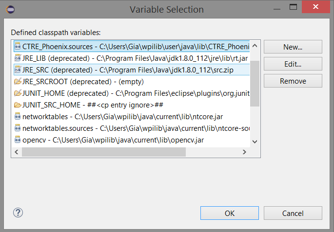

4. From there you should see a "Edit Variable" window as seen below. Start off by using the exact name of "CTRE_Phoenix.sources". Then clicking on "File..", navigate to the CTRE_Phoenix-sources.jar file, which is generally found within C:\Users\'AccountName'\wpilib\user\java\lib
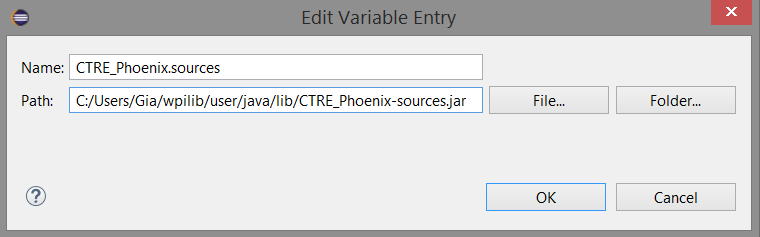

5. Now exit all windows by clicking on "OK". Verify that the Javadoc has been installed by hovering over any of the Phoenix Framework API which should bring up a small window with information about the API's functionality, parameters, return. It also grants the ability to go to the API's source location.


## **Where is the API**
### Java - How to intellisense/What to import
The java libraries for the phoenix framework can be imported by starting the import with `import com.ctre.phoenix.` The line can be finished off by manually typing in the package wanted or by using intellisense. Intellisense can be brought up by pressing CTRL + Spacebar at the . (dot). This will show all the sub-packages, classes, and interfaces available within the current package as seen below.
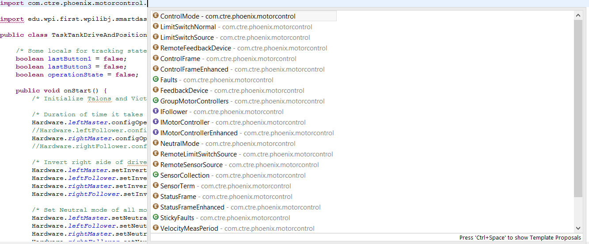
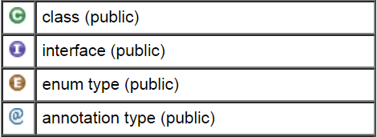

If the Javadoc was installed properly, which was explained in the ["Add Javadoc if using Java"](https://github.com/CrossTheRoadElec/Phoenix-Documentation#Add-Javadoc-if-using-Java) section, you should have the ability to hover over the Phoenix Framework API and find it's functionality details, parameters and return.

### C++ - How to intellisense/What header
### LabVIEW - Where are the VIs?
The CTRE Palette is located in:
- WPI Robotics Library -> Third Party.


This palette can also be found in:
- WPI Robotics Library -> RobotDrive -> MotorControl -> CanMotor
- WPI Robotics Library -> Sensors -> Third Party
- WPI Robotics Library -> Actuators -> Third Party

#### Motor Controller VIs - What are MC and E-MC?
There are two types of VI when it comes to CTRE/VEX motor controllers - Motor Controller (or "MC")   and Enhanced Motor Controller (or "E-MC")  .

 Motor Controller VIs work for all CTRE/VEX motor controllers.

 Enhanced Motor Controller VIs work only for motor controllers with a data port (currently Talon SRX).


## **Hardware Object Model**
### Motor Controllers
 CTRE/VEX provide two CAN/PWM motor controller options...
- [Victor SPX](http://www.ctr-electronics.com/victor-spx.html)
- [Talon SRX](http://www.ctr-electronics.com/talon-srx.html)

#### Where to begin? Create the object.
The first step of controlling a motor controller is to instantiate the controller in your robot controller software.

If using LabVIEW, use the Open VI corresponding to your motor controller.  Here we are creating an object for the Talon with device ID 15.
Notice that with LabVIEW you can also pick your motor direction on open.

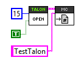

If using a programming language, create a Talon SRX object using the appropriate class name.

` private TalonSRX m_Wheel = new TalonSRX(15); `

Regardless of the what the motor controller is used for, the next step is usually open-loop (no sensor) control.  This is to ensure the mechanism is functional and that the motor and motor controller is wired correctly.

Start with the open-loop features below and configure each setting that is applicable.

#### Factory Default the Configuration Parameters
Both the Talon SRX and Victor SPX have some persistent settings such as neutral mode, limit switches, soft limits, PID gains and a few others. These settings can be reverted to factory defaults by holding the B/C button on the Talon SRX and Victor SPX.

1. Hold down the B/C CAL button until both status LEDS begin to rapidly blink red and green.
2. Release the B/C CAL button.
3. If the Talon SRX was calibrated properly, the status LEDs will blink green several times. If the calibration failed, the status LEDs will blink red and the previous calibration will be kept.

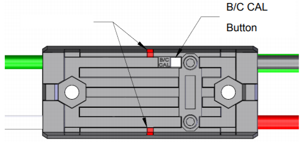

[**Need image for Victor SPX's button?**](AnotherPic.jpg)

#### Open-Loop (No Sensor) Control
These features and configurations influence the behavior of the motor controller when it is directly controlled by the robot controller.
##### Pick your direction
Direction of output from a motor controller can be set by calling the `setInverted()` function as seen below. LEDs, sensor phase, and limit switches will also be inverted as well to match the direction of output.

Pass in false if the signage of the motor controller is correct, else pass in true to reverse direction.

Java -
```java
/* Talon Direction has been inverted */
Hardware.Talon.setInverted(true);
```

C++ -

LabVIEW -
You can pick your direction in the open VI.  Use the Set Invert VI if you need to change it again.

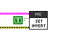

##### Pick your neutral mode
Mode of operation during Neutral throttle output may be set by using the `setNeutralMode()` function.

As of right now, there are two options when setting the neutral mode of a motor controller, brake and coast.

Java -
```java
/* Displaying the two neutral mode options that both the Talon and Victor have */
Hardware.Talon.setNeutralMode(com.ctre.phoenix.MotorControl.NeutralMode.Coast);
Hardware.Talon.setNeutralMode(com.ctre.phoenix.MotorControl.NeutralMode.Brake);
```


C++ -

LabVIEW -

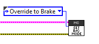

##### Current limiting
Talon SRX has the ability to limit the output current to a specified maximum threshold. This functionality is available in all open-loop control modes. There is a separate current limit configuration for closed-loop control.

Current limiting configuration and enabling can be controlled by the following API.

1. Configure the continuous current limit to the amperage that you desire the current be limited to.
2. Configure the peak current limit to the current threshold amperage that will enforce the current limiting. If the peak current limit is set to 0, current limiting will be enforced at the continuous current limit.
3. Configure the peak current duration to the duration allowable over the peak current limit. If peak current duration is configured to 0, enforce current limiting as soon as current surpasses the peak current threshold.
4. Enable current limiting.

<!-- ```Java
/* The following java example limits the current to 10 amps whenever the current has exceeded 15 amps for 100 Ms */
Hardware.Talon.configContinuousCurrentLimit(10, 0);
Hardware.Talon.configPeakCurrentLimit(15, 0);
Hardware.Talon.configPeakCurrentDuration(100, 0);
Hardware.Talon.enableCurrentLimit(true);
``` -->

C++ -
```c++
/* The following C++ example limits current to 15 amps at all times, working the same way as the 2017 Framework. */
```

LabVIEW -
##### Ramping
The Talon SRX and Victor SPX can be set to honor a ramp rate to prevent instantaneous changes in throttle.

There are two ramp rates - one for open-loop control modes and one for closed-loop control modes.

The open-loop ramp rate of a motor controller can be configured by using the `configOpenloopRamp();` function. The function takes two parameters and returns a Error code generated by the function if the configuration fails to complete within the timeout.

**Note:** The open-loop ramp rate should only be configured for motor controller masters, as followers will mimic the Masters output already.

Java -
```java
/* Talon is configured to ramp from neutral to full within 2 seconds, and followers are configured to 0*/
Hardware.leftMaster.configOpenloopRamp(2, 0);
Hardware.leftFollower.configOpenloopRamp(0, 0);
Hardware.rightMaster.configOpenloopRamp(2, 0);
Hardware.rightFollower.configOpenloopRamp(0, 0);
```

C++ -

LabVIEW -


##### Follower
Both the Talon SRX and Victor SPX have a follower feature that allows the motor controllers to mimic another motor controller's output. Users will still need to set the motor controller's direction, and neutral mode.

There are two methods for creating a follower motor controller. The first method `set(ControlMode.follower, IDofMotorController)` allows users to create a motor controller follower of the same model, talon to talon, or victor to victor.

The second method `follow()` allows users to create a motor controller follower of not only the same model, but also other models, talon to talon, victor to victor, talon to victor, and victor to talon.

Java -
```java
/* The first line, we have a Victor following a Talon. The follow() function may also be used to create Talon follower for a Victor */
Hardware.VictorFollower.follow(Hardware.TalonMaster);
/* In the second line, we have a Talon following Talon. The set(ControlMode.Follower, MotorcontrollerID) creates followers of the same model. */
Hardware.TalonFollower.set(com.ctre.phoenix.MotorControl.ControlMode.Follower, 6);
```

C++ -

LabVIEW -

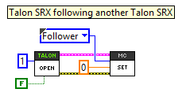


#### Setup Limit switches
An “out of the box” Talon SRX or Victor SPX will default to the limit switch setting of “Normally Open” for both forward and reverse. This means that motor drive is allowed when a limit switch input is not closed (i.e. not connected to ground). When a limit switch input is closed (is connected to ground) the Talon SRX/Victor SPX will disable motor drive and individually blink both LEDs red in the direction of the fault (red blink pattern will move towards the M+/white wire for positive limit fault, and towards M-/green wire for negative limit fault)


Limit switch features can be disabled or changed to “Normally Closed” in the roboRIO web-based configuration. Changing the settings will take effect once the “Save” button is pressed. The settings are saved
in persistent memory.

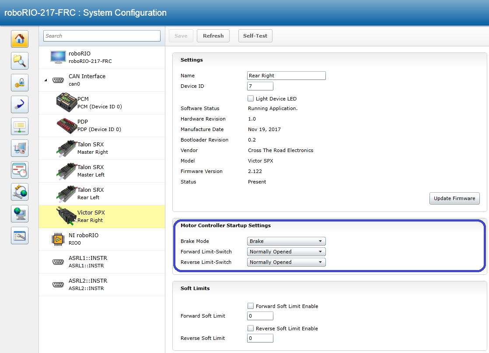

If the neutral mode or limit switch mode is changed in the roboRIO web-based configuration, the motor controller will momentarily disable then resume motor drive. All other settings can be changed without impacting the motor drive or enabled-state of the Talon SRX

##### Limit Switch Source
The source of the forward and reverse limit switches are configurable in software.  For Talon SRX you can choose the default feedback connector (data port), and for both controllers you can choose a remote source or to deactivate the limit switch.  You must also indicate whether this limit switch is normally open, normally closed, or disabled, which overrides the setting from the web-based configuration page.  This override is not permanent and will be reset when the device is power cycled. If you are choosing a remote source, you must also specify the device ID of the remote CAN device.

Java -
```Java
/* Configured forward and reverse limit switch of Talon to be from a feedback connector and be normally open */
Hardware.leftTalonMaster.configForwardLimitSwitchSource(LimitSwitchSource.FeedbackConnector, LimitSwitchNormal.NormallyOpen, 0);
Hardware.leftTalonMaster.configReverseLimitSwitchSource(LimitSwitchSource.FeedbackConnector, LimitSwitchNormal.NormallyOpen, 0);


/* Configured forward and reverse limit switch of a Victor to be from a Remote Talon SRX with the ID of 3 and normally closed */
Hardware.rightVictorMaster.configForwardLimitSwitchSource(RemoteLimitSwitchSource.RemoteTalonSRX, LimitSwitchNormal.NormallyClosed, 3, 0);
Hardware.rightVictorMaster.configReverseLimitSwitchSource(RemoteLimitSwitchSource.RemoteTalonSRX, LimitSwitchNormal.NormallyClosed, 3, 0);
```

C++ -

LabVIEW -


##### Limit Switch Override Enable

The enable state of the limit switches can be overridden in software.  This can be called at any time to enable or disable both limit switches.

Java -
```Java
/* Limit switches are forced disabled on Talon and forced enabled on Victor */
Hardware.leftTalonMaster.overrideLimitSwitchesEnable(false);
Hardware.rightVictorMaster.overrideLimitSwitchesEnable(true);

```

C++ -

LabVIEW -

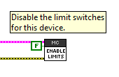

#### Closed-Loop (Using Sensor) Control
These features and configurations influence the behavior of the motor controller when encoders/sensors are being used to provide feedback to a maneuver.
##### Sensors
Sensors for motor controllers provide feedback about the position, velocity, and acceleration of the system using that motor controller. The Talon SRX supports a wide variety of sensors while the Victor SPX is able to grab sensor data from another motor controller, which we call remote source.

**NotSureHowThisIsGoingToWorkYet**

###### Why bother with sensors?
Sensors allows both the motor controller and user to receive data and feedback. That information allows us to act upon different situations by giving us information about the motors position, speed, and acceleration. This information is especially important when implementing a closed-loop control, such as a PID control loop.

###### How do I choose the sensor?
**NotSureHowThisIsGoingToWorkYet**

###### How do I know the sensor works?
There are multiple methods of ensuring the connected sensor is active and returning meaningful data. The best method is to plot the signal and watch the plot, looking for continuous data that is responsive. Another, but less reliable method is to print your values to a console and check for values, which makes it harder to see if there is noise in the values.

Java/C++ - For the FRC languages, the easiest way to produce a plot is to use the SmartDashboard, a feature part of the FRC Driver Station. Below is an example of how to set up the sensor on the Talon SRX and get a plot.

Java -
```java
/* Setup sensors to check status, can also be used for phasing */
Hardware.rightMaster.configSelectedFeedbackSensor(com.ctre.phoenix.MotorControl.FeedbackDevice.QuadEncoder, 0);
Hardware.rightMaster.setSensorPhase(false);
Hardware.leftMaster.configSelectedFeedbackSensor(com.ctre.phoenix.MotorControl.FeedbackDevice.QuadEncoder, 0);
Hardware.leftMaster.setSensorPhase(false);

/* Output value to SmartDashboard */
SmartDashboard.putNumber("Right Sensor position", Hardware.rightMaster.getSelectedSensorPosition());
SmartDashboard.putNumber("Left Sensor Velocity", Hardware.leftMaster.getSelectedSensorVelocity());
```

Once you have deployed the code and opened SmartDashboard from the FRC Driver Station, you may reveal the values by going under the view tab and revealing the values which will be listed by their key name. You may then change the numerical indicator the a line-plot and generate the plot by driving the motor controller.


###### Sensor phase and why it matters
Sensor phase is the term used to explain sensor direction. In order for limit switches and closed-loop features to function properly the sensor and motor has to be “in-phase.” This means that the sensor position must move in a positive direction as the motor controller drives positive throttle. To test this, first drive the motor manually (using
gamepad axis for example). Watch the sensor position in the roboRIO web-based configuration self-test, plot using the method explained in the section [*How do I know the sensor works?*](https://github.com/CrossTheRoadElec/Phoenix-Documentation#how-do-i-know-the-sensor-works), or by calling `GetSensorPosition()` and printing it to console.

Sensor phase can be set by using `setSensorPhase()`. If the sensor is out of phase, set true.

Java -
```Java
/* Sensor was out of phase, invert the sensor */
Hardware.Talon.setSensorPhase(true);
```

C++ -

LabVIEW -


###### What are the units of my sensor?
**NotSureHowThisIsGoingToWorkYet**

###### Setup the soft limits
Soft limits can be used to disable motor drive when the “Sensor Position” is outside of a specified range. Forward throttle will be disabled if the “Sensor Position” is greater than the Forward Soft Limit. Reverse throttle will be disabled if the “Sensor Position” is less than the Reverse Soft Limit. The respective Soft Limit Enable must be enabled for this feature to take effect.

Java -
```Java
/* Talon configured to have soft limits 10000 native units in either direction and enabled */
Hardware.rightMaster.configForwardSoftLimitThreshold(10000, 0);
Hardware.rightMaster.configReverseSoftLimitThreshold(-10000, 0);
Hardware.rightMaster.configForwardSoftLimitEnable(true, 0);
Hardware.rightMaster.configReverseSoftLimitEnable(true, 0);
```

C++ -

LabVIEW -

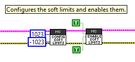

###### Override the Soft Limit Enable
After the soft limits have been configured, at any point you can override the enable to turn the soft limit functionality on or off.

Java -

C++ -

LabVIEW -

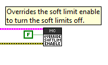

##### Closed-loop Ramping
##### Closed-loop/Firmware Control Modes
When it comes to the Talon SRX and Victor SPX, there are multiple closed-loop control mode options to choose from. Below is a list with an explanation of each supported closed-loop type.

**Position closed-loop -**
The Talon's closed-loop logic can be used to maintain a target position. Target and sampled position is passed into the equation in native units, which can be found in the section [How is the closed-loop implemented?](https://github.com/CrossTheRoadElec/Phoenix-Documentation#how-is-the-closed-loop-implemented).

**Velocity closed-loop -**
The Talon's closed-loop logic can be used to maintain a target velocity. Target and sampled velocity is passed into the equation in native units per 100ms, which can be found in section[How is the closed-loop implemented?](https://github.com/CrossTheRoadElec/Phoenix-Documentation#how-is-the-closed-loop-implemented). For more information on native units, go to section [blah blah blah blah](whatever.com).

**Current closed-loop -**
The Talon's closed-loop logic can be used to approach a target current-draw. Target and
sampled current is passed into the equation in milliamperes, which can be found in section [How is the closed-loop implemented?](https://github.com/CrossTheRoadElec/Phoenix-Documentation#how-is-the-closed-loop-implemented). API expresses the target current in amperes.

Note: Current Control Mode is separate from Current Limit. Current limit can be found [here](https://github.com/CrossTheRoadElec/Phoenix-Documentation#current-limiting).

**Motion profiling - Not tested/implemented yet**

**Motion Magic - Not tested/implemented yet**

**Motion Magic Arc -Not tested/implemented yet**

###### Position closed-loop walkthrough
Below is a full example for position closed-looping using the HERO development board. These functions are also available in FRC C++/Java, and comparable VIs are available in LabVIEW.


###### Current closed-loop walkthrough


##### How is the closed-loop-implemented?
The closed-loop logic is the same regardless of which feedback sensor or closed-loop mode is selected. The verbatim implementation in the Talon firmware is displayed below.

##### I Want to process the sensor myself, How do I do that?

#### Current limiting
#### Status Frames and how to tweak them
#### Accessing the raw signals on the Gadgeteer port

### Multi-purpose/sensor Devices
#### Pigeon IMU
##### Where to begin?
#### CANifier
##### Where to begin?

### Common Device API
#### Error handling
#### Detecting error conditions
##### Did my device reset?
##### Is the device on the CAN bus?
#### Configuration Parameters - General Guide lines
##### Configuration Parameters - Why the timeout?
##### Configuration Parameters - Why the general API?

## Software Object Model
### Gearbox Model
#### Why use Gearbox objects?
### Drivetrain Model
#### Why use Drivetrain objects?
### Servo Object Model
#### Programming language Servo Walkthroughs
##### Language: Velocity Servo walkthrough
##### Language: Motion Magic/Position Servo Walkthrough
##### Language: Motion Magic with Arc Servo Walkthrough
#### LabVIEW Servo walkthroughs
##### LabVIEW: Velocity Servo walkthrough
##### LabVIEW: Motion Magic/Position Servo Walkthrough
##### LabVIEW: Motion Magic with Arc Servo Walkthrough
### WPILib SpeedController/Drivetrain Objects
The Victor SPX and Talon SRX hardware objects can be converted to be used for any WPILib class or VI requiring a WPILib "SpeedController".
PercentOutput is the only control mode of Victor SPX and Talon SRX that is supported for the WPILib objects.  If your motor controller is not already in PercentOutput mode, its mode will be changed to Percent Output when it is controlled from any WPILib object.

#### WPILib: Java

#### WPILib: C++

#### WPILib: LabVIEW
Using the WPI Motor Set VI in Teleop.vi:


Opening Multiple Motors for a Drivetrain in Begin.vi:

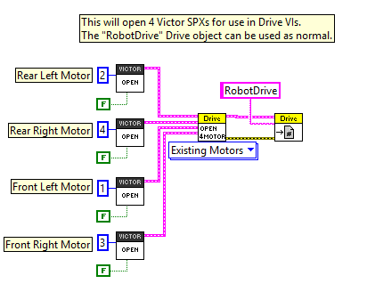

## **Driver Station / Logger errors**
### What do I do when I see errors in Driver Station?

## **CRF Firmware Version**
