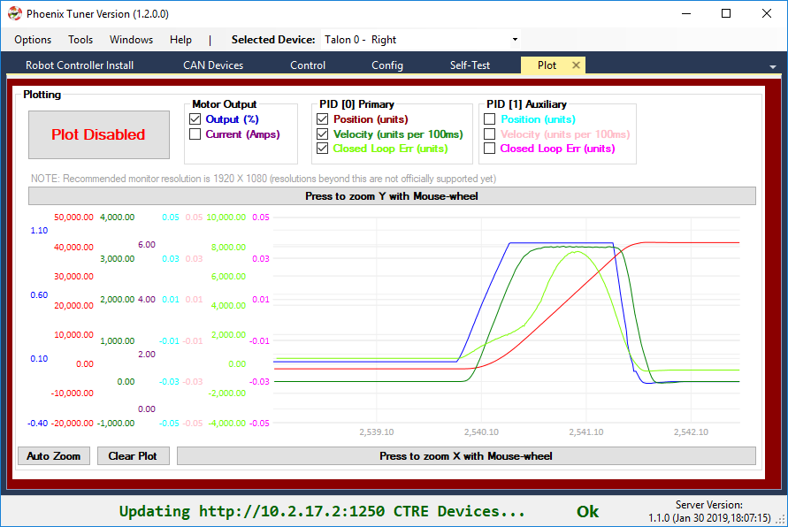

.. post:: Feb 1, 2019

BLOG: FRC 2019 Week 4
=====================

Hello FRC Community!

This week we are releasing our **first comprehensive update for the 2019 season**.
Our test plan for this release was vigorous and took longer than we expected to complete, but we are satisfied with the results.

In this release the following components were updated:

- New Tuner v1.2 (with Diagnostic Server v1.1)
- New Phoenix API v15.3
- New Firmware for Talon SRX (4.15), Victor SPX (4.15) and Pigeon IMU (4.13).

A breakdown of the changes are below, but due to the variety of improvements and how these components interact, we **strongly recommend collectively updating all three components** before `Stop Build Day <https://www.firstinspires.org/robotics/frc/season-calendar/stop-build-day>`_.

How To download
~~~~~~~~~~~~~~~~~~~~~~~~~~~~~~~~~~~~~~~~~~~~
**Windows users** can download the **v5.13 Installer**, which provides all three components.

Alternatively, users can download the individual components:

- Release page on GitHub: https://github.com/CrossTheRoadElec/Phoenix-Releases/releases
- Firmware can be downloaded from the product pages on http://www.ctr-electronics.com/
- Additionally teams can pull the latest Phoenix API via the online method through VS Code, or via the non-Windows zip.

Download instructions can be found here
http://localhost:8000/build/html/ch05_PrepWorkstation.html#what-to-download-and-why

.. note:: The online method refers to the “Check for updates (online)” feature. However this is not recommended as this requires a live Internet connection to use your FRC project.

See the sections below for more information and good luck this build season!

Omar Zrien
Co-owner CTR-Electronics

New Tuner v1.2 (with Diagnostic Server v1.1)
~~~~~~~~~~~~~~~~~~~~~~~~~~~~~~~~~~~~~~~~~~~~

Comms Improvements
-----------------------------------------------------------------
The biggest update to the Phoenix Tuner/Diagnostic Server package is **updating the communication** method to use the latest Windows web-request API.
This appears to have solved the remaining customer reports where the browser responds correctly to Diagnostic Server, but Tuner does not.

**Memory and performance improvements** were also made to improve the runtime behavior when **leaving the software connected for extended periods of time**.

If you experienced any communication issues with the Kickoff release of Tuner, we **strongly recommend** switching to the latest Tuner and installing the latest Diagnostics Server (Robot Controller Install tab).

Plotter Improvements
-----------------------------------------------------------------
Some teams are beginning to move into the "tuning" phase of their mechanisms, so we added a few more channels to the plotter.

Phoenix Libraries cleared on roboRIO reboot 
-----------------------------------------------------------------
We received a couple reports where the roboRIO appears to be *losing Phoenix libraries after a power cycle*.
The root-cause was determined to be **teams accidently using HERO LifeBoat** to install 2018 libraries in a location that prevents the 2019 libraries from loading correctly.
Details on this can be found at https://github.com/CrossTheRoadElec/Phoenix-Releases/issues/1

**To solve this completely** we made two changes:

1. Latest Phoenix Tuner **will find and delete the erroneously placed 2018 library files**.
2. Latest HERO LifeBoat **will not install** libraries into a roboRIO.

If this applies to your robot, we **recommend downloading latest Tuner (via Windows Installer or via GitHub releases)** and **perform a fresh "Robot Controller Install"** to ensure no loss of functionality after RIO reboot.

Misc Updates
-----------------------------------------------------------------
We've also made several minor corrections to the Self-Test results, and compatibility adjustments to match latest firmware.
The details can be found in the `release notes <https://www.ctr-electronics.com/downloads/release_notes/RELEASE_NOTES>`_.

New Phoenix API v15.3
~~~~~~~~~~~~~~~~~~~~~~~~~~~~~~~~~~~~~~~~~~~~~~~~~

Desktop Simulation - Our first steps
-----------------------------------------------------------------
Teams using VS Code may have noticed a **checkbox in the "Create New Project" prompt for "Desktop Support"**.
When checked, the newly created project is setup to perform **desktop compilation** in addition to compiling for the roboRIO.
This can provide the means of testing newly written code when you are away from the roboRIO.

In the previous 2019 release of Phoenix, the desktop libraries required for this feature were not packaged.
But that has changed - **starting with v5.13, you can now set this checkbox**, thereby enabling the desktop builds to compile on your native machine.
This means your roboRIO project that links Phoenix will now compile on Windows/Linux desktop.

.. note:: This *may* slow the build time of your source due to the additional compile tasks.

Although the project will compile, you will notice the **typical Driver Station errors when communicating with CTRE Devices that are not present** on the CAN bus.
This is why we consider this our "first step" in simulation.
Future releases will include more comprehensive support, with the ultimate goal of full-simulation of our CAN devices.

Jetson TX and Raspberry Pi
-----------------------------------------------------------------
The classifiers for our armhf and aarch64 builds have been modified to **explicitly name the Jetson TX2 and Raspbian toolchain**.
This better communicates the intended target platforms of these libraries, and aligns the Raspbian binary artifacts with WPILIB's naming scheme.

Pigeon Pitch/Roll
-----------------------------------------------------------------
A couple teams reported that the **API to poll Pitch and Roll were not correct** if the angle is steep enough.
This has also been solved in this release.

New Firmware -  Talon SRX (4.15), Victor SPX (4.15) and Pigeon IMU (4.13)
~~~~~~~~~~~~~~~~~~~~~~~~~~~~~~~~~~~~~~~~~~~~~~~~~~~~~~~~~~~~~~~~~~~~~~~~~
Pigeon IMU (4.13)
-----------------------------------------------------------------
This hot-fix was released over two weeks ago to solve an issue for teams using the remote-sensor/Arc features of the Talon SRX.

https://github.com/CrossTheRoadElec/Phoenix-Releases/releases/tag/Pigeon_IMU_v4.13

Since this is the first installer since the hot-fix, this CRF has been included.

Talon SRX / Victor SPX Firmware (4.15)
-----------------------------------------------------------------
A **critical fix** has been applied to the Talon SRX and Victor SPX firmware for those of you using the **firmware closed-loop features**.
We've identified a circumstance where **measurement noise** can occur in the **sensor velocity and closed-loop derivative error**, when motor output is less-than-full, and the current-draw measurement is nonzero and changing.

This was first discovered and reproduced by `FRC Team 2767 Strike Force <https://www.strykeforce.org/>`_.
If that name sounds familiar, you've probably watched an FRC World Championship, or two.

Thanks to the feedback from 2767, we've solved the issue with several performance improving fixes.
The issue was root-caused to be an inefficiency in the current-draw calculation, which has been addressed in 4.15.
Note that the current-measurement in 4.15 may report slightly different values when compared to previous firmware (within 0.100A) due to rounding changes.

Because measurement noise can be very difficult to diagnose, we **strongly recommend** teams using the closed-loop features of Talon to update.
If you are using the closed-loop features successfully, you may find that updating will improve your tuning experiences (gains seem to be easier to find).

Additional firmware updates
-----------------------------------------------------------------
The additional firmware changes are also mentioned in the `release notes <https://www.ctr-electronics.com/downloads/release_notes/RELEASE_NOTES>`_.
