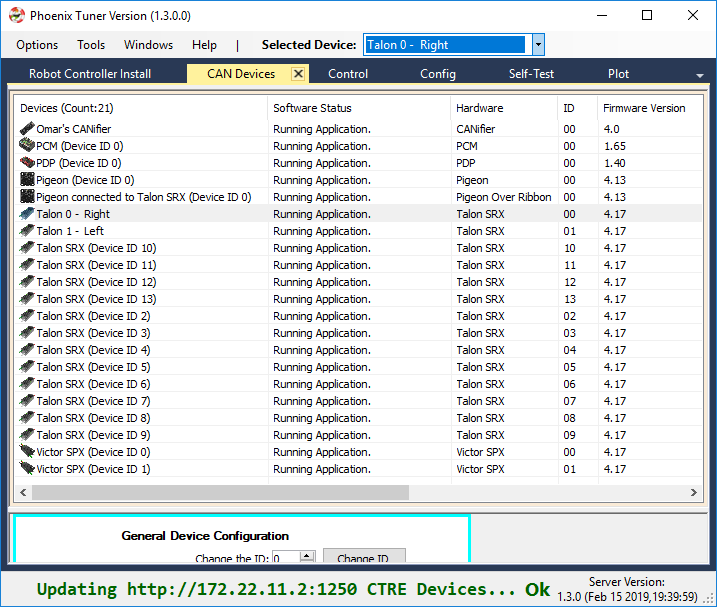
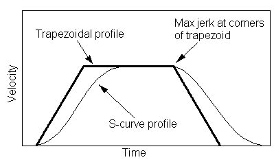
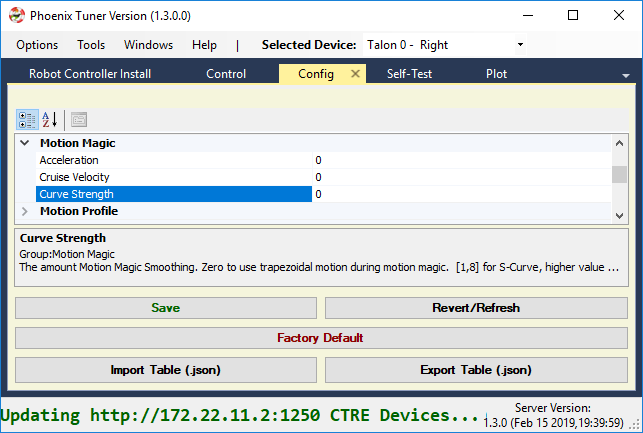
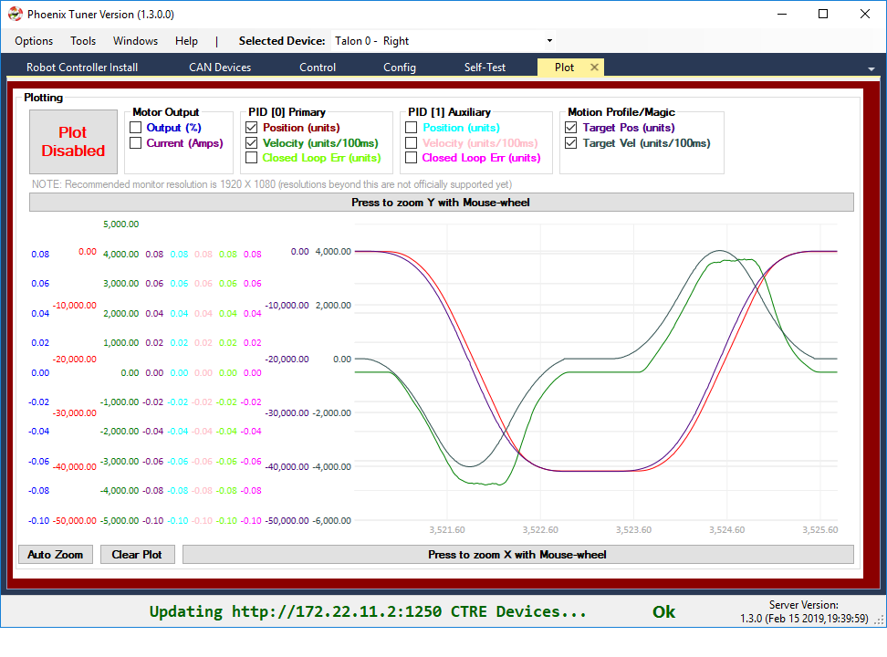
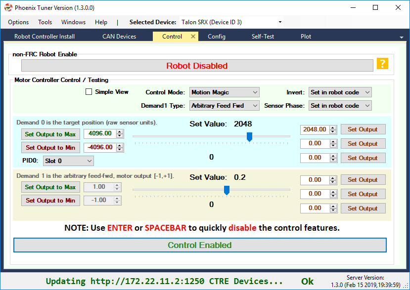

.. post:: Feb 16, 2019

BLOG: FRC 2019 Week 6
=====================

Hello FRC Community!

This weekend we have posted the **Phoenix v5.14 feature release**.
This update has a few **new Motion Control features** we think will benefit teams as they wrap up their build seasons.

The features included are:

- Talon and Victor firmware support for **motion magic with S-Curve**.
- Tuner plotter can **plot target position and velocity** for MotionMagic/MotionProfile.
- Tuner **control tab** supports testing **several closed-loop modes including Motion Magic**.

In this release the following components were updated:

- New Tuner v1.3 (with Diagnostic Server v1.3)
- New Phoenix API v15.4
- New Firmware for Talon SRX (4.17) and Victor SPX (4.17)

.. note:: Latest Tuner and Diagnostic Server versions shown below (Tuner version in the top status bar, Server version in the bottom right - both report "1.3.0").

The details of the update can be found in the `release notes <https://oldsite.ctr-electronics.com/downloads/release_notes/RELEASE_NOTES>`_.
See the sections below for more information and good luck this build season!

Omar Zrien
Co-owner CTR-Electronics

New S-Curve feature
~~~~~~~~~~~~~~~~~~~~~~~~~~~~~~~~~~~~~~~~~~~~

What is it?
-------------------------------------------------------------
The **Talon SRX and Victor SPX Motion Magic** control mode has definitely had a **positive impact on FRC teams** since its initial release in 2017.
For the first time, teams could **control their velocity profiles** with **virtually no additional software to develop**.
This feature works by using a strategy called **Trapezoidal Motion Profile**, a technique where **constant acceleration is applied when adjusting the mechanism velocity**.

However, trapezoidal profiling is **not commonly used in industry**. Instead, true motion profilers (CNC equipment for example) use **S-Curve profiling**.
This means that the sharp "corner" points typical of the simpler trapezoidal method are smoothed to form a continuous curve.

.. note:: Image source: https://electronics.stackexchange.com/questions/38573/smooth-a-motor-movement

Due to the successful and widespread use of this control mode, we've enhanced it to allow for true S-Curve profiling.

Why use it?
-------------------------------------------------------------
Smoothing the profile generally leads to **reduced oscillation** in the movement **caused by the "jerk" points** that occur when the target velocity changes abruptly.
This also means a more **deliberate and reproducible maneuver**, which is important in FRC.

As more teams become familiar with profiling techniques, classic trapezoidal profile may not be good enough for the future challenges team face.

How to use it?
-------------------------------------------------------------
C++ and Java teams will now be able to use **configMotionSCurveStrength()** to select how much smoothing to apply.
This setting is available in the C++/Java API, as well as latest Tuner (config tab).

There are **nine levels** (0 through 8), where 0 represents no smoothing (same as classic trapezoidal profiling) and 8 represents max smoothing.

This setting also defaults to 0 to ensure a "smooth" transition when migrating from the older Phoenix releases.

New Tuner Plotter
~~~~~~~~~~~~~~~~~~~~~~~~~~~~~~~~~~~~~~~~~~~~
Given the enhancement to Talon/Victor profiling, we also added the ability to **plot the Motion Magic / Motion Profile target position and velocity**.
This will allow teams to learn about and tweak their profiles, as well as experiment with the new S-Curve feature.

.. note:: The capture below shows a "smoothed" MotionMagic velocity curve.

.. note:: The target velocity and position is also updated when using Motion Profile (streaming).

New Tuner Control
~~~~~~~~~~~~~~~~~~~~~~~~~~~~~~~~~~~~~~~~~~~~
The Tuner control tab now provides the means of testing:

- Percent Output
- Position Closed-Loop
- Velocity Closed-Loop
- Motion Magic Closed-Loop
- Current (draw) Closed-Loop

The graphical interface has been enhanced a bit to cover the various combinations of control strategies.
For teams who leverage advanced features (such as **arbitrary feed-forward** or **auxiliary PID1**), **uncheck the "Simple View" checkbox** to get all the bells and whistles.

How To download
~~~~~~~~~~~~~~~~~~~~~~~~~~~~~~~~~~~~~~~~~~~~
**Windows users** can download the **v5.14 Installer**, which provides all three components.

Alternatively, users can download the individual components:

- Release page on GitHub: https://github.com/CrossTheRoadElec/Phoenix-Releases/releases
- Firmware can be downloaded from the product pages on http://oldsite.ctr-electronics.com/
- Additionally teams can pull the latest Phoenix API via the online method through VS Code, or via the non-Windows zip.

Download instructions can be found `here <https://phoenix-documentation.readthedocs.io/en/latest/ch05_PrepWorkstation.html#what-to-download-and-why>`_.

.. note:: The online method refers to the “Check for updates (online)” feature. However this is not recommended as this requires a live Internet connection to use your FRC project.

