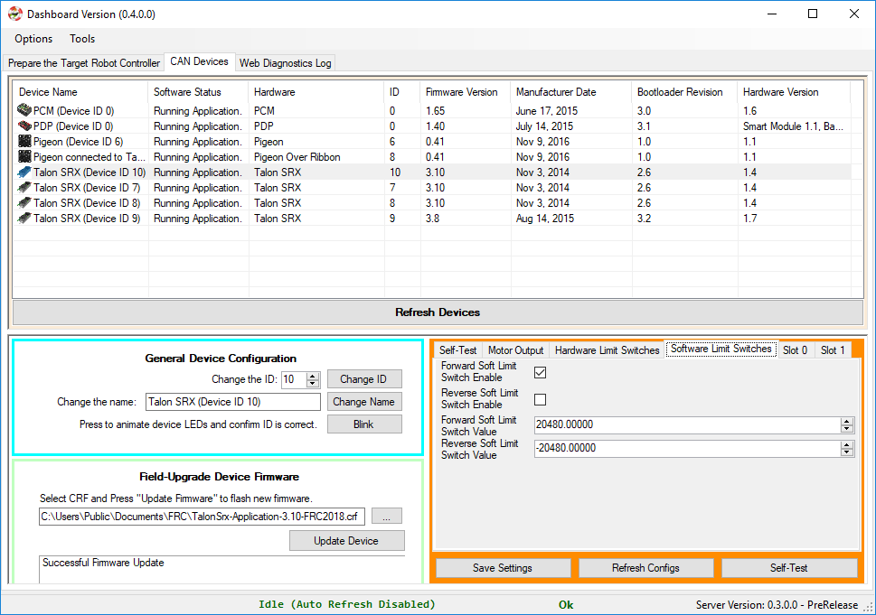

Primer: What is Phoenix Software
================================
Phoenix is a package that targets LabVIEW, C++, and Java for the FRC Robotics Controller platform, i.e. the  NI roboRIO robot controller. 

It includes the Application Programming Interface (API), which are the functions you call to manipulate :ref:`Phoenix devices <Do I need to install any of this?>` on the CAN bus.

.. note:: PCM and PDP API are built into the core WPI distribution.

The C++ and Java APIs are very similar, typically only differing on the function name case (configAllSettings in Java versus ConfigAllSettings in C++).
Because Java is more widely used in FRC than C++, this document will reference the Java routine names.
C++ users should take note that the leading character of every function is UPPERCASE in C++.

Additionally, Phoenix shared libraries are also targeted for C++ on Linux (amd64, armhf, aarch64) and typically available on our maven repository.  The example support libraries use socket-can for CANBus access, however custom drivers can be provided by the end user for alternative CANBus solutions (NVIDIA TX2 native CAN bus for example).

Phoenix also includes a NETMF (C#) class library for the non-FRC HERO Robot Controller.
This can replace the roboRIO in use cases that don’t require the full features of the FRC control system, and are not in use during competition.

.. note:: With Phoenix framework, teams can control/leverage :ref:`Phoenix devices <Do I need to install any of this?>` outside of the roboRIO (e.g. Rasp-Pi or Jetson TX2), and use the roboRIO/DriverStation to safely enable/disable the actuators.

.. note:: Leveraging CTRE CAN devices from third-party CAN hardware was officially made FRC legal for the **2019 season**.

There are tons of examples in all languages at CTRE’s GitHub account:

- https://github.com/CrossTheRoadElec/Phoenix-Examples-Languages
- https://github.com/CrossTheRoadElec/Phoenix-Examples-LabVIEW

Entire GitHub organization: https://github.com/CrossTheRoadElec/

Phoenix-Examples-Languages and Phoenix-Examples-LabVIEW are specifically tested on the FRC RoboRIO control system.

Phoenix-Linux-SocketCAN-Example demonstrates control of Talons from a Raspberry Pi.
https://github.com/CrossTheRoadElec/Phoenix-Linux-SocketCAN-Example

What is Phoenix Tuner?
~~~~~~~~~~~~~~~~~~~~~~~~~~~~~~~~~~~~~~~~~~~~~~~~~~~~~~~~~~~~~~~~~~~~~~~~~~~~~~~~~~~~~~~~~~~~~~~~~~~~~~~~~~~~~~~~~~~~
Phoenix-Tuner is the graphical interface that allows for configuration of Phoenix CAN bus devices.

It provides a variety of functionality to support all Phoenix CAN Bus devices.  The feature set includes:

- Update device firmware (including PDP/PCM) 
- Change CAN IDs 
- Configure direction and offsets
- Self-test Snapshot devices 
- Change configuration settings 
- Factory default configuration settings
- Test motors
- Check plots
- Temperature Calibrate Pigeon-IMU
- Confirm proper CAN bus wiring **without writing any software**.

Now you can drive your motors and collect data *without writing any software*.

.. image:: img/sensor-11.png

Configuration values can be **checked, modified, and defaulted** with the new config view.
Config values can also be **imported/exported** as an easy-to-follow JSON formatted file.

.. image:: img/sensor-20.png

The following sections of documentation will cover how to use Phoenix Tuner and the other components of Phoenix.

.. tip:: Have a feature request?  Send to us at support@ctr-electronics.com or report it on GitHub.
