Prepare your workstation computer
=================================

Before Installing Phoenix...
~~~~~~~~~~~~~~~~~~~~~~~~~~~~~~~~~~~~~~~~~~~~~~~~~~~~~~~~~~~~~~~~~~~~~~~~~~~~~~~~~~~~~~~~~~~~~~~~~~~~~~~~~~~~~~~~~~~~
It is strongly recommended to complete the base installation of FRC tools.

Test base FRC Installation - FRC LabVIEW 2018
----------------------------------------------------------------------------------
If team intends to use LabVIEW to develop robot software, be sure to complete the full NI installer.  At which point, opening LabVIEW should reveal the FRC-styled graphical start menu.

At this point it is recommended to create a simple template project and test deploy to the roboRIO.  Be sure DriverStation can communicate with robot controller, and that DS message log is functional.

.. note:: You will likely need to image the roboRIO to successfully deploy a test application.

.. note:: LabVIEW is versioned 2018 due to its release schedule. Therefore, LV2018 is used for the 2019 season.

Test base FRC Installation - FRC C++ / Java
----------------------------------------------------------------------------------
It is recommended to install the FRC Driver Station Utilities. This will install the Driver Station software, which is necessary for:
1. Basic comms checks
2. Reading joystick data
3. Generally required for enabling motor actuation (Phoenix Tuner provides an alternative).

Important note regarding FRC 2019 C++ / Java.
----------------------------------------------------------------------------------
The FRC C++/Java standard distribution for 2019 is quite different than previous seasons. WPILIB has replaced the Eclipse-based development environment with Microsoft Visual Studio Code and GradleRIO.
This is a considerable change in both user experience and in implementation. If you are developing C++/Java FRC programs, we strongly recommend testing full deployment to your robot controller before installing Phoenix and porting previous season software.
A recommended test is to:
1. Create a project from scratch
2. Make a simple change such as add a print statement with a counter.
3. Deploy (or debug) your application.
4. Confirm robot can be teleop-enabled in DS.
5. Open FRC message Console and read through all the messages.
6. Repeat 2 - 5 ten times. This will train students to become familiar with and build general confidence in the tools.

.. note:: Third-party vendor libraries are installed into the C++/Java project, not the environment.  For each C++/Java project you create, you must use the WPI provided tools to select Phoenix to bring the libraries into your project.

What to Download (and why)
~~~~~~~~~~~~~~~~~~~~~~~~~~~~~~~~~~~~~~~~~~~~~~~~~~~~~~~~~~~~~~~~~~~~~~~~~~~~~~~~~~~~~~~~~~~~~~~~~~~~~~~~~~~~~~~~~~~~

Option 1: Windows installer (strongly recommended)
----------------------------------------------------------------------------------
Environments: Windows-LabVIEW, Windows-C++/Java, HERO C#

Phoenix Installer zip can be downloaded at:
http://www.ctr-electronics.com/hro.html#product_tabs_technical_resources.

It is typically named Phoenix Framework_Windows_vW.X.Y.Z.zip

This will install:

- The LabVIEW Phoenix API (if LabVIEW is detected and selected in installer)
- The C++/Java Phoenix API (if selected in installer)
- Device Firmware Files (that were tested with the release)
- CTRE Support of RobotBuilder
- Phoenix Tuner

  - Installs Phoenix API libraries into the roboRIO (required for LabVIEW)
  - Installs Phoenix Diagnostics Server into the RoboRIO (needed for CAN diagnostics). 
  - Plotter/Control features
  - Self-test
  - Device ID and field-upgrade

Option 2: Phoenix API via Non-Windows Zip 
----------------------------------------------------------------------------------
Environments: Linux/MacOS - C++/Java

The Phoenix API can be manually installed on non-Windows platforms by downloading the “non-Windows” zip and following the instructions found inside.  

This essentially contains a maven-style repository that holds the API binaries and headers, as well as a “vendordeps” JSON file that instructs VS how to incorporate the Phoenix C++/Java API libraries.

.. note:: This is auto installed when using the Windows full installer (Option 1).

Option 3: Phoenix API via online install (maven)
----------------------------------------------------------------------------------
Environments: Windows/Linux/MacOS - C++/Java

Although this is not manual download, it is worth mentioning that Phoenix API can be automatically downloaded through maven/FRC-json.

http://devsite.ctr-electronics.com/maven/release/com/ctre/phoenix/Phoenix-latest.json

Phoenix Tuner
----------------------------------------------------------------------------------
Environments: Windows, (possible future Linux/MacOS depending on Mono compliancy)
If you are using option 2 or 3, you will not pick up Phoenix Tuner.  Alternatively, Phoenix Tuner is available as a separate download.  This can be convenient for workstations that aren’t used for software development, but are used for field-upgrade or testing motor controllers.

.. note:: Phoenix Tuner is required to install Phoenix libraries into the roboRIO.  Phoenix libraries must be present in both the workstation and in the robot controller for LabVIEW.

.. note:: This is auto installed when using the Windows full installer.

.. note:: Developers may be interested to know that all Phoenix Tuner features leverage an HTTP API provided by the Phoenix Diagnostics Server. As such, custom tooling can be developed to field-upgrade, test-control, or diagnostics CTRE devices without Tuner.

Device Firmware Files (crf)
----------------------------------------------------------------------------------
The test firmware files for all CTRE devices are packaged with the Windows Installer (and has been for years).  However, many FRC teams don’t notice, or prefer to download them directly from the product pages on the ctr-electronics.com website.  If Internet access is available, they can be downloaded as such.

The FRC Software installer will create a directory with various firmware files/tools for many control system components.  
Typically, the path is:

.. code-block:: html

  C:\Users\Public\Documents\FRC
 

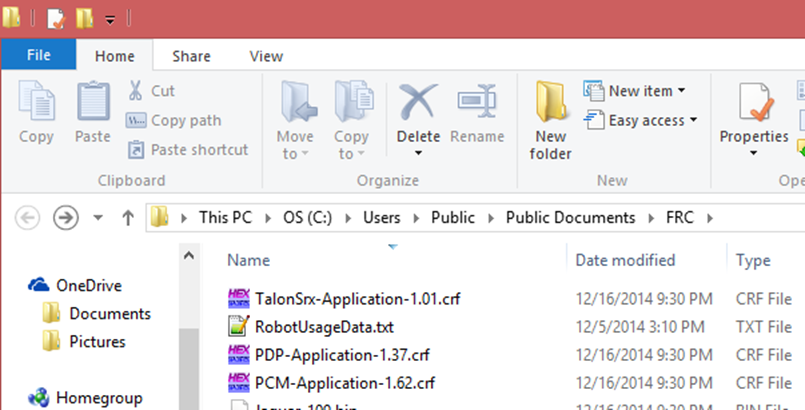
 
When the path is entered into a browser, the browser may fix-up the path:

.. code-block:: html

   C:\Users\Public\Public Documents\FRC

In this directory are the initial release firmware CRF files for all CTRE CAN bus devices, including the Talon SRX. 

The latest firmware to be used at time of writing is version 4.11 for Talon SRX, Victor SPX, and 4.00 for CANifier, and Pigeon IMU.

.. note:: Additionally, newer updates may be provided online at http://www.ctr-electronics.com.

.. note:: Be sure to watch for team updates for what is legal and required!

.. note:: There is no longer FRC versus non-FRC firmware for motor controllers.  Instead the latest firmware detects if the use case is FRC.  If so, the device will FRC-Lock, and will require the Driver Station for actuation.  

Workstation Installation
~~~~~~~~~~~~~~~~~~~~~~~~~~~~~~~~~~~~~~~~~~~~~~~~~~~~~~~~~~~~~~~~~~~~~~~~~~~~~~~~~~~~~~~~~~~~~~~~~~~~~~~~~~~~~~~~~~~~

There are three installation methods listed below.  The simplest and recommended approach is to run the Windows Installer (Option 1).

Option 1: Windows Offline Installer (C++/Java/LabVIEW, HERO C#)
----------------------------------------------------------------------------------
Un-compress the downloaded zip.

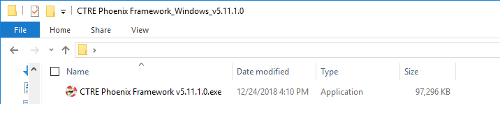

Double click on the installer. If the Windows protection popup appears press More Info, then Run anyway.

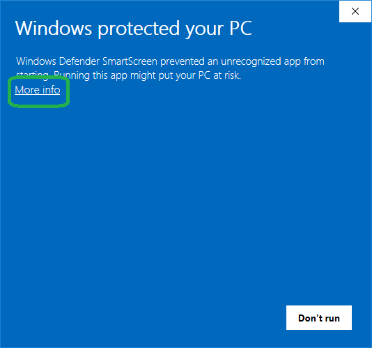

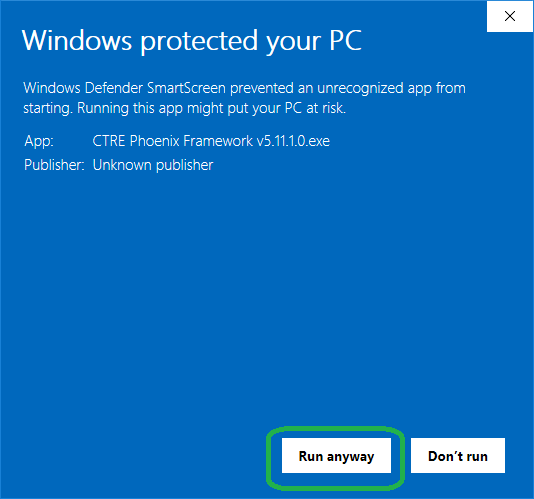

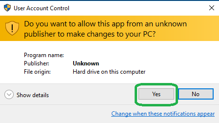

This will look very similar to previous installers - make sure you have the relevant component selected for your programming language.

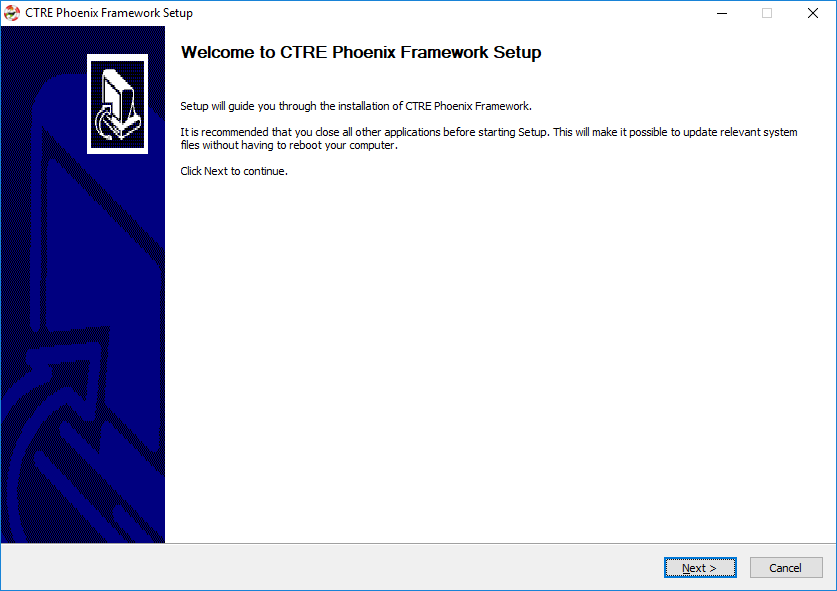

LV Teams: Make sure LabVIEW is selected.  If it is grayed out, then LabVIEW was not installed on the PC.

C++/Java Teams: Make sure C++/Java is selected.  

If Visual Studio 2017 (Community/Professional) is detected, HERO C# will be selected.  This can be turned off to speed up the installer.

.. image:: img/install-2a.png

Installer can take anywhere from 30 seconds to 5 minutes depending on which Microsoft runtimes need to be installed.

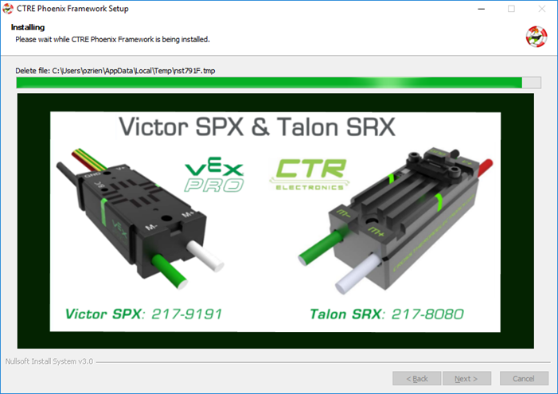

Final page will look like this.  The Phoenix Tuner link can be used to open Phoenix Tuner.  Alternatively, you can use the Windows Start Menu.

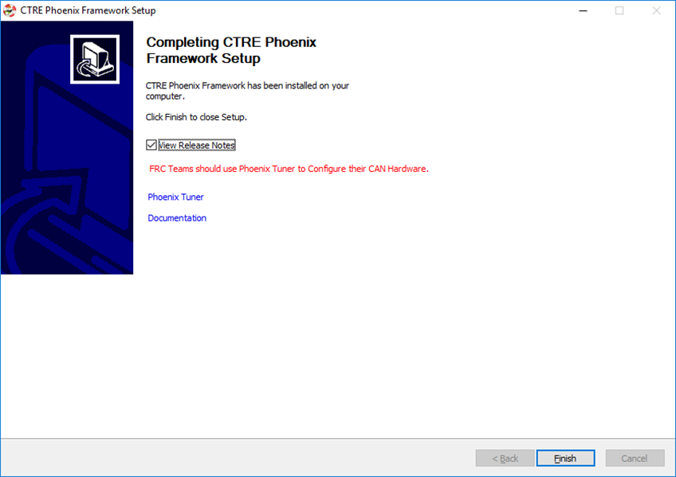

Option 2: Non-Windows Zip  (C++/Java)
----------------------------------------------------------------------------------

The zip will contain two folders, “maven” and “vendordeps”.
These folders are meant to be inserted into the frc2019 install folder.  See WPI documentation for typical location.

Copy/paste the maven and vendordeps folder into frc2019.  This will override a pre-existing Phoenix installation if present.

.. note:: This will not install Phoenix Tuner or firmware files.  If these are necessary (and they typically are) these can be downloaded separately or consider using the complete Phoenix Installer.

Option 3: Phoenix API via online install (maven)
----------------------------------------------------------------------------------

Use the following URL to pull latest API.
http://devsite.ctr-electronics.com/maven/release/com/ctre/phoenix/Phoenix-latest.json

.. note:: that there may be a circumstance that requires a firmware update for latest API to function correctly.  This is not typically common, but review latest release notes for API when updating to ensure no compatibility issues.

Post Installation Steps
~~~~~~~~~~~~~~~~~~~~~~~~~~~~~~~~~~~~~~~~~~~~~~~~~~~~~~~~~~~~~~~~~~~~~~~~~~~~~~~~~~~~~~~~~~~~~~~~~~~~~~~~~~~~~~~~~~~~

After all workstation installs, the following checks should be follow to confirm proper installation.

FRC C++/Java
----------------------------------------------------------------------------------

FRC C++/Java - Verify Installation
^^^^^^^^^^^^^^^^^^^^^^^^^^^^^^^^^^^^^^^^^^

The offline files for vscode are typically installed in:

.. code-block:: html

  C:\Users\Public\frc2019\vendordeps\Phoenix.json (File used by vscode to include Phoenix in your project)
  C:\Users\Public\frc2019\maven\com\ctre\frcbeta\phoenix (multiple maven-style library files)

Your drive letter may be different than "C:".
After running the Phoenix Installer, the instructions to add or update Phoenix in your robot project must be followed.

FRC C++/Java – Create a Project 
^^^^^^^^^^^^^^^^^^^^^^^^^^^^^^^^^^^^^^^^^^

Next we will create a new robot project in vscode and create a Talon SRX.  The goal is compile the project only, so hardware is not needed.

Follow the WPI Screensteps instructions on reaching the create new project.  Typically, you can use CNTRL+SHIFT+P to open the VS text bar, and type create to reach the WPI command.

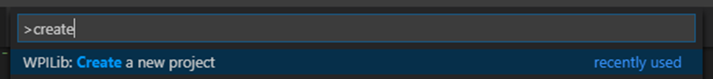

Make sure the desktop checkbox is cleared, Phoenix does not currently support desktop simulation.  “Timed Skeleton” is used in this example for sake of simplicity.

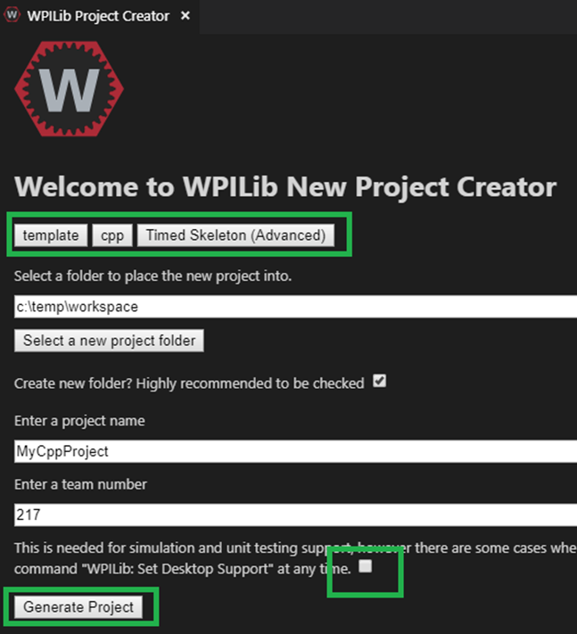

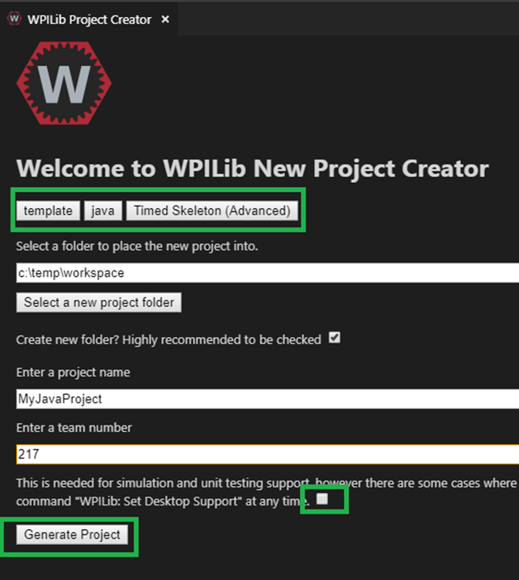

Once the project is created, ensure project builds.  Testing robot deploy is also useful if robot controller is available.

FRC C++/Java – Add Phoenix 
^^^^^^^^^^^^^^^^^^^^^^^^^^^^^^^^^^^^^^^^^^

Right-Click on "build.gradle" in the project tree, then select "Manage Vendor Libraries".

.. note:: if "Manage Vendor Libraries" is **missing** then you likely are using 2018 Alpha VS. Ensure you are using **2019 Release VSCode from WPI**. 

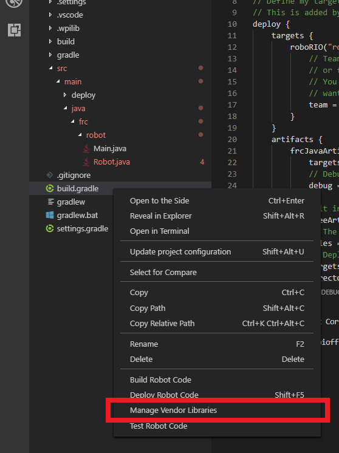

At the top of your screen, a menu will appear. Select "Install new libraries (offline)".

.. image:: img/verify-5.png

The menu will now display a list of vendor libraries you can install. Check "CTRE Phoenix", then click "OK"

.. image:: img/verify-6.png

.. note:: This will bring the library into the project references, however the library will not loaded if the source code does not create a Phoenix object or call any Phoenix routines.  Therefore, you must create a Phoenix object to properly test the install.

.. tip:: Teams can verify Phoenix is in their robot project by checking for the existence of vendordeps/Phoenix.json in the project directory.

FRC C++ Build Test: Single Talon
^^^^^^^^^^^^^^^^^^^^^^^^^^^^^^^^^^^^^^^^^^

Create a TalonSRX object.  The number specified is the Talon’s device ID, however for this test, the device ID is irrelevant.

Be sure to include “ctre/Phoenix.h”, otherwise TalonSRX will not be recognized as a valid class type.

Add an example call, take your time to ensure to spell it correctly.  

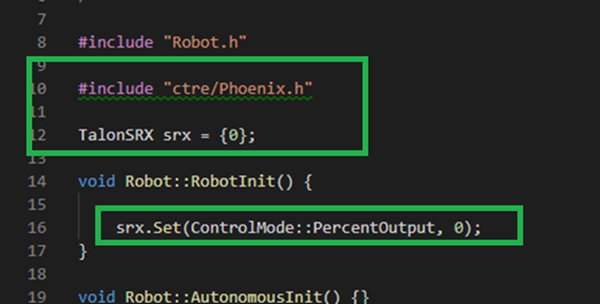

Intellisense may not be functional at this point in time (note the green underline indicating VS did not parse the header).  

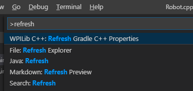

.. tip:: Perform a Gradle C++ Refresh, confirm it completes, and manually restart of VSCode will correct this.

If you see linker errors, then the desktop simulation checkbox was likely checked.

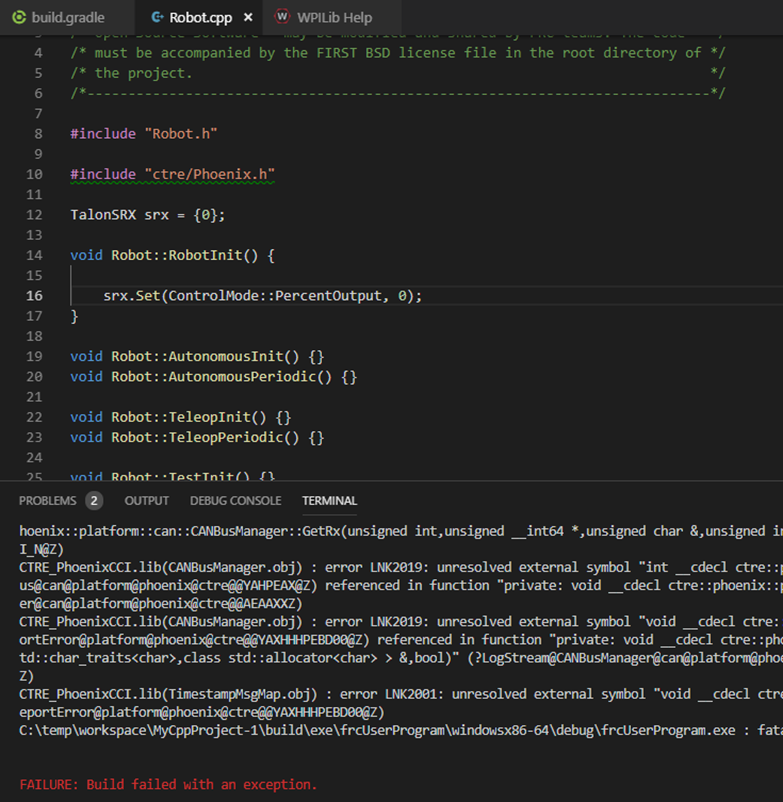

This can be resolved by manually turning off the feature.  Set flag to false.

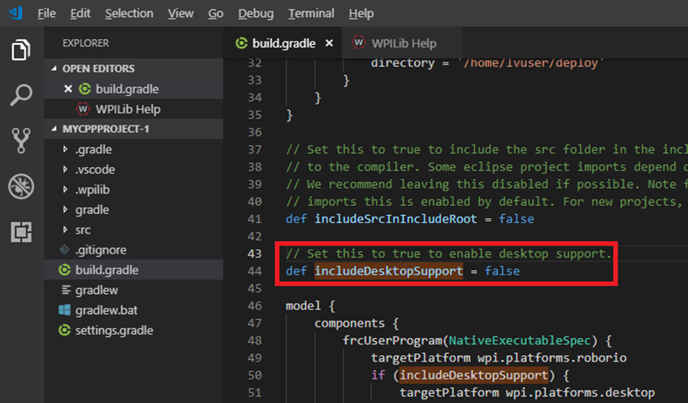

.. tip:: When resolving compiler/linker errors, press the trash icon first to cleanly erase the previous error lines in the terminal.  Or manually scroll the bottom to ensure you are not looking at stale error lines from previously failed builds.

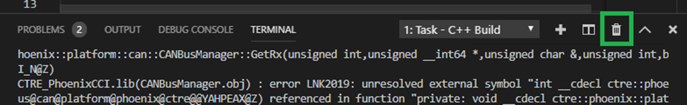

The only reliable way to confirm build was successful is to confirm the BUILD SUCCESFUL line at the bottom of the TERMINAL.

.. note:: The problems tab may or may not be clear of errors.  Our testing with VSCode has shown that it can report stale or incorrect information while making code changes.  Always use the TERMINAL output to determine the health of your compilation and build system.

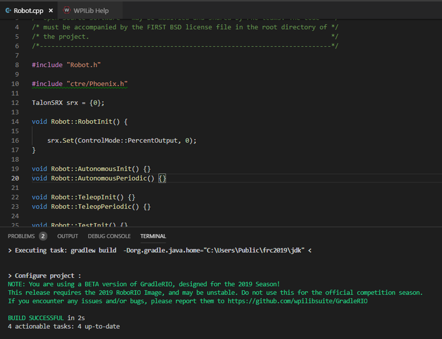

In the event that the intellisense is not resolving symbols (for IDE auto-complete features), restart VSCode.

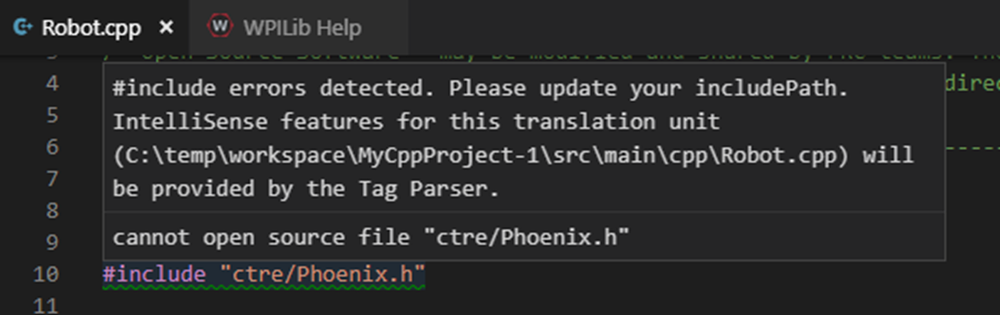

After restart, routines should be found correctly.

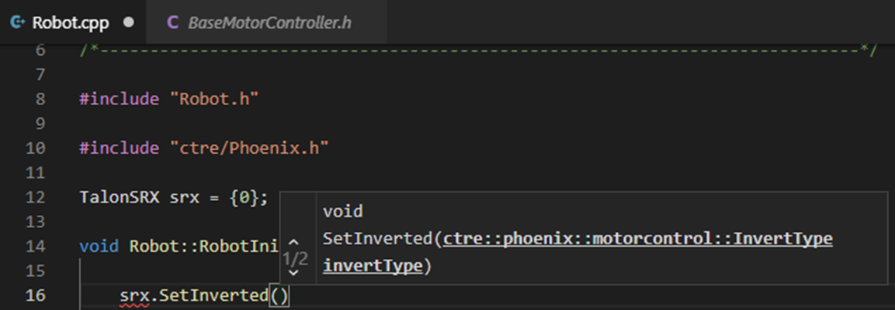

.. tip:: Headers can be auto-opened by CNTRL+CLICK the include line.

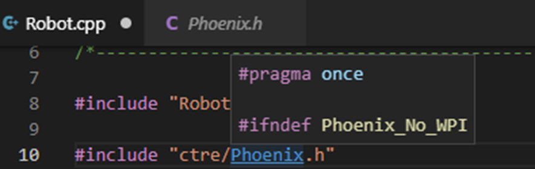

Depending on the version of VS Code used, you may encounter an IntelliSense warning.  These can be ignored.

.. image:: img/verify-15.png

FRC Java Build Test: Single Talon
^^^^^^^^^^^^^^^^^^^^^^^^^^^^^^^^^^^^^^^^^^

Create a TalonSRX object.  The number specified is the Talon’s device ID, however for this test, the device ID is irrelevant.

Typically, you can type “TalonSRX” and watch the intellisense auto pop up. If you press ENTER to select the entry, the IDE may auto insert the import line for you.

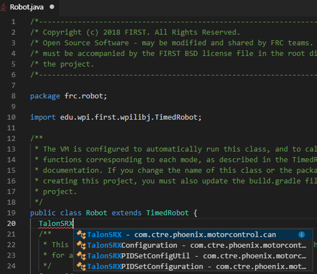

Add an example call, take your time to ensure to spell it correctly.  Use the intellisense features if available.

Here is the final result.

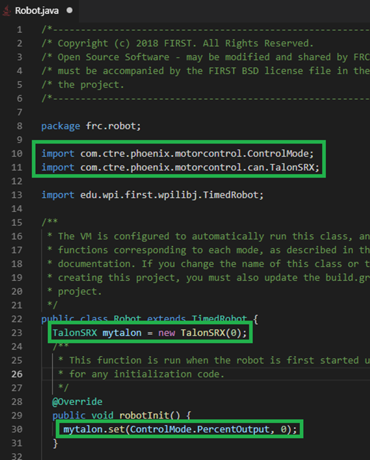

If you see build errors, carefully find the first erroneous line in the TERMINAL output.  Typically, you can CNTRL + click the error line and auto-navigate to the source.

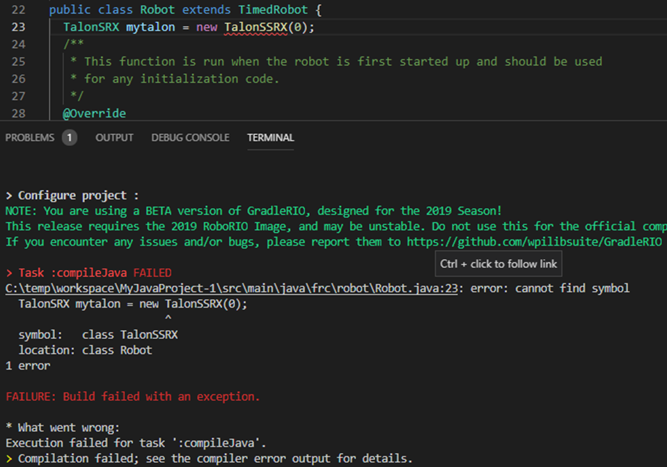

When resolving compiler errors, press the trash icon first to cleanly erase the previous error lines in the **terminal**.  Or manually scroll the bottom to ensure you are not looking at stale error lines from previously failed builds.

The only reliable way to confirm build was successful is to confirm the BUILD SUCCESFUL line at the bottom of the TERMINAL.

.. note:: The problems tab may or may not be clear of errors.  Our testing with VSCode has shown that it can report stale or incorrect information while making code changes.  Always use the TERMINAL output to determine the health of your compilation and build system.

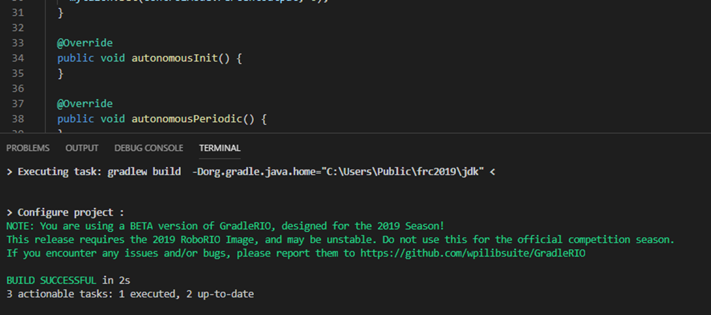

FRC C++/Java - Updating Phoenix
^^^^^^^^^^^^^^^^^^^^^^^^^^^^^^^^^^^^^^^^^^

If you already have a 2019 version of Phoenix installed and you want to update to a newer version, follow these steps.
Install the latest version of Phoenix on your PC.  Basically, rerun the latest installer (same as section above). 

Open you robot program in VS Code.

At the top of your screen, a menu will appear. Select "Check for updates (offline)".

.. image:: img/verify-21.png

The menu will now display a list of vendor libraries you can update. Check "CTRE Phoenix", then click "OK"

.. image:: img/verify-6.png

FRC C++/Java – Test Deploy
^^^^^^^^^^^^^^^^^^^^^^^^^^^^^^^^^^^^^^^^^^

Create a Talon SRX (or Pigeon, CANifier, Victor SPX) and attempt to “deploy”.
Adding a print statement also helps to confirm you are actually deploying the software displayed in VsCode.
Confirm that the software deployed using DriverStation.
DS may report firmware-too-old / not-retrieved errors since the hardware has not been setup yet.

FRC LabVIEW – Verify Installation
----------------------------------------------------------------------------------

After running the installer, open a pristine copy of FRC LabVIEW 2018.

Testing the install can be done by opening LabVIEW and confirming the VIs are installed. This can be done by opening an existing project or creating a new project, or opening a single VI in LabVIEW. Whatever the simplest method to getting to the LabVIEW palette.

The CTRE Palette is located in:

• WPI Robotics Library -> Third Party.

.. image:: img/lv-paletteMenu.png

This palette can also be found in:

• WPI Robotics Library -> RobotDrive -> MotorControl -> CanMotor
• WPI Robotics Library -> Sensors -> Third Party
• WPI Robotics Library -> Actuators -> Third Party

FRC Windows – Open Phoenix Tuner
----------------------------------------------------------------------------------
Open Phoenix Tuner

.. image:: img/tuner-1.png

If this is the first time opening application, confirm the following:

- the status bar should read “Lost Comm”.
- No CAN devices will appear.
- The Server version will be unknown.

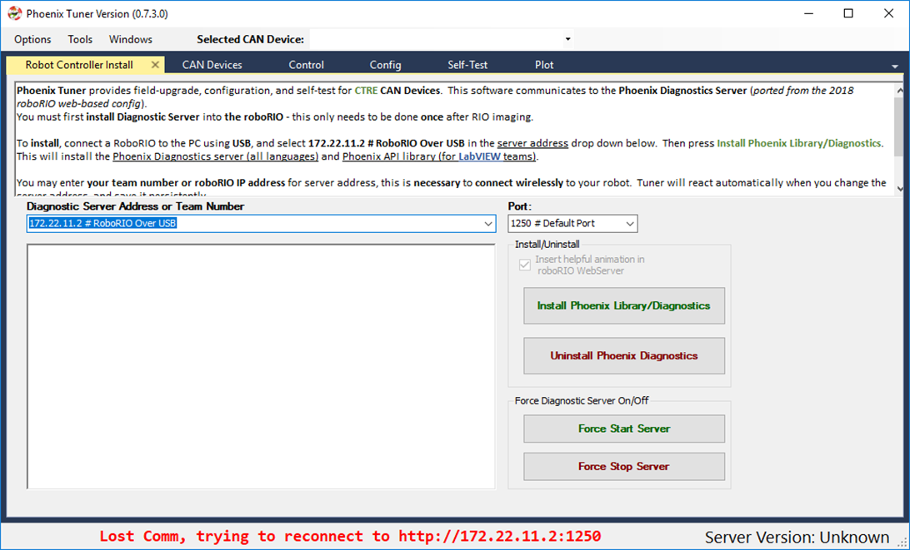
