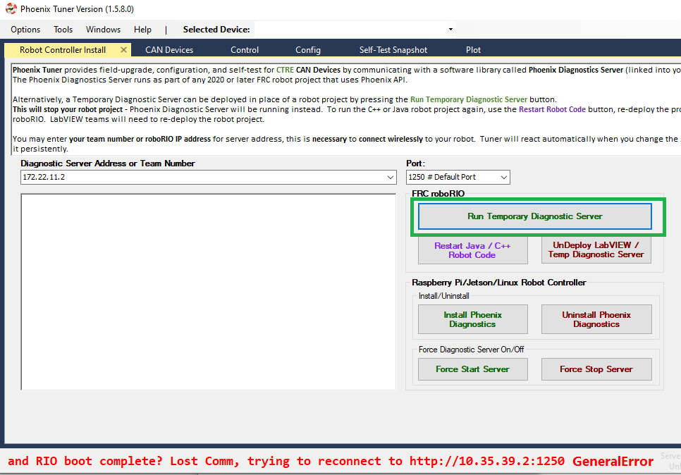
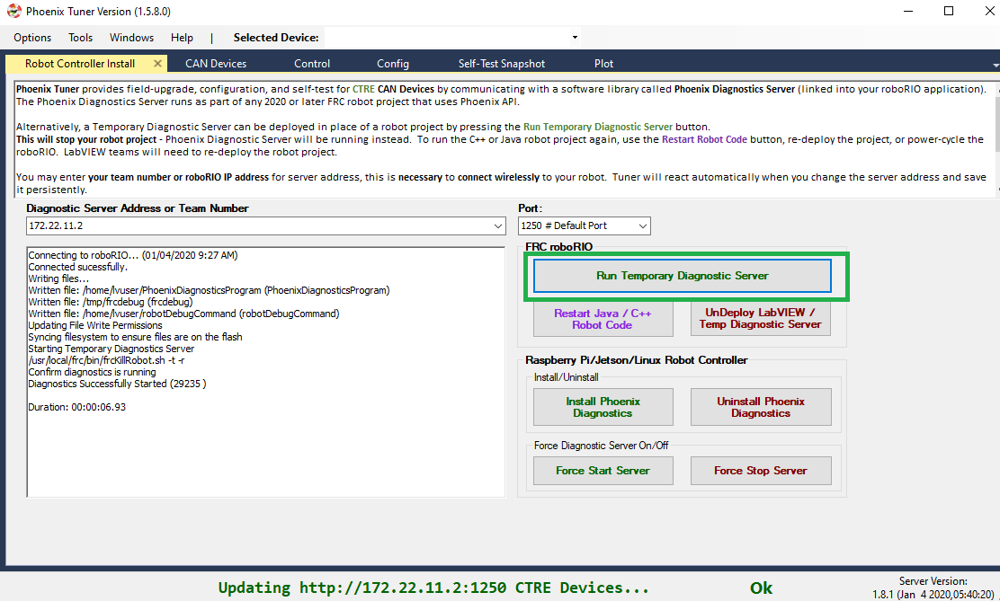
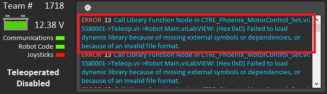
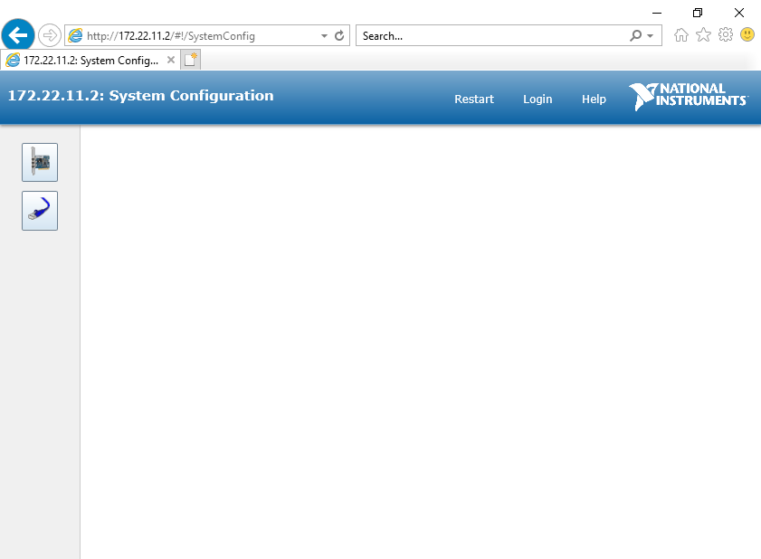

FRC: Prepare NI roboRIO
========================

Why prepare Robot Controller?
~~~~~~~~~~~~~~~~~~~~~~~~~~~~~~~~~~~~~~~~~~~~~~~~~~~~~~~~~~~~~~~~~~~~~~~~~~~~~~~~~~~~~~

In the previous 2019 season, preparing the Robot Controller typically meant:

1. Installing the Phoenix Diagnostics
2. Installing the Phoenix API into roboRIO (if using LabVIEW).

**In the 2020 release of Phoenix, both of these are automatically handled by the library deployment features of WPI Visual Studio Code extensions (C++/Java) and NI LabVIEW.**

Phoenix Diagnostics has become a library that is compiled into the FRC robot application.  This is a result of the roboRIO CAN bus changes implemented by the NI for 2020.
Tuner now communicates with "Phoenix Diagnostic Server" running in the deployed application via an HTTP API.

If the roboRIO does not have a deployed application, a temporary Diagnostic Server application can be deployed from Tuner.  This is particularly useful during hardware-bringup.

.. _PrepRobotLV:

LabVIEW
----------------------------------------------------
In the past few seasons, we have relied on a NI LabVIEW feature that would automatically deploy the Phoenix API libraries to the roboRIO.
However, we have found circumstances where the NI feature potentially corrupts our libraries during install.  

So we have **opted to deploy our binaries directly from Phoenix Tuner** to ensure proper installation.

As a result starting in 2022, LabVIEW users must install Phoenix API libraries into their roboRIO (after roboRIO is imaged).  Afterwards deploy your LabVIEW application as you would normally.

.. tip:: Remember to specify the **Team Numer** or **Address** of the roboRIO under Diagnostic Server Adress.  We recommend using the USB cable and selecting "172.22.11.2" to avoid networking issues.

.. image:: img/tuner-deploy-labview.png

How to prepare Robot Controller
~~~~~~~~~~~~~~~~~~~~~~~~~~~~~~~~~~~~~~~~~~~~~~~~~~~~~~~~~~~~~~~~~~~~~~~~~~~~~~~~~~~~~~

Open Tuner and connect USB between the workstation and the roboRIO.

.. image:: img/tuner-1.png

Select **172.22.11.2 # RoboRIO Over USB** and **1250** for the **address** and **port**. 
These are generally selected by default, and typically do not require modification.

Deploy the Temporary Diagnostic Server.

.. note:: This is unnecessary if a robot application has been deployed already (C++, Java, or LabVIEW).

Verify the robot controller - Tuner
~~~~~~~~~~~~~~~~~~~~~~~~~~~~~~~~~~~~~~~~~~~~~~~~~~~~~~~~~~~~~~~~~~~~~~~~~~~~~~~~~~~~~~

After application deployment, Tuner will immediately connect to the roboRIO.

Confirm the bottom status bar is green and healthy, and server version is present.

If there are CAN device present, they will appear.  However, it is possible that devices are missing, this will be resolved in the next major section (CAN Bus bring up).

.. image:: img/tuner-6.png

roboRIO Connection (Wi-Fi/Ethernet)
------------------------------------------------------
The recommended connection method for control/plotter features is over **USB or using static IP (Ethernet/Wi-Fi)**.  
The mDNS strategy used by the roboRIO can *sometimes* fail intermittently which can cause hiccups when submitting HTTP requests to the roboRIO. 

Testing has shown that using USB (172.22.11.2) or using static IP address has yielded a greater user experience than the roborio-team-frc.local host name has.

.. note:: Future releases may have improvements to circumvent the limitations of mDNS.

Verify the robot controller - LabVIEW
~~~~~~~~~~~~~~~~~~~~~~~~~~~~~~~~~~~~~~~~~~~~~~~~~~~~~~~~~~~~~~~~~~~~~~~~~~~~~~~~~~~~~~
Create a pristine LabVIEW application.  Add a CTRE device to Begin.Vi.  For example, create a Talon SRX object, even if the device is not physically present.

.. image:: img/verify-LV.png

.. tip:: Drag drop the following into your Begin.vi

.. image:: img/lv-snip-1.png

Connect DS and turn on Warnings and Prints by selecting the bottom most option.

.. image:: img/prep-rc-2.png

Upload the application to the robot controller and check the driver station message log.

If everything is working, the Phoenix Initialization message can be found.  

.. note:: This message will not appear after subsequent "soft" deploy (LabVIEW RAM-only temporary deploys).

.. image:: img/prep-rc-3.png

If Phoenix API has not been installed into the robot controller, this message will appear.

.. image:: img/prep-rc-4.png

If you have used Phoenix LifeBoat (which should NOT be used), this message will appear.  If this occurs you will need to re-image your roboRIO and then re-follow the instructions in this section exactly, without using LifeBoat.

Verify the robot controller - Web page
~~~~~~~~~~~~~~~~~~~~~~~~~~~~~~~~~~~~~~~~~~~~~~~~~~~~~~~~~~~~~~~~~~~~~~~~~~~~~~~~~~~~~~

The Silverlight web interface provided in previous seasons is **no longer available**.  Moving forward, the NI web interface will likely be much simpler.  

As a result, **Phoenix Tuner** *may* embed a *small message reminder* **indicating that CAN features have been moved to Tuner**.  This will depend on the version of Phoenix.

Typically, the message will disappear after 5 seconds.  This will not interfere with normal web page features (IP Config, etc.).

.. image:: img/prep-rc-5.png

.. warning:: The roboRIO Web-page does not provide CAN bus support any more as this has been removed by NI.  Use Phoenix Tuner instead.

.. warning:: The roboRIO Web-page does not render correctly if using Internet Explorer (see below).  Recommended browsers are Chrome or Firefox.  

Verify the robot controller - HTTP API
~~~~~~~~~~~~~~~~~~~~~~~~~~~~~~~~~~~~~~~~~~~~~~~~~~~~~~~~~~~~~~~~~~~~~~~~~~~~~~~~~~~~~~

Tuner leverages the HTTP API provided by Phoenix Diagnostics Server.  

So technically you have already confirmed this is working.  

But, it is worth noting that this HTTP API can potentially be used by third-party software, or even the robot application itself.

Here is a simple get version command and response.

.. code-block:: html

  http://172.22.11.2:1250/?action=getversion

.. image:: img/prep-rc-7.png

Here is a simple getdevices command and response.

.. code-block:: html

  http://172.22.11.2:1250/?action=getdevices

.. image:: img/prep-rc-6.png

