Prepare Robot Controller 
========================

Why prepare Robot Controller?
~~~~~~~~~~~~~~~~~~~~~~~~~~~~~~~~~~~~~~~~~~~~~~~~~~~~~~~~~~~~~~~~~~~~~~~~~~~~~~~~~~~~~~

Preparing the Robot Controller typically means:
1. Installing the Phoenix Diagnostic Server
2. Installing the Phoenix API into roboRIO (if using LabVIEW).

[1] Is necessary for Phoenix Tuner to interact with CTRE CAN Devices.  Tuner communicates with "Phoenix Diagnostic Server", a roboRIO Linux application that provides an HTTP API.

[2] Is only required for LabVIEW.  This is because the programming language solutions (WPI C++/Java) automatically delivers these libraries whenever the application is deployed in VS Code.

.. warning:: If the roboRIO is re-imaged, these steps must be followed again for Tuner and LabVIEW to function.

How to prepare Robot Controller
~~~~~~~~~~~~~~~~~~~~~~~~~~~~~~~~~~~~~~~~~~~~~~~~~~~~~~~~~~~~~~~~~~~~~~~~~~~~~~~~~~~~~~

Open Tuner and connect USB between the workstation and the roboRIO.

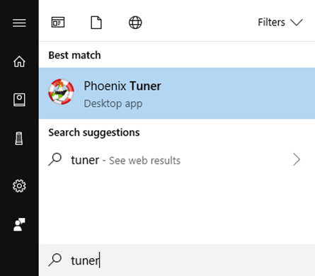

Select **172.22.11.2 # RoboRIO Over USB** and **1250** for the **address** and **port**. 
These are generally selected by default, and typically do not require modification.

Press the Install button.

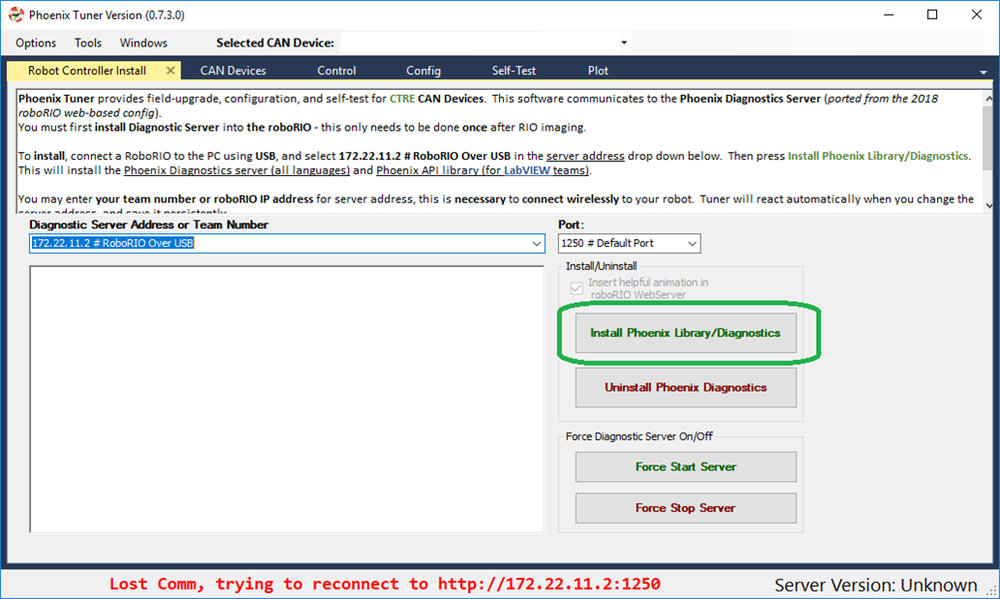

Verify the robot controller - Tuner
~~~~~~~~~~~~~~~~~~~~~~~~~~~~~~~~~~~~~~~~~~~~~~~~~~~~~~~~~~~~~~~~~~~~~~~~~~~~~~~~~~~~~~

After installation is complete, Tuner will immediately connect to the roboRIO.

Confirm the bottom status bar is green and healthy, and server version is present.

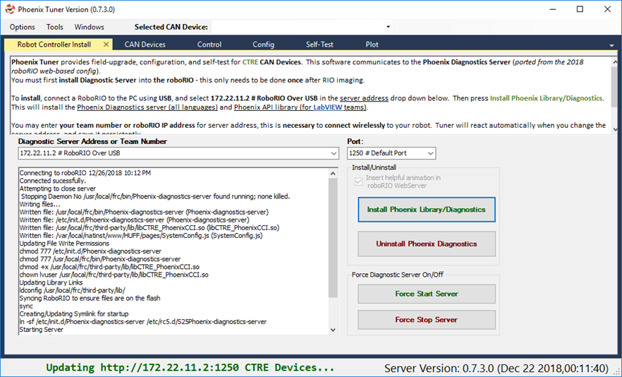

If there are CAN device present, they will appear.  However, it is possible that devices are missing, this will be resolved in the next major section (CAN Bus bring up).

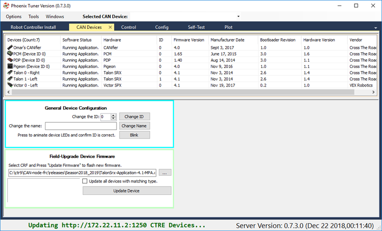

roboRIO Connection (WiFi/Ethernet)
------------------------------------------------------
The recommended connection method for control/plotter features is over **USB or using static IP (Ethernet/WiFi)**.  
The mDNS strategy used by the roboRIO can *sometimes* fail intermittently which can cause hiccups when submitting HTTP requests to the roboRIO. 

Testing has shown that using USB (172.22.11.2) or using static IP address has yielded a greater user experience than the roborio-team-frc.local host name has.

.. note:: Future releases may have improvements to circumvent the limitations of mDNS.

Verify the robot controller - LabVIEW
~~~~~~~~~~~~~~~~~~~~~~~~~~~~~~~~~~~~~~~~~~~~~~~~~~~~~~~~~~~~~~~~~~~~~~~~~~~~~~~~~~~~~~
Create a pristine LabVIEW application.  Add a CTRE device to Begin.Vi.  For example, create a Talon SRX object, even if the device is not physically present.

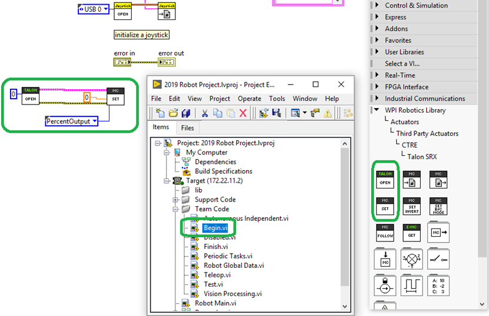

.. tip:: Drag drop the following into your Begin.vi

.. image:: img/lv-snip-1.png

Connect DS and turn on Warnings and Prints by selecting the bottom most option.

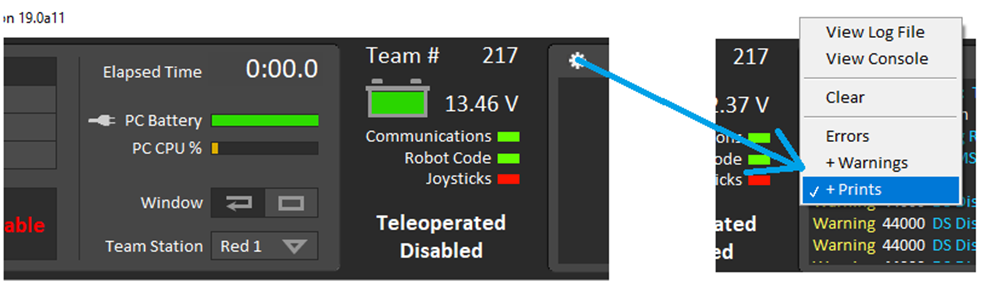

Upload the application to the robot controller and check the driver station message log.

If everything is working, the Phoenix Initialization message can be found.  
.. note:: This message will not appear after subsequent “soft” deploy (LabVIEW RAM-only temporary deploys).

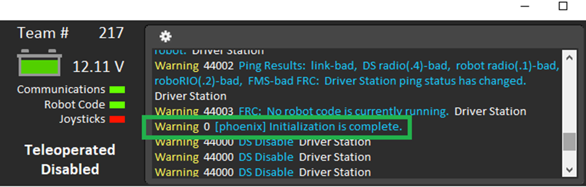

If Phoenix API has not been installed into the robot controller, this message will appear.

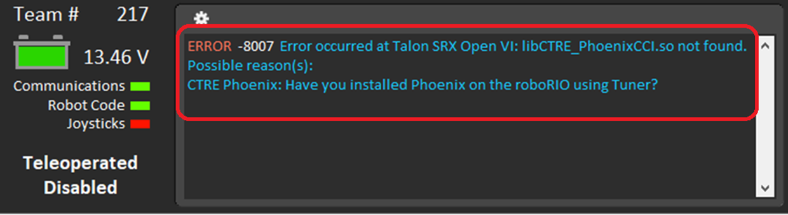

Verify the robot controller – Web page
~~~~~~~~~~~~~~~~~~~~~~~~~~~~~~~~~~~~~~~~~~~~~~~~~~~~~~~~~~~~~~~~~~~~~~~~~~~~~~~~~~~~~~

The Silverlight web interface provided in previous seasons is no longer available.

Moving forward, the NI web interface will likely be much simpler.  

As a result, Phoenix Tuner will embed a small message reminder indicating that CAN features have been moved to Tuner.

Typically, the message will disappear after 5 seconds.  This will not interfere with normal web page features (IP Config, etc…).

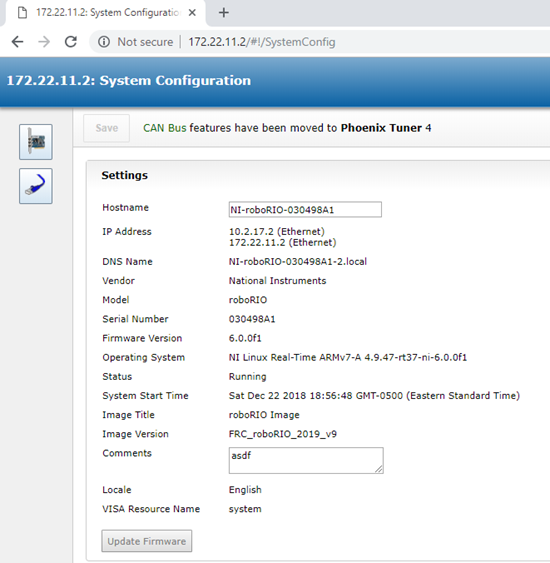

Verify the robot controller – HTTP API
~~~~~~~~~~~~~~~~~~~~~~~~~~~~~~~~~~~~~~~~~~~~~~~~~~~~~~~~~~~~~~~~~~~~~~~~~~~~~~~~~~~~~~

Tuner leverages the HTTP API provided by Phoenix Diagnostics Server.  

So technically you have already confirmed this is working.  

But, it is worth noting that this HTTP API can potentially be used by third-party software, or even the robot application itself.

Here is a simple get version command and response.

.. code-block:: html

  http://172.22.11.2:1250/?action=getversion

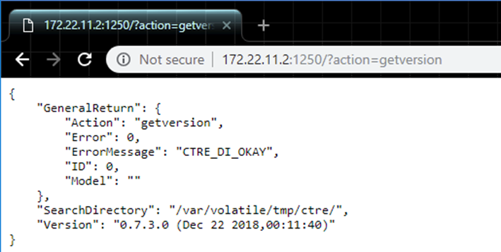

Here is a simple getdevices command and response.

.. code-block:: html

  http://172.22.11.2:1250/?action=getdevices

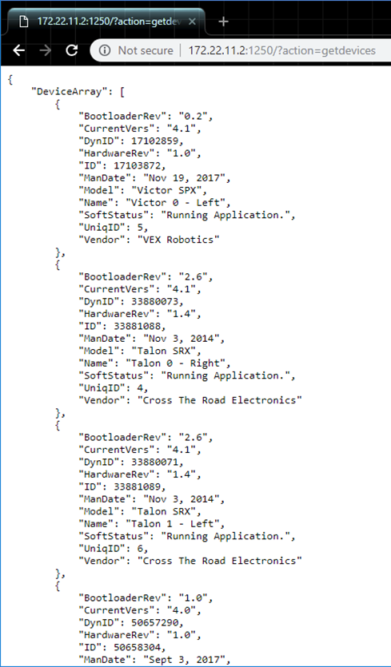

