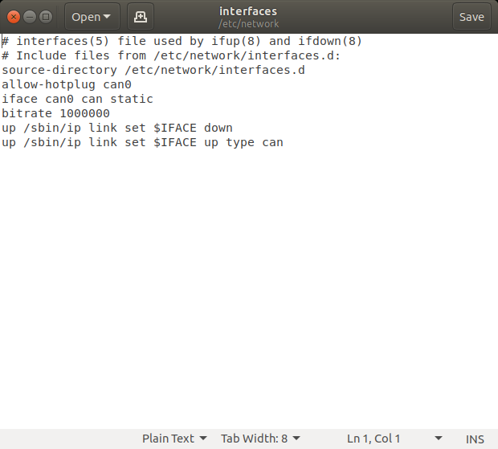

Prepare Linux Robot Controller 
======================================================
 
How to prepare Robot Controller Hardware?
~~~~~~~~~~~~~~~~~~~~~~~~~~~~~~~~~~~~~~~~~~~~~~~~~~~~~~~~~~~~~~~~~~~~~~~~~~~~~~~~~~~~~~

Image your device with the respective image below.

`Link <https://downloads.raspberrypi.org/raspbian/images/raspbian-2019-07-12/2019-07-10-raspbian-buster.zip>`_  to Raspbian desktop test image.

`Link <https://developer.nvidia.com/jetson-nano-sd-card-image-r322>`_ to Jetson Nano Developer Kit SD Card Image. 
	
Once you have your image downloaded, open Etcher (download `here <https://www.balena.io/etcher/>`_ ), select your image, SD card target and click ``Flash!``.

Once flashed insert the SD card into your device, set up a user and connect to a Wi-Fi network.

Image your Canable or other usb CAN adapter 

Update Canable firmware to candlelight `here <https://canable.io/updater/>`_.

Alternatively deploy the SocketCAN firmware to a HERO, download `here <https://github.com/CrossTheRoadElec/HERO-STM32F4>`_.

How to prepare Robot Controller Software?
~~~~~~~~~~~~~~~~~~~~~~~~~~~~~~~~~~~~~~~~~~~~~~~~~~~~~~~~~~~~~~~~~~~~~~~~~~~~~~~~~~~~~~
Once you have your Device setup open a terminal and run the following commands to install necessary files.
	
	* ``sudo apt-get upgrade``

	* ``sudo apt-get update``

	* ``sudo apt-get upgrade``

Install CAN tools with ``sudo apt-get install can-utils``.

Install git with ``sudo apt-get install git``.

Install necessary libs to build example.

	* ``sudo apt-get install cmake``

	* ``sudo ap-get install libsdl2-dev``

Clone the example repo into the user directory with ``git clone https://github.com/CrossTheRoadElec/Phoenix-Linux-SocketCAN-Example.git`` then navigate into repo with ``cd ./Phoenix-Linux-SocketCAN-Example/.``

Run the Chmod shell scripts to allow you to use them to run the example later.

	* ``chmod +x build.sh``

	* ``chmod +x clean.sh``

	* ``chmod +x canableStart.sh``
	
Bring up can 0 with ``./canableStart.sh`` 

.. note:: if you see the message ``Device or resource busy`` it means the CAN network is already up and requires no further action.

How to validate SocketCan functionality?
~~~~~~~~~~~~~~~~~~~~~~~~~~~~~~~~~~~~~~~~~~~~~~~~~~~~~~~~~~~~~~~~~~~~~~~~~~~~~~~~~~~~~~
Make sure you have talons or another CTRE CAN device connected for validation of can network.
Use ``ifconfig`` to display status of the CAN socket.
The first network listed should be can0 and should look like this 

.. image:: img/can0.png

Type ``cansend can0 999#DEADBEEF`` to send a CAN frame, your talons should now blink orange since a valid CAN message has been seen.

Use ``candump can0`` to see all incoming CAN traffic, which should display all periodic information being sent by a Talon.
You should see a constant stream of messages similar to this:

.. image:: img/candump.png

How to connect to Tuner 
~~~~~~~~~~~~~~~~~~~~~~~~~~~~~~~~~~~~~~~~~~~~~~~~~~~~~~~~~~~~~~~~~~~~~~~~~~~~~~~~~~~~~~

Open Tuner and connect to the same Wi-Fi network on the workstation and the Linux Device.

Open a terminal on the device and run ifconfig.

 
Find the ip listed under wlan0 and next to inet. 

.. note:: Depending on your connection setup the ip you want to use may be under a different wlan#.

.. image:: img/linuxWlan.png

Enter your ip into Phoenix tuner.

.. image:: img/tunerLinux.png

Press the Install button.

.. image:: img/tuner-4.png

Enter your username and password when prompted. 

.. note:: The user must have sudo permissions to successfully install Tuner.

.. image:: img/RemoteCred.png

.. note:: To find your username look at the text before the @ in the terminal. For example, in this terminal the user is ctre.

  .. image:: img/user.png

Tuner will then install and start the diagnostics server on the device.

The diagnostics server is now installed and running on your device.

Verify the robot controller - Tuner
~~~~~~~~~~~~~~~~~~~~~~~~~~~~~~~~~~~~~~~~~~~~~~~~~~~~~~~~~~~~~~~~~~~~~~~~~~~~~~~~~~~~~~

After installation is complete, Tuner will immediately connect to your device.

Confirm the bottom status bar is green and healthy, and server version is present.

.. image:: img/tuner-5.png

If there are CAN device present, they will appear.  However, it is possible that devices are missing, this will be resolved in the next major section (CAN Bus bring up).

.. image:: img/tuner-6.png

Device Connection (Wi-Fi/Ethernet)
------------------------------------------------------
The recommended connection method for control/plotter features is over **static IP (Ethernet/Wi-Fi)**.  

Field upgrade though tuner
~~~~~~~~~~~~~~~~~~~~~~~~~~~~~~~~~~~~~~~~~~~~~~~~~~~~~~~~~~~~~~~~~~~~~~~~~~~~~~~~~~~~~~
See :ref:`Field upgrade devices<field-upgrade>`.

Confirm Device is not FRC locked
~~~~~~~~~~~~~~~~~~~~~~~~~~~~~~~~~~~~~~~~~~~~~~~~~~~~~~~~~~~~~~~~~~~~~~~~~~~~~~~~~~~~~~
See 
:ref:`Confirm FRC Unlock<frc-unlock>`.

Set up hot swapping 
~~~~~~~~~~~~~~~~~~~~~~~~~~~~~~~~~~~~~~~~~~~~~~~~~~~~~~~~~~~~~~~~~~~~~~~~~~~~~~~~~~~~~~
Open a new terminal and type ``cd /etc/network/.``. 
Once inside the network directory type ``sudo gedit interfaces``.

| On Raspberry PI type ``sudo geany interfaces`` to edit the file.  

A text editor should open, add the following lines to the file 

| ``allow-hotplug can0``
| ``iface can0 can static``
| ``bitrate 1000000``
| ``up /sbin/ip link set $IFACE down`` 
| ``up /sbin/ip link set $IFACE up type can``

Once your file looks like this click save and exit out of the editor and terminal.

.. _SocketCan:

Running the SocketCan Example
~~~~~~~~~~~~~~~~~~~~~~~~~~~~~~~~~~~~~~~~~~~~~~~~~~~~~~~~~~~~~~~~~~~~~~~~~~~~~~~~~~~~~~
Build the example with ``./build.sh``. 

Then run the example with ``./bin/example``.

You're now running Phoenix on your Linux device. Confirm there are no error messages being sent to console output.

You can stop your Program with ``Ctrl+z``.

Modifying the SocketCan Example
~~~~~~~~~~~~~~~~~~~~~~~~~~~~~~~~~~~~~~~~~~~~~~~~~~~~~~~~~~~~~~~~~~~~~~~~~~~~~~~~~~~~~~
To modify the example  
Open the file explorer and navigate to the Phoenix-Linux-SocketCAN-Example folder.

.. image:: img/opening.png

Right click example.cpp and click ``Open With Other Application`` then select Text Editor from the options. For Raspberry Pi Open with Geany instead.

.. image:: img/inside.png

After modifying the file click the ``Save`` button in the top right corner then Go back to :ref:`Running the SocketCAN Example<SocketCan>` to run your modified example.

.. image:: img/editor.png

