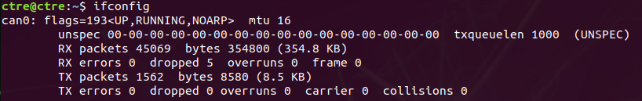
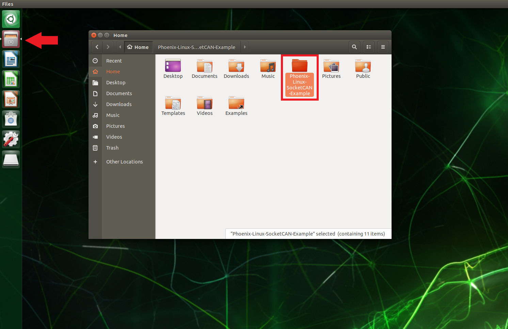
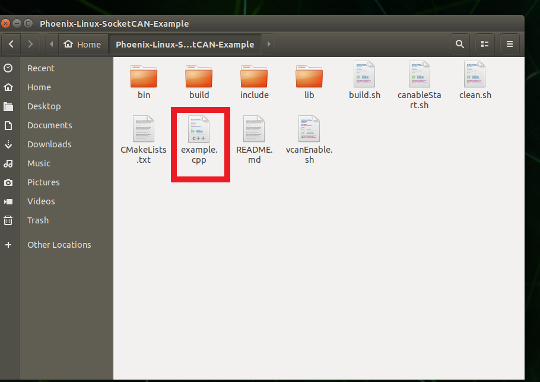
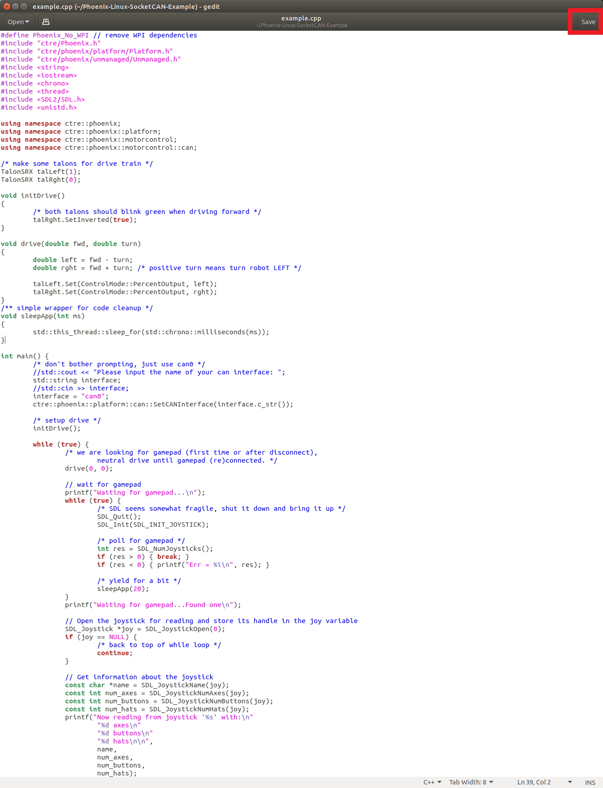
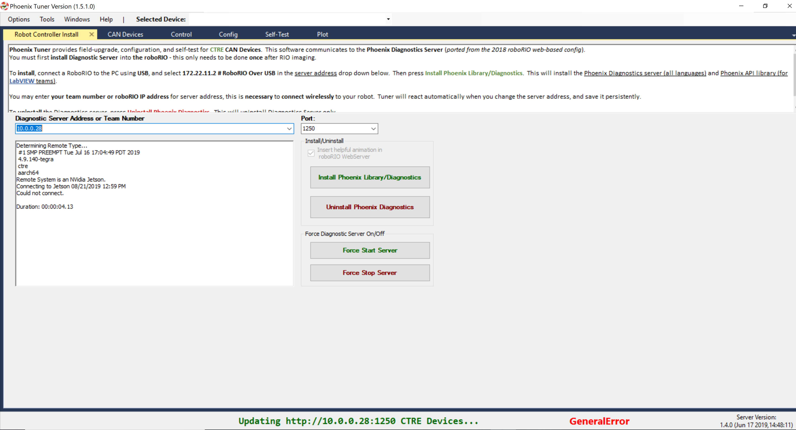
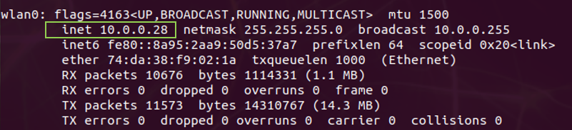

Prepare Linux Robot Controller
==============================

Why prepare Linux Robot Controller?
~~~~~~~~~~~~~~~~~~~~~~~~~~~~~~~~~~~~~~~~~~~~~~~~~~~~~~~~~~~~~~~~~~~~~~~~~~~~~~~~~~~~~~

Preparing a Linux robot controller allows CAN Device control without a roboRio for non-FRC use or as a secondary processor that can also directly control CAN Devices while still using the roboRIO for Enable/Disable Signal.

Phoenix Diagnostic Server is necessary for Phoenix Tuner to interact with CTRE CAN Devices. Tuner communicates with “Phoenix Diagnostic Server”, a Linux application that provides an HTTP API.

Supported Linux Controllers
~~~~~~~~~~~~~~~~~~~~~~~~~~~~~~~~~~~~~~~~~~~~~~~~~~~~~~~~~~~~~~~~~~~~~~~~~~~~~~~~~~~~~~

Below are the currently supported Linux hardware platforms.  An additional SocketCAN device is necessary to utilize the provided software as-is, otherwise a custom platform library is required.

 - NVidia Jetson TX2
 - NVidia Jetson Nano
 - Raspberry Pi 3
 - Raspberry Pi 4

It is possible to use other hardware platforms, however hardware and software setup may be different than this documentation.

.. note:: CTRE currently recommends the CANable for use as a SocketCAN device.  More information can be found here: https://canable.io/

How to prepare Hardware?
~~~~~~~~~~~~~~~~~~~~~~~~~~~~~~~~~~~~~~~~~~~~~~~~~~~~~~~~~~~~~~~~~~~~~~~~~~~~~~~~~~~~~~

Jetson TX2
------------------------------------------------------
Follow the documentation provided by NVidia to setup the Jetson TX2: https://developer.nvidia.com/embedded/downloads

Raspberry Pi/Jetson Nano
------------------------------------------------------
Image your device with the respective image below. Other Images can also be used, although these images have been tested and are known to be supported.

Raspbian Buster Image for Raspberry Pi: `Pi Image <https://downloads.raspberrypi.org/raspbian/images/raspbian-2019-07-12/2019-07-10-raspbian-buster.zip>`_

Jetson Nano Developer Kit SD Card Image: `Nano Image <https://developer.nvidia.com/jetson-nano-sd-card-image-r322>`_

Etcher (available `here <https://www.balena.io/etcher/>`_) is the recommended tool for flashing the image to an SD card.  With Etcher open, select your downloaded image and the SD card target, then click "Flash!".

Once flashed insert the SD card into your device, set up a user and connect to a Wi-Fi network.

CANable (SocketCAN Device)
------------------------------------------------------
Once your controller is ready, it is necessary to setup your SocketCAN device. 

To use CANable as a SocketCAN device, update the Canable firmware to "candlelight" `using these instructions <https://canable.io/updater/>`_.

Alternatively you can deploy SocketCAN firmware to a HERO. See our repository `on Github <https://github.com/CrossTheRoadElec/HERO-STM32F4>`_.

How to prepare Robot Controller Software?
~~~~~~~~~~~~~~~~~~~~~~~~~~~~~~~~~~~~~~~~~~~~~~~~~~~~~~~~~~~~~~~~~~~~~~~~~~~~~~~~~~~~~~
It is recommended to update your Linux platform software before installing the components necessary for Phoenix.

	* ``sudo apt-get update``

	* ``sudo apt-get upgrade``

Next, install the required software packages using the following commands:

 - CAN Tools ``sudo apt-get install can-utils``
 - Git ``sudo apt-get install git``
 - cmake (for build support) ``sudo apt-get install cmake``
 - libsdl2 (for gamepad support) ``sudo apt-get install libsdl2-dev``

With the necessary software installed, clone the example repository into the user directory.  This example is a basic C++ project that includes all necessary Phoenix libraries and will be used to validate the hardware and software setup.

From the user directory, run: ``git clone https://github.com/CrossTheRoadElec/Phoenix-Linux-SocketCAN-Example.git`` 

Then navigate into the repo directory: ``cd ./Phoenix-Linux-SocketCAN-Example/.``

To ensure the scripts from our cloned repository can be executed, make sure to enable execution privileges.

	* ``chmod +x build.sh``

	* ``chmod +x clean.sh``

	* ``chmod +x canableStart.sh``

Now we can initialize our SocketCAN interface.
Bring up the interface as socket "can0" by running the CANable start script:
``./canableStart.sh`` 

.. note:: if you see the message ``Device or resource busy`` it means the CAN network is already up and requires no further action.

Configure SocketCAN to allow hot swapping
------------------------------------------------------
This is necessary to be able to disconnect and reconnect your USB to CAN adapter without running bringing up the CAN network each time your usb to can adapter is reconnected.
Open a new terminal and type ``cd /etc/network/.``. 
Once inside the network directory type ``sudo gedit interfaces``.

| On Raspberry PI type ``sudo geany interfaces`` to edit the file.  

A text editor should open. Add the following lines to the file:

.. code-block:: text

	allow-hotplug can0
	iface can0 can static
	bitrate 1000000
	txqueuelen 1000
	up /sbin/ip link set $IFACE down
	up /sbin/ip link set $IFACE up type can

How to validate SocketCAN functionality?
~~~~~~~~~~~~~~~~~~~~~~~~~~~~~~~~~~~~~~~~~~~~~~~~~~~~~~~~~~~~~~~~~~~~~~~~~~~~~~~~~~~~~~
Make sure you have at least one CTRE CAN device connected for validation of the CAN network.  With no CAN traffic, device LEDs will be blinking RED.

Use the ``ifconfig`` command to list network interfaces, where you can see the status of the CAN socket.
The interfaces list should contain an entry for "can0" and should look like this:

Type ``cansend can0 999#DEADBEEF`` to send a test CAN frame.  Your CAN devices should now blink orange since a valid CAN message has been seen.

Use ``candump can0`` to see all incoming CAN traffic, which should display all periodic information being sent by a CAN Device.
You should see a constant stream of messages similar to this:

.. _SocketCan:

Running the SocketCan Example
~~~~~~~~~~~~~~~~~~~~~~~~~~~~~~~~~~~~~~~~~~~~~~~~~~~~~~~~~~~~~~~~~~~~~~~~~~~~~~~~~~~~~~
Build the example with ``./build.sh``. 

Then run the example with ``./bin/example``.

You're now running Phoenix on your Linux device. Confirm there are no error messages being sent to console output.

.. note:: You may see error messages if your CAN devices are not yet configured and firmware updated.  Follow the :ref:`Bring Up: CAN<ch08_BringUpCAN>` section to setup your CAN devices.

.. warning:: If your CTRE CAN devices were previously used with a roboRIO it is likely they are FRC locked and will not enable without a roboRIO on the CAN bus.
	See :ref:`Confirm FRC Unlock<frc-unlock>` for instructions to confirm FRC unlock.

You can stop your Program with ``Ctrl+C``.

Modifying the SocketCan Example
~~~~~~~~~~~~~~~~~~~~~~~~~~~~~~~~~~~~~~~~~~~~~~~~~~~~~~~~~~~~~~~~~~~~~~~~~~~~~~~~~~~~~~
To modify the example  
Open the file explorer and navigate to the Phoenix-Linux-SocketCAN-Example folder.

The example is a simple program, so all of the code is contained within example.cpp.  Edit this file to modify the program.

After modifying the file click the ``Save`` button in the top right corner then Go back to :ref:`Running the SocketCAN Example<SocketCan>` to run your modified example.

How to setup Phoenix Tuner?
~~~~~~~~~~~~~~~~~~~~~~~~~~~~~~~~~~~~~~~~~~~~~~~~~~~~~~~~~~~~~~~~~~~~~~~~~~~~~~~~~~~~~~

With the CAN network up and running, Phoenix Tuner can be used with the Linux Robot Controller in the same manner as the roboRIO.

.. note:: SSH must be enabled on the Linux Robot Controller to perform a field upgrade or modify a device's configuration using Phoenix Tuner.

Connect both the Linux Robot Controller and Windows machine to the same network via WiFi or an ethernet connection.

Enter the IP Address or Name of the Linux Robot Controller into Phoenix tuner.

.. tip:: To find the IP address in Linux, run the ``ifconfig`` command to display network interfaces.  The IP address will be listed under a 'lan' or 'wlan' entry and listed as inet. 
	|_Linux_IP_Image_|

Setting up the Phoenix Diagnostics Server
-----------------------------------------

The Phoenix Diagnostics Server is an HTTP server that communicates with the Phoenix Tuner. There are two versions of the server:
a standalone version installed through Phoenix Tuner (legacy), and a version built into your user program (latest). Only one version of
the diagnostics server may be running at any given time. We recommend you run the diagnostics server through your user program.

You can disable the diagnostics server in your program by adding ``c_SetPhoenixDiagnosticsStartTime(-1);`` to the start
of your main method. The line is commented out in the example program.

.. warning:: The instructions below are available for legacy support. We recommend you instead run the Phoenix Diagnostics Server in your user program.

.. warning:: The legacy instructions below currently do not work. See: https://github.com/CrossTheRoadElec/Phoenix-Linux-SocketCAN-Example/issues/15
.. raw:: html

	<strike>

To install the standalone diagnostics server:

Press the Install button.

.. image:: img/tuner-4.png

Enter your username and password when prompted. 

.. note:: The user must have sudo permissions to successfully install.

.. image:: img/RemoteCred.png

.. note:: To find your username look at the text before the @ in the terminal. For example, in this terminal the user is ctre.

  .. image:: img/user.png

Tuner will then install and start the diagnostics server on the device.

The diagnostics server is now installed and running on your device.

.. raw:: html

	</strike>

Verify the robot controller - Tuner
~~~~~~~~~~~~~~~~~~~~~~~~~~~~~~~~~~~~~~~~~~~~~~~~~~~~~~~~~~~~~~~~~~~~~~~~~~~~~~~~~~~~~~

After installation is complete, Tuner will immediately connect to your device.

Confirm the bottom status bar is green and healthy, and server version is present.  If this is not the case and you are using the standalone server (legacy), you may need to re-start the Diagnostic Server by using the "Force Stop Server" and "Force Start Server" buttons.

.. image:: img/tuner-5.png

If there are CAN device present they will appear in the "CAN Devices" tab.  However, it is possible that devices will appear to be missing - this will be resolved in "Bring Up: CAN Bus".

.. image:: img/tuner-6.png

