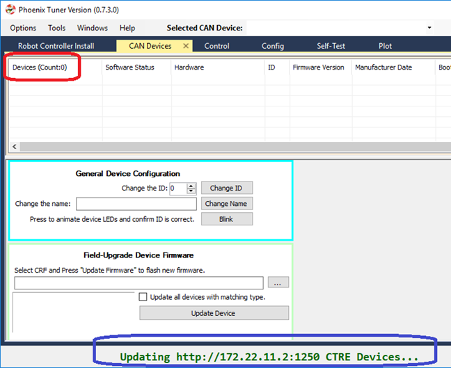
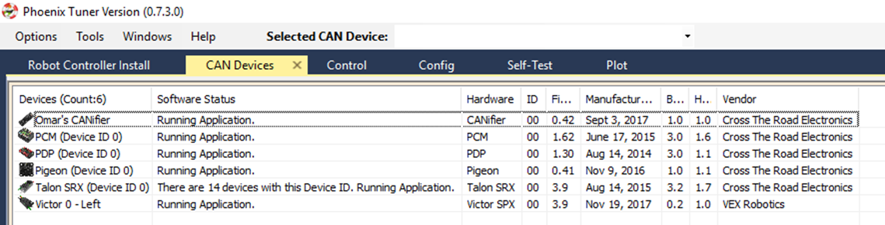
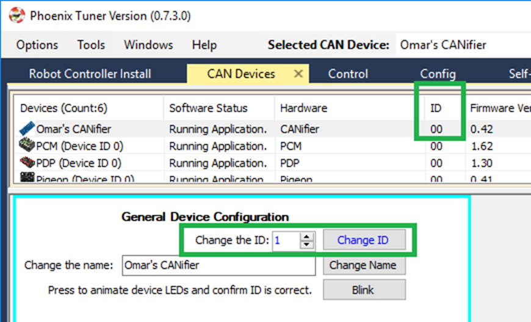
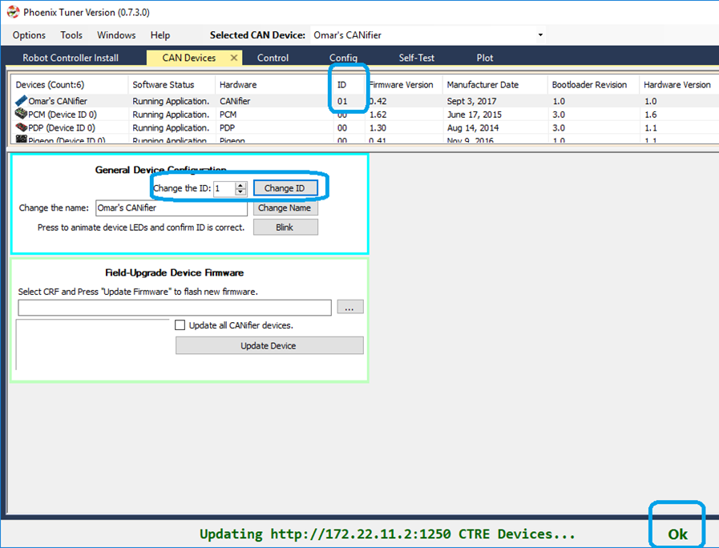
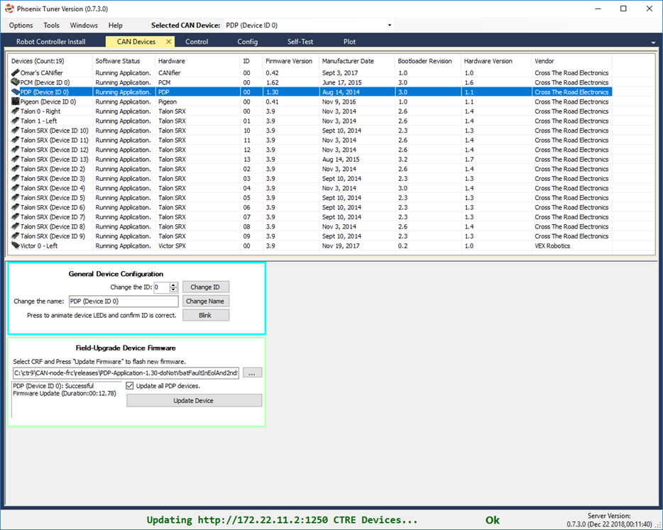
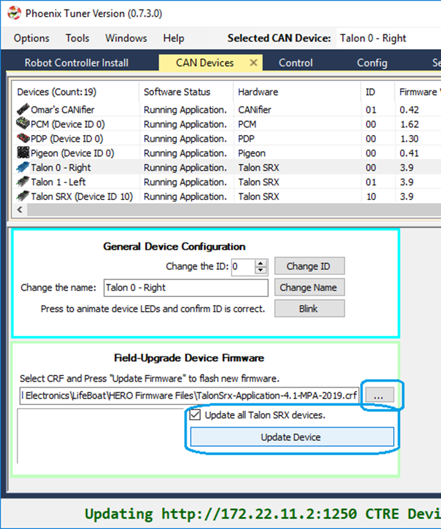
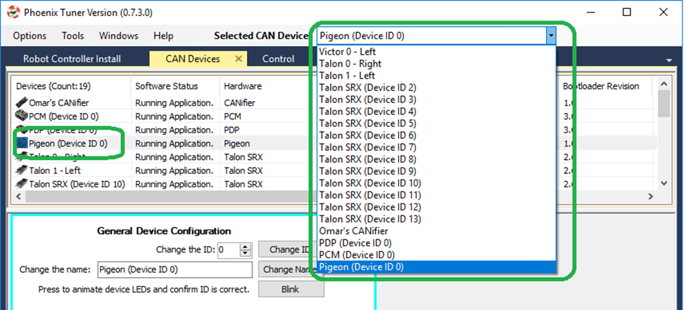
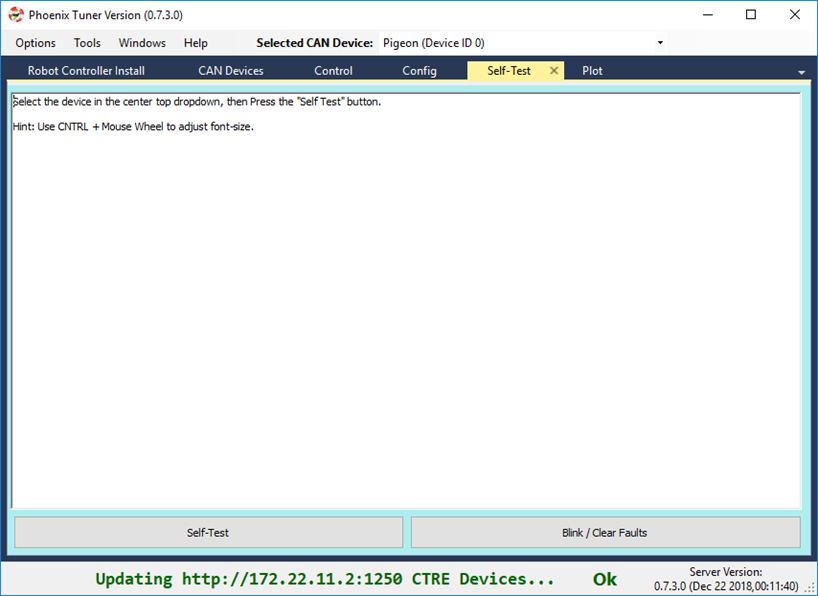
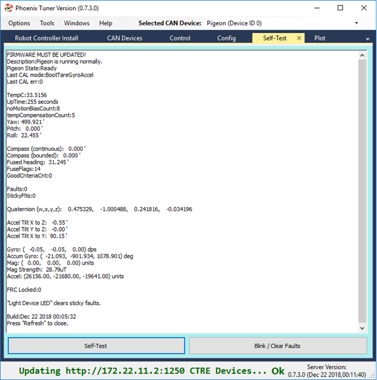
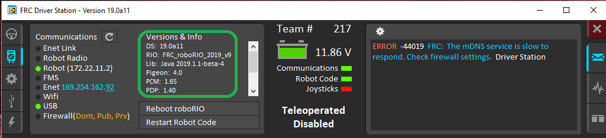

Bring Up: CAN Bus 
=================

Now that all of the software is installed and verified, the next major step is to setup hardware and firmware.

Understand the goal
~~~~~~~~~~~~~~~~~~~~~~~~~~~~~~~~~~~~~~~~~~~~~~~~~~~~~~~~~~~~~~~~~~~~~~~~~~~~~~~~~~~~~~

At this point we want to have reliable communication with CAN devices.  
There are typically two failure modes that must be resolved:

- There are same-model devices on the bus with the same device ID (devices have a default device ID of ‘0’). 
- CAN bus is not wired correctly / robustly.

This is why during hardware validation, you will likely have to isolate each device during hardware validation to assign a unique device ID.   

.. note:: CTRE software has the ability to resolve device ID conflicts without device isolation, and CAN bus is capable of reporting the health of the CAN bus (see Driver Station lightening tab).  However, the problem is when **both** root-causes are occurring at the same time, this can confuse students who have no experience with CAN bus systems.

.. note:: Many teams will preassign and update devices (Talon SRXs for example) long before the robot takes form.  This is also a great task for new students who need to start learning the control system (with the appropriate mentor oversight to ensure hardware does not get damaged).  

.. note:: Label the devices appropriately so there is no guessing which device ID is what. Don’t have a label maker?  Use tape and/or Sharpie (sharpie marks can be removed with alcohol).

.. note:: “Once you eliminate the impossible, whatever remains, no matter how improbable, must be the truth.”  Keep this in mind when troubleshooting.

Check your wiring
~~~~~~~~~~~~~~~~~~~~~~~~~~~~~~~~~~~~~~~~~~~~~~~~~~~~~~~~~~~~~~~~~~~~~~~~~~~~~~~~~~~~~~

Specific wiring instructions can be found in the user manual of each product, but there are common steps that must be followed for all devices:

- If connectors are used for CANBus, **tug-test each individual crimped wire** one at a time.  Bad crimps/connection points are the most common cause of intermittent connection issues.
- Confirm red and black are not flipped.  **Motor Controllers typically are not reverse power protected**.
- Confirm battery voltage is adequate (through Driver Station or through voltmeter).
- Manually inspect and confirm that green-connects-to-green and yellow-connect-to-yellow at every connection point. **Flipping/mixing green and yellow is a common failure point during hardware bring up**.
- Confirm breakers are installed in the PDP where appropriate.
- Measure resistance between CANH and CANL when system is not powered. Should measure ~60Ω.  If the measurement is 120Ω, then confirm both RIO and PDP are in circuit, and PDP jumper is in the correct location.

Open Phoenix Tuner
~~~~~~~~~~~~~~~~~~~~~~~~~~~~~~~~~~~~~~~~~~~~~~~~~~~~~~~~~~~~~~~~~~~~~~~~~~~~~~~~~~~~~~

Navigate to the CAN devices page.  

This capture is taken with no devices connected to the RIO.  RIO will take around 30 seconds to boot.

Power up and check LEDs
~~~~~~~~~~~~~~~~~~~~~~~~~~~~~~~~~~~~~~~~~~~~~~~~~~~~~~~~~~~~~~~~~~~~~~~~~~~~~~~~~~~~~~

Power up the platform (robot, bench setup, etc) and confirm LEDs are illuminated (at all) on all devices.  

You may find many of them are blinking or “blipping” red (no communication) either all the time, or when you shake/jostle the wiring.  

.. tip:: If you are color-blind or unable to determine color-state, grab another team member to assist you.

.. note:: If using Ribbon cabled Pigeon IMUs, Pigeon LEDs will reflect the ribbon cable, not the CAN bus.  At which point any comm issue with Pigeon will be resolved under section Bring Up: Pigeon IMU.

LEDs are red – now what?
~~~~~~~~~~~~~~~~~~~~~~~~~~~~~~~~~~~~~~~~~~~~~~~~~~~~~~~~~~~~~~~~~~~~~~~~~~~~~~~~~~~~~~

We need to rule out same-id versus bad-bus-wiring.  
There are two approaches.  
Approach 1 will help troubleshoot bad wiring and common IDs.  
Approach 2 will only be effective in troubleshooting common IDs.  But this method is noteworthy because it is simple/quick (no wiring changes, just pull breakers).

The specific instructions for changing device ID are in the next section. Review this if needed.

Approach 1 (best)
------------------------------------------------------
Procedure:

- **Physically power and connect CAN bus from roboRIO to one device only.  Circumvent your wiring if need be.**
- Power boot robot/bench setup.
- Open Phoenix Tuner and wait for connection (RIO may take ~30 seconds to boot)
- Open CAN devices tab
- Confirm if CAN device appears. 
- Use Tuner to change the device ID
- Label the new ID on the physical device
- Repeat this procedure for every device. 

If you find a particular device where communication is not possible, scrutinize devices power and CAN connection to RIO.  Make the test setup so simple that the only failure mode possible is within the device itself.  

.. note:: Typically, there must be two termination resistors at each end of the bus. One is in the RIO and one is in the PDP.  But during bring-up, if you keep your harness short (such as the 1ft pigtail leads from a single Talon) then the internal resistor in the RIO is adequate.

Approach 2 (easier)
------------------------------------------------------
Procedure:

- **Leave CAN bus wiring as is.**
- **Pull breakers and PCM fuse from PDP.**
- **Disconnect CAN bus pigtail from PDP.**
- **Pick the first device to power up and restore breaker/fuse/pigtail so that only this CAN device is powered.**
- Power boot robot/bench setup.
- Open Phoenix Tuner and wait for connection (RIO may take ~30 seconds to boot)
- Open CAN devices tab
- Confirm if CAN device appears. If device does not appear scrutinize devices power and CAN connection to RIO.
- Use Tuner to change the device ID
- Label the new ID on the physical device
- Repeat this procedure for every device.

If you find a particular device or section of devices where communication is not possible, then the CAN bus wiring needs to be re-inspected.  Remember to “flick” / “shake” / “jostle” the CAN wiring in various sections to attempt to reproduce red LED blips.  This is a sure sign of loose contact points.

If you are able to detect and change device ID on your devices individually, begin piecing your CAN bus together.  Start with roboRIO ---- device --- PDP, to ensure termination exists at both ends.  Then introduce the remaining devices until a failure is observed or until all devices are in-circuit.  If introducing a new device creates a failure symptom, scrutinize that device by replacing it, inspecting common wires, and inspecting power.

.. note:: If 2014 PDP is the only device that does not appear or has red LEDs, see PDP boot up section for specific failure mode.

.. note:: If ribbon cable Pigeon does not appear, it likely is because Talon has old firmware.

At the end of this section, all devices should appear (notwithstanding the above notes) and device LEDs should not be red. PCM, Talon, Victor, Pigeon, and CANifier typically blink orange when they are healthy and not controlled.  PDP may be orange or green depending on its sticky faults.

Set Device IDs
~~~~~~~~~~~~~~~~~~~~~~~~~~~~~~~~~~~~~~~~~~~~~~~~~~~~~~~~~~~~~~~~~~~~~~~~~~~~~~~~~~~~~~

.. note:: A CTRE device can have an ID from 0 to 62.  If you select an invalid ID, you will generally get an immediate prompt.

Below we see several devices, however the physical robot has 19 actual devices.
Because all the Talons have a device ID of ‘0’, the do not show up as unique hardware.  This must be resolved before you can attempt utilizing them.

.. note:: We recommend isolating each device and assigning a unique ID first.  But in the event there is a conflict, expect an entry mentions multiple devices.  When select a device, the actually physical device selected will be the conflict-id device that booted last.  You can use this information to control which Talon you are resolving by power cycling the conflict device, then changing its ID in Tuner.

Select the device and use the numeric entry to change the ID. Note the text will change blue when you do this.  Then press Change ID to apply the changes.

If operation completes, and OK will appear in the bottom status bar (this is true of all operations).  Also note the ID has updated in the device list, and the ID text is now black again.

.. tip:: All production CTRE hardware ships with a default ID of ‘0’. As a result, it is useful to start your devices at device ID ‘1‘, so you can cleanly add another out-of-box device without introducing a conflict.

When complete, make sure every device is visible in the view.  Use the Blink button on each device to confirm the ID matches the expected physical device.

.. note:: The device count is present in the top left corner of the device list.  Use this to quickly confirm all devices are present.

.. note:: If ribbon-cabled pigeon is not present, then the host talon likely has old firmware.

Field upgrade devices
~~~~~~~~~~~~~~~~~~~~~~~~~~~~~~~~~~~~~~~~~~~~~~~~~~~~~~~~~~~~~~~~~~~~~~~~~~~~~~~~~~~~~~

At this point all devices are present, but the firmware is likely old.  

The 2019 seasons has 4.X firmware for Talon SRX, Victor SPX, CANifier, and Pigeon IMU.
4.X firmware is required for 2019 targeted Phoenix API and Tuner releases.

.. note:: Latest PDP is 1.40.  PDP typically ship with 1.30.  1.40 has a math fix for the energy measurement, and will tare the current measures so current will read 0 instead of ~1-2 amps when there is no current-draw .

.. note:: Latest PCM is 1.65.  PCM typically ship with 1.62.  Firmware 1.65 has an improvement where hardware-revision 1.6 PCMs will not-interrupt compressor when blacklisting a shorted solenoid channel.  Older revisions will pause the compressor in order to safely sticky-fault, new revisions have no need to do this (if firmware is up to date).

Select the CRF under the Field-upgrade section then press Update Device.
The CRFs are available in multiple places, and likely are already on your PC/
See section “Device Firmware Files (crf)”.

If there are multiple devices of same type (multiple Talon SRXs for example), you may check Update all devices.  This will automatically iterate through all the devices of the same type, and update them.  If a device field-upgrade fails, then the operation will complete.  Confirm Firmware Version column in the device list after field-upgrade.

.. note:: Each device takes approximately 15 seconds to field-upgrade.

When complete every device should have latest firmware.

Pick device names (optional)
~~~~~~~~~~~~~~~~~~~~~~~~~~~~~~~~~~~~~~~~~~~~~~~~~~~~~~~~~~~~~~~~~~~~~~~~~~~~~~~~~~~~~~

The device name can also be changed for certain device types:
- CANifier
- Pigeon IMU (on CAN bus only)
- Talon SRX and Victor SPX

.. note:: PDP and PCM do not support this.
.. note:: Ribbon cabled Pigeon IMUs do not support this.
.. note:: To re-default the custom name, clear the “Name” text entry so it is blank and press “Save”.

Self-test
~~~~~~~~~~~~~~~~~~~~~~~~~~~~~~~~~~~~~~~~~~~~~~~~~~~~~~~~~~~~~~~~~~~~~~~~~~~~~~~~~~~~~~

At this point every device should be present on the bus, and updated to latest.
This is an opportune time to test the self-test feature of each device. 

Select each device either in the device list, or using the dropdown at the center-top.
This dropdown is convenient as it is accessible regardless of how the tabs are docked with Tuner.

.. note:: If you press the “Selected CAN device” text next to dropdown, you will be taken back to the CAN Devices tab.

Navigate to the self-test tab.  If self-test tab is not present, use the Windows menu bar to reopen it.

Press self-test button and confirm the results.  

.. note:: This Pigeon has not had its firmware updated, this is reported at the top.

You can also use the Blink/Clear faults button to blink the selected device and clear any previously logged sticky faults.

Driver Station Versions Page
~~~~~~~~~~~~~~~~~~~~~~~~~~~~~~~~~~~~~~~~~~~~~~~~~~~~~~~~~~~~~~~~~~~~~~~~~~~~~~~~~~~~~~

It is worth mentioning there is basic support of reporting the CAN devices and their versions in the diagnostics tab of the Driver Station.

If there is a mixed collection of firmware versions for a given product type, the version will report "Inconsistent".

.. note:: The recommended method for confirming firmware versions is to use Phoenix Tuner.

.. note:: There is a known issue where ribbon-cabled Pigeons may erroneously report as a Talon.  Since this is not a critical feature of the Driver Station, this should not be problematic for FRC teams.
