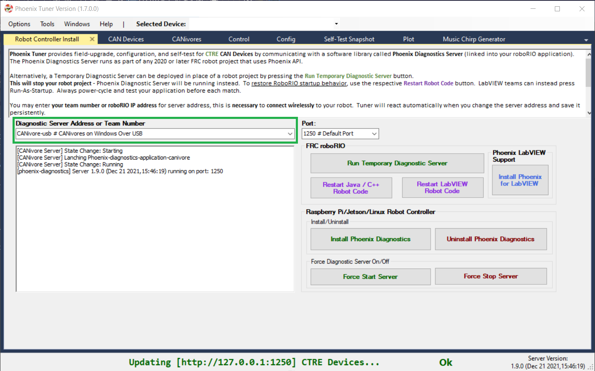
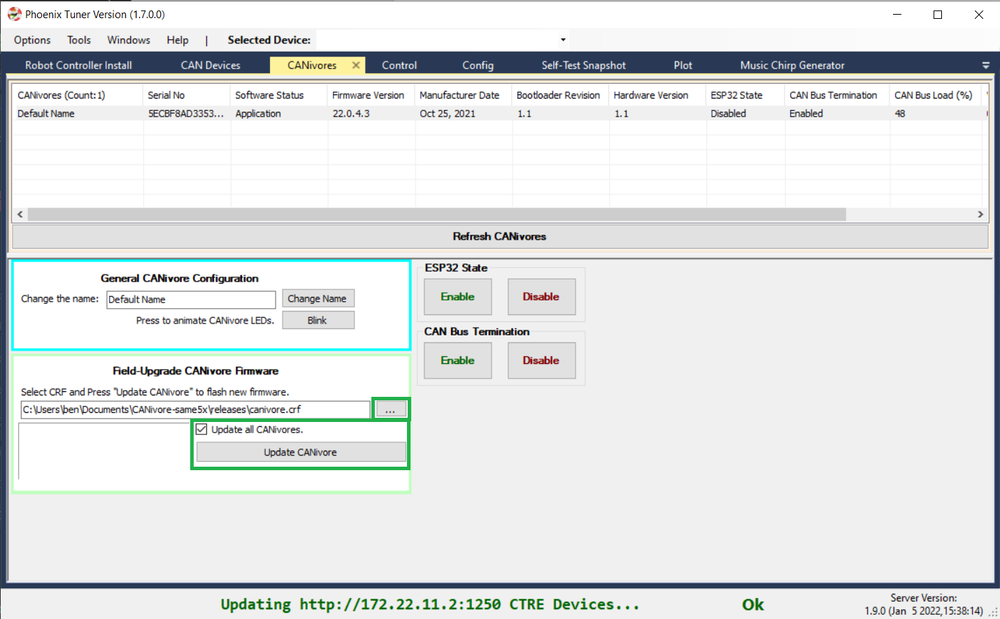

.. _ch08a_BringUpCANivore:

Bring Up: CANivore 
==================

Supported systems
~~~~~~~~~~~~~~~~~~~~~~~~~~~~~~~~~~~~~~~~~~~~~~~~~~~~~~~~~~~~~~~~~~~~~~~~~~~~~~~~~~~~~~
Currently, the following systems are supported for CANivore development:

- roboRIO
- Windows

View attached CANivores
~~~~~~~~~~~~~~~~~~~~~~~~~~~~~~~~~~~~~~~~~~~~~~~~~~~~~~~~~~~~~~~~~~~~~~~~~~~~~~~~~~~~~~
Open Phoenix Tuner, go to the CANivores tab, and click on the Refresh CANivores button to get a list of CANivores
attached to the target system. You can specify the target system in the Robot Controller Install tab.

.. image:: img/bring-8a-list.png

.. note:: The Phoenix Diagnostic Server must be running on the target system to use the CANivores page.

.. tip:: If you are connecting to CANivores on your local Windows machine, there is a CANivore-usb option in the Diagnostic Server Address dropdown.
	This option runs a diagnostic server within Tuner so you do not need to run a robot project to communicate with CANivores.
	|_Windows_CANivore_USB_Image_|

Field upgrade CANivores
~~~~~~~~~~~~~~~~~~~~~~~~~~~~~~~~~~~~~~~~~~~~~~~~~~~~~~~~~~~~~~~~~~~~~~~~~~~~~~~~~~~~~~
In the CANivores tab of Phoenix Tuner, select the CANivore you wish to update.
Select the CRF under the Field-upgrade section then press Update Device.
The CRFs are available in multiple places, and likely are already on your PC. See section :ref:`Device Firmware Files (crf)`.

If you wish to update all attached CANivores, check Update all CANivores. If a CANivore field-upgrade fails, then the operation will complete.
Confirm Firmware Version column in the device list after field-upgrade.

Rename CANivores
~~~~~~~~~~~~~~~~~~~~~~~~~~~~~~~~~~~~~~~~~~~~~~~~~~~~~~~~~~~~~~~~~~~~~~~~~~~~~~~~~~~~~~
CANivores can be given custom names for use within a robot program.
Select the CANivore you wish to rename. Under the General CANivore Configuration section, set the new name and click "Change Name".

.. note:: CANivore names cannot be longer than 32 characters.

.. note:: To re-default the custom name, clear the “Name” text entry so it is blank and press “Change Name”.

.. image:: img/bring-8a-name.png

Configure CAN bus termination
~~~~~~~~~~~~~~~~~~~~~~~~~~~~~~~~~~~~~~~~~~~~~~~~~~~~~~~~~~~~~~~~~~~~~~~~~~~~~~~~~~~~~~
The CANivore has a 120-ohm programmable resistor for terminating the CAN bus. The resistor can be configured using the CAN Bus Termination
Enable and Disable buttons in the CANivores tab of Phoenix Tuner.
The current state of the terminating resistor can be seen in the "CAN Bus Termination" column of the list of CANivores.

.. note:: A CAN bus requires two terminating resistors - one at each extreme end. If only one is present, communication over CAN may fail.

.. image:: img/bring-8a-can-termination.png

Configure ESP32
~~~~~~~~~~~~~~~~~~~~~~~~~~~~~~~~~~~~~~~~~~~~~~~~~~~~~~~~~~~~~~~~~~~~~~~~~~~~~~~~~~~~~~
The CANivore includes an **ESP32 module** which provides the ability to **run custom code**, which in turn allows **access to Wi-Fi and Bluetooth features**.
By default, the ESP32 is disabled and held in reset.  Users can enable the ESP32 via Phoenix Tuner so that it is allowed to run.

CANivore provides a software USB COM port, which typical ESP32 software tools can use to deploy and debug.

**Examples will be coming soon!**

The current state of the ESP32 can be seen in the "ESP32 State" column of the list of CANivores.

.. tip:: For convenience, the software USB COM port is always available and can be used to deploy an ESP32 application even if setting is disabled.  However ESP will not boot up after power reset if setting is disabled.

.. warning:: FRC rules *typically* require that no device is allowed to emit wireless signals during an FRC competition.
	Teams are encouraged to read the latest game rules and disable ESP32 during competition use if need be.

.. image:: img/bring-8a-ESP32.png

CANivore API
~~~~~~~~~~~~~~~~~~~~~~~~~~~~~~~~~~~~~~~~~~~~~~~~~~~~~~~~~~~~~~~~~~~~~~~~~~~~~~~~~~~~~~
In the constructors for CANivore-compatible CAN devices, there is an optional string parameter to set the device's CAN bus.
This string can be the CANivore's name or serial number.

.. note:: On the roboRIO, if no CAN bus string is passed into the constructor, or the CAN bus string is empty, the device will use the roboRIO native CAN bus.
	Otherwise, the device will use the first CANivore found.

.. note:: You can explicitly specify that a device should use the roboRIO native CAN bus by passing down "rio" or "roborio".

.. code-block:: java

	TalonFX fx_default = new TalonFX(0);
	TalonFX fx_rio = new TalonFX(1, "rio");
	TalonFX fx_drivebase = new TalonFX(0, "Drivebase");
	CANCoder cc_elevator = new CANCoder(0, "Elevator");

CANivore Status Prints
~~~~~~~~~~~~~~~~~~~~~~~~~~~~~~~~~~~~~~~~~~~~~~~~~~~~~~~~~~~~~~~~~~~~~~~~~~~~~~~~~~~~~~
When working with CANivore CAN buses in a robot program, Phoenix prints some messages to report the state of the
CANivore connection. These messages can be useful to debug connection issues (bad USB vs bad CAN) or report bugs
to CTR Electronics.

.. list-table:: Connection Messages
	:widths: 50 80
  	:header-rows: 1

	* - Message
	  - Connection Status
	* - CANbus Failed to Connect
	  - Could not connect to a CANivore with the given name or serial number
	* - CANbus Connected
	  - Successfully found and connected to the CANivore with the given name or serial number
	* - CANbus Disconnected
	  - Detected that a CANivore USB device has been disconnected

.. list-table:: CANivore Bring-up Messages (Linux only)
	:widths: 50 80
  	:header-rows: 1

	* - Message
	  - Bring-up Status
	* - CANbus Failed Bring-up
	  - Found and connected to the CANivore, but it could not configure the device or start the network
	* - CANbus Successfully Started
	  - Successfully configured the CANivore and started the network

.. list-table:: Network State Messages
	:widths: 50 80
  	:header-rows: 1

	* - Message
	  - Network State
	* - CANbus Network Down
	  - | Linux: The SocketCAN network has been deactivated, USB-to-CAN activity has stopped
	    | Windows: Could not open the communication channels for USB-to-CAN traffic
	* - CANbus Network Up
	  - | Linux: The SocketCAN network has been activated, USB-to-CAN activity has resumed
	    | Windows: Successfully opened the communication channels for USB-to-CAN traffic
     

caniv - CANivore CLI
~~~~~~~~~~~~~~~~~~~~~~~~~~~~~~~~~~~~~~~~~~~~~~~~~~~~~~~~~~~~~~~~~~~~~~~~~~~~~~~~~~~~~~
``caniv`` is a Command-line Interface (CLI) to interact with CANivores outside of Phoenix Tuner.

After running any action on the CANivores page of Phoenix Tuner, Latest ``caniv`` is deployed to the target system. 

.. note:: Unlike the CANivores page in Phoenix Tuner, ``caniv`` does **not** require a running Phoenix Diagnostic Server.

On Linux systems (including the roboRIO), ``caniv`` can be found at /usr/local/bin. On Windows systems, the program
is in the Phoenix Tuner install location, under Binary\\windows\\ctre.

To view a list of available commands, run ``caniv`` either with no parameters or with ``--help``.

