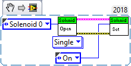
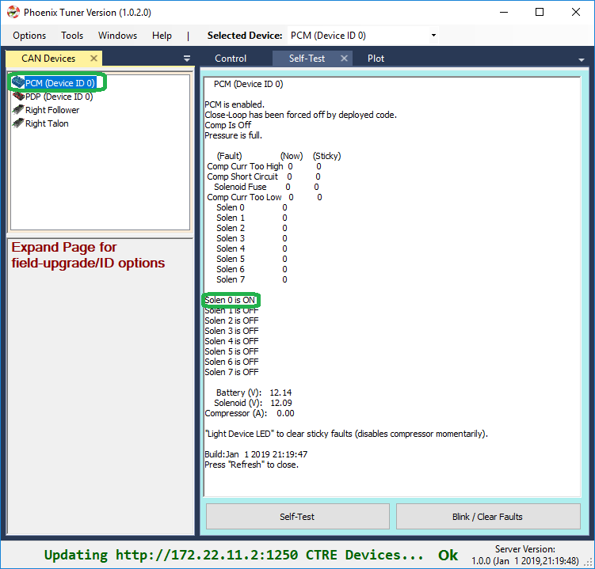
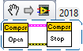

Bring Up: PCM
=============

At this point PCM will have firmware 1.62 or 1.65 (latest).  Open Phoenix Tuner to confirm.

Phoenix Tuner Self-Test
~~~~~~~~~~~~~~~~~~~~~~~~~~~~~~~~~~~~~~~~~~~~~~~~~~~~~~~~~~~~~~~~~~~~~~~~~~~~~~~~~~~~~~

Press self-test to confirm solenoid states, compressor state ,and battery/current measurements.
Since device is not enabled, no outputs should assert.

.. image:: img/bring-10.png

.. note:: In this view, the Self-Test was docked to the right.  If CAN Devices width is shrunk small enough, the field-upgrade and Device ID options are hidden and the list view becomes collapsed.  This way you can still use the device list as an alternative to the center-top dropdown.

The next step is to get the compressor and solenoids operational.

Create a Solenoid object in LabVIEW/C++/Java and set channel 0 to true.

.. code-block:: java

    import edu.wpi.first.wpilibj.Solenoid;
    public class Robot extends TimedRobot {
        Solenoid _solenoid = new Solenoid(0, 0); // first number is the PCM ID (usually zero), second number is the solenoid channel

        public void teleopPeriodic() {
            _solenoid.set(true);
        }

.. tip:: Image below can be dragged/dropped into LabVIEW editor.

Then confirm using the Solenoid LED on the PCM and self-test in Tuner.

Generally creating a solenoid object is sufficient for the compressor features to function.
In order for the compressor output to activate, all of the following conditions must be met:

- The robot is enabled via the Driver Station 
- Robot application has created a solenoid (or compressor object) with the correct PCM device ID.
- PCM must be powered/wired to CAN Bus.
- Pressure-switch reads too-low (can be confirmed in Self-Test).
- No compressor related faults occur (can be confirmed in Self-Test)

.. tip:: Creating a compressor object is not necessary, but can be useful to force the compressor **off despite pressure reading too-low** with the setClosedLoopControl routine/VI.  This can be useful for robot power management during critical operations.

.. code-block:: java

    
    import edu.wpi.first.wpilibj.Compressor;
    public class Robot extends TimedRobot {
        Compressor _compressor = new Compressor();

        public void teleopPeriodic() {
            _compressor.setClosedLoopControl(false); //This will force the compressor off
        }

.. tip:: Image below can be dragged/dropped into LabVIEW editor.

