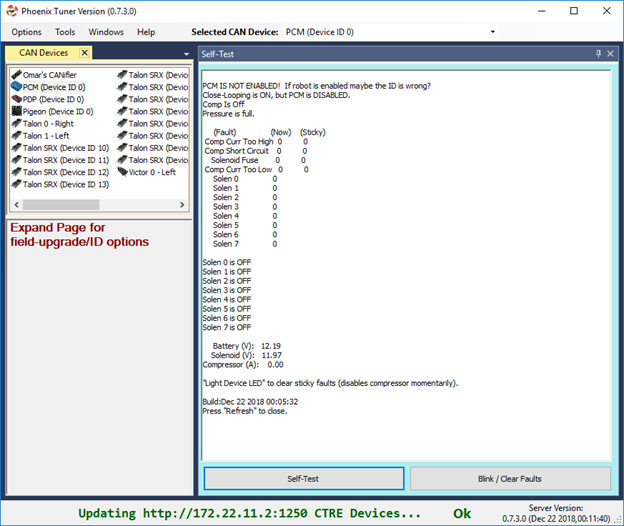

Bring Up: PCM
=============

At this point PCM will have firmware 1.62 or 1.65 (latest).  Open Phoenix Tuner to confirm.

Phoenix Tuner Self-Test
~~~~~~~~~~~~~~~~~~~~~~~~~~~~~~~~~~~~~~~~~~~~~~~~~~~~~~~~~~~~~~~~~~~~~~~~~~~~~~~~~~~~~~

Press self-test to confirm solenoid states, compressor state ,and battery/current measurements.
Since device is not enabled, no outputs should assert.

.. note:: In this view, the Self-Test was docked to the right.  If CAN Devices width is shrunk small enough, the field-upgrade and Device ID options are hidden and the list view becomes collapsed.  This way you can still use the device list as an alternative to the center-top dropdown.

The next step is to get the compressor and solenoids operational.

The PCM User’s guide will have the details on how to accomplish this. 
http://www.ctr-electronics.com/pcm.html#product_tabs_technical_resources

Create a Solenoid object in LabVIEW/C++/Java and set channel 0 to true.
Then confirm using the Solenoid LED on the PCM and self-test in Tuner.

After creating a solenoid object, the compressor will automatically engage if the robot is enabled via the Driver Station and if pressure-switch reads too-low (also confirm in self-test).
