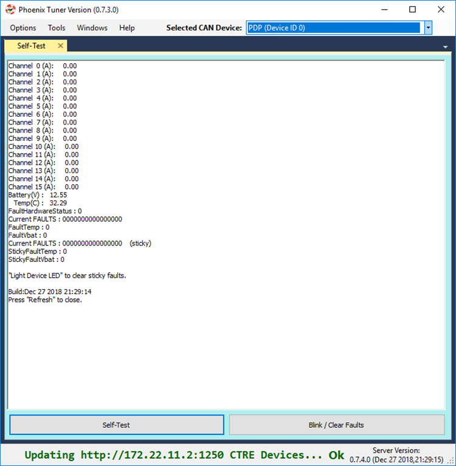
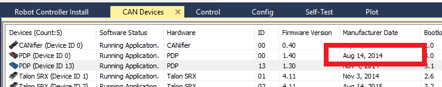

Bring Up: PDP
=============

At this point PDP will have firmware 1.40 (latest).  Open Phoenix Tuner to confirm.

Use Self-Test to confirm reasonable values for current and voltage.

Getting sensor data
~~~~~~~~~~~~~~~~~~~~~~~~~~~~~~~~~~~~~~~~~~~~~~~~~~~~~~~~~~~~~~~~~~~~~~~~~~~~~~~~~~~~~~
Sensor data can also be retrieved using the base FRC API available in LabVIEW/C++/Java.
See WPI/NI/FRC documentation for how.

DriverStation Logs
~~~~~~~~~~~~~~~~~~~~~~~~~~~~~~~~~~~~~~~~~~~~~~~~~~~~~~~~~~~~~~~~~~~~~~~~~~~~~~~~~~~~~~
Driver Station logs are automatically generated during normal FRC use.  This includes current logging on all PDP Wago channels.  Review WPI/NI/FRC documentation for how leverage this.

2015 Kick off Kit PDPs
~~~~~~~~~~~~~~~~~~~~~~~~~~~~~~~~~~~~~~~~~~~~~~~~~~~~~~~~~~~~~~~~~~~~~~~~~~~~~~~~~~~~~~
There is a known issue with 2015 Kickoff-Kit PDPs where the PDP will not appear on CAN bus and/or LEDs will be red, despite all other devices on the CAN bus functioning properly. This is due to an ESD vulnerability that only exists in the initial manufacture run in 2014.  Every season PDP afterwards does not have this issue.  

Manufacture date of the PDP can be checked in Tuner.  Any PDP with a manufacture date of August 14, 2014 may have this issue.  No other PDPs (even those with other 2014 manufacture dates) are known to be affected.

These PDPs do correctly provide power and terminate the CAN bus with no compromises.  However, the current measurement features may not be correct or available on this version of PDP.  If such a PDP is re-used or re-purposed, we recommend using it on your practice robot or for bench setups, and not for competition.

