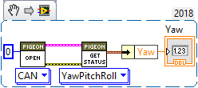
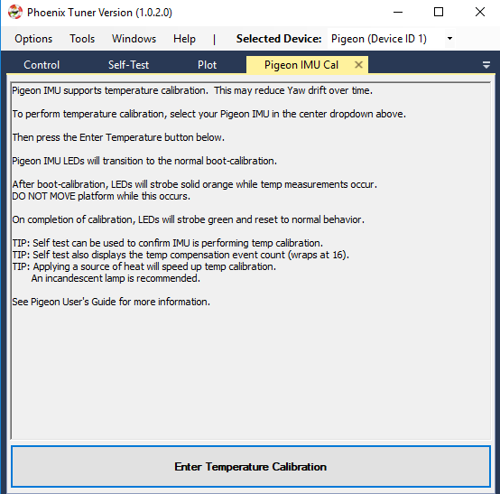
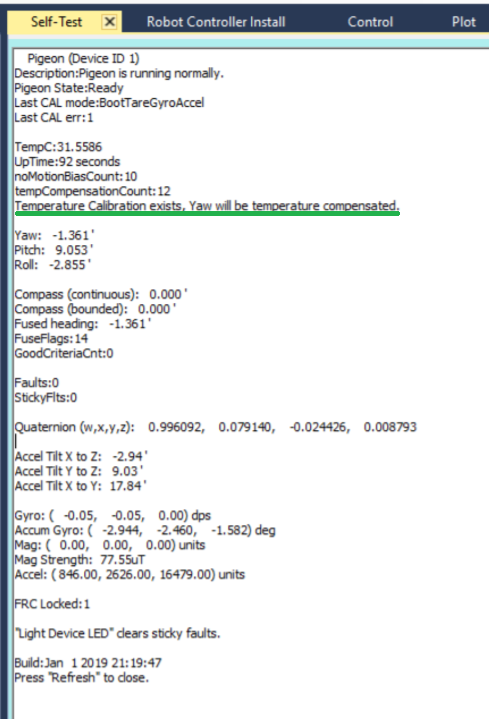

.. _ch11_BringUpPigeon:

Bring Up: Pigeon IMU
====================

Power Boot
~~~~~~~~~~~~~~~~~~~~~~~~~~~~~~~~~~~~~~~~~~~~~~~~~~~~~~~~~~~~~~~~~~~~~~~~~~~~~~~~~~~~~~

Power boot the robot and wait for Pigeon IMU LED pattern indicating device has settled.
This will appear as a symmetric blink pattern (equal time on each side’s LED).
If the LED strobe is weighted to one side (more time on one side than the other) then IMU is still settling.  Typical settle time is four seconds.

.. warning:: Ribbon cabled Pigeon may not appear in CAN devices if Talon SRX firmware is too old.

.. warning:: Ribbon cabled Pigeon may not work as a remote sensor unless `Pigeon Firmware <https://github.com/CrossTheRoadElec/Phoenix-Releases/releases/tag/Pigeon_IMU_v4.13>`_ is at least 4.13.  

Phoenix Tuner
~~~~~~~~~~~~~~~~~~~~~~~~~~~~~~~~~~~~~~~~~~~~~~~~~~~~~~~~~~~~~~~~~~~~~~~~~~~~~~~~~~~~~~
Open Phoenix tuner and use the Self-test Snapshot feature to confirm values.
Rotate IMU and confirm Yaw moves as expected.

.. image:: img/bring-12.png

.. note:: Moving counter-clockwise is interpreted as a positive change.

Pigeon API
~~~~~~~~~~~~~~~~~~~~~~~~~~~~~~~~~~~~~~~~~~~~~~~~~~~~~~~~~~~~~~~~~~~~~~~~~~~~~~~~~~~~~~

Create a Pigeon IMU object in your robot application and poll the Yaw value.  

.. warning :: In a competition robot application it is **strongly recommended** to first **confirm that getState() yields a Ready State**.  Otherwise the IMU values will not be useful.

.. code-block:: java

    import com.ctre.phoenix.sensors.PigeonIMU;
    public class Robot extends TimedRobot {
        PigeonIMU _pigeon = new PigeonIMU(0);
        int _loopCount = 0;

        public void teleopPeriodic() {
            if(_loopCount++ > 10)
            {
                _loopCount = 0;
                double[] ypr = new double[3];
                _pigeon.getYawPitchRoll(ypr);
                System.out.println("Pigeon Yaw is: " + ypr[0]);
            }
        }

.. tip:: Image below can be dragged/dropped into LabVIEW editor.

Confirm that the output matches the Self-test Snapshot results.

If using LabVIEW plotter or SmartDash plotting, send the Yaw value into the plotted channel.  Then confirm Yaw value provides a smooth curve while robot is rotated by hand.

Temperature Calibration
~~~~~~~~~~~~~~~~~~~~~~~~~~~~~~~~~~~~~~~~~~~~~~~~~~~~~~~~~~~~~~~~~~~~~~~~~~~~~~~~~~~~~~
The greatest source of yaw drift in the FRC use case is drift due to changes in temperature.
This can be compensated by running the temperature self-calibration once.

In previous seasons this can be invoked via Phoenix API.

.. image:: img/bring-13.png

However, starting in 2019, you can manually enter temperature compensation mode by opening the Pigeon IMU Cal tab (go to Windows in the top menu bar).

Select the specific Pigeon in the top drop down, and press the Enter Temperature Calibration button.  Self-test Snapshot can be used to monitor the progress.

.. image:: img/bring-14.png

.. note:: There is no harm in starting a temp calibration, and aborting by power cycling.  Previous temp calibration (if present) is overridden at the very end of the procedure.  See Self-test Snapshot for current state of Temperature Calibration and Compensation.

Temperature Calibration procedure
-------------------------------------------------------
When temperature-calibrating the Pigeon, the user should first observe the impact of temperature by cleanly booting the system and observing the critical values (such as yaw) while heating the Pigeon.
This can be done by self-testing the Pigeon in Phoenix Tuner or printing the critical values in a robot application.

 1. Place the Pigeon on a reasonably level surface such that it stays still.
 2. After it boot calibrates, heat the Pigeon. A simple off the shelf halogen desk lamp is sufficient to heat.
 3. Observe the critical values as the temperature increases. Some IMU chips are very temperature sensitive and will experience a drift in yaw by over 40 degrees, while others may not drift at all.

After having observed the impact of temperature on the critical values, you can go about calibrating it from that drift.

1. Ensure Pigeon is cool before beginning temperature calibration. This can be confirmed with a Self-test Snapshot or by printing the temperature in a robot application.
2. Enter temperature calibration mode. This is done either using the API or using Phoenix Tuner

3. Heat the Pigeon.
4. Once the Pigeon has seen a sufficient range of temperatures, it will momentarily blink green, then cleanly boot-calibrate.
5. Perform a Self-test Snapshot on the Pigeon. It should read "Temperature calibration exists" along with a description of whether it will use it or not and for what reason if not.

6. After the Pigeon has boot-calibrated, re-observe the effect of temperature on the critical values' drift using the above procedure.
7. While re-observing, notice the tempCompensationCount tracker tick up as the Pigeon compensates for temperature.
