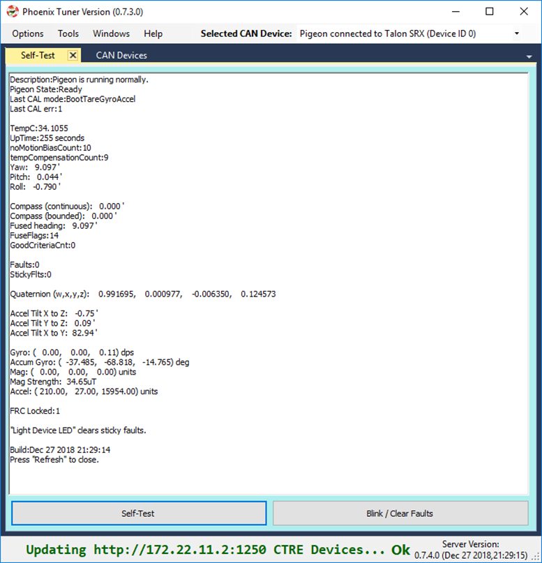
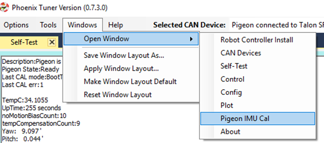
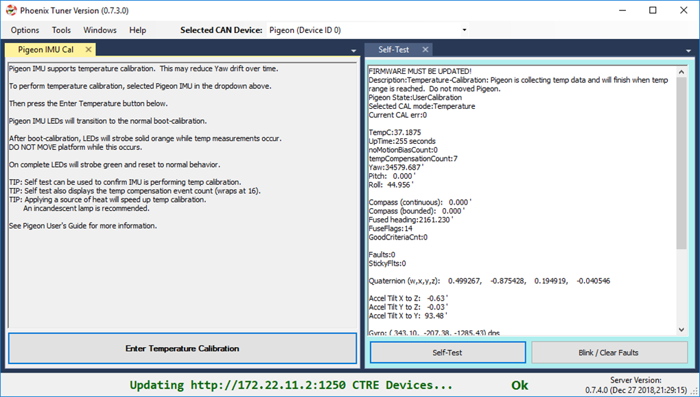

Bring Up: Pigeon IMU
====================

Power Boot
~~~~~~~~~~~~~~~~~~~~~~~~~~~~~~~~~~~~~~~~~~~~~~~~~~~~~~~~~~~~~~~~~~~~~~~~~~~~~~~~~~~~~~

Power boot the robot and wait for Pigeon IMU LED pattern indicating device has settled.
This will appear as a symmetric blink pattern (equal time on each side’s LED).
If the LED strobe is weighted to one side (more time on one side than the other) then IMU is still settling.  Typical settle time is four seconds.

.. warning:: Ribbon cabled Pigeon may not appear in CAN devices if Talon SRX firmware is too old.

Phoenix Tuner
~~~~~~~~~~~~~~~~~~~~~~~~~~~~~~~~~~~~~~~~~~~~~~~~~~~~~~~~~~~~~~~~~~~~~~~~~~~~~~~~~~~~~~
Open Phoenix tuner and use the self-test feature to confirm values.
Rotate IMU and confirm Yaw moves as expected.

.. note:: Moving counter-clockwise is interpreted as a positive change.

Pigeon API
~~~~~~~~~~~~~~~~~~~~~~~~~~~~~~~~~~~~~~~~~~~~~~~~~~~~~~~~~~~~~~~~~~~~~~~~~~~~~~~~~~~~~~

Create a Pigeon IMU object in your robot application and poll the Yaw value.  

Confirm that the output matches the self-test results.

If using LabVIEW plotter or SmartDash plotting, send the Yaw value into the plotted channel.  Then confirm Yaw value provides a smooth curve while robot is rotated by hand.

Temperature Calibration
~~~~~~~~~~~~~~~~~~~~~~~~~~~~~~~~~~~~~~~~~~~~~~~~~~~~~~~~~~~~~~~~~~~~~~~~~~~~~~~~~~~~~~
The greatest source of yaw drift in the FRC use case is drift due to changes in temperature.
This can be compensated by running the temperature self-calibration once.

In previous seasons this can be invoked via Phoenix API.

However, starting in 2019, you can manually enter temperature compensation mode by opening the Pigeon IMU Cal tab (go to Windows in the top menu bar).

Select the specific Pigeon in the top drop down, and press the Enter Temperature Calibration button.  Self-test can be used to monitor the progress.

.. note:: There is no harm in starting a temp calibration, and aborting by power cycling.  Previous temp calibration (if present) is overridden at the very end of the procedure.  See Self-Test for current state of Temperature Calibration and Compensation.
