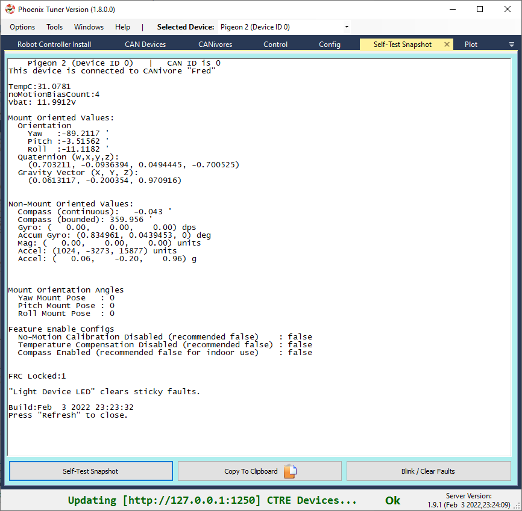

.. _ch11a_BringUpPigeon2:

Bring Up: Pigeon 2.0
====================

Power Boot
~~~~~~~~~~~~~~~~~~~~~~~~~~~~~~~~~~~~~~~~~~~~~~~~~~~~~~~~~~~~~~~~~~~~~~~~~~~~~~~~~~~~~~

Pigeon 2.0 measurements can be obtained immediately after boot.

Phoenix Tuner
~~~~~~~~~~~~~~~~~~~~~~~~~~~~~~~~~~~~~~~~~~~~~~~~~~~~~~~~~~~~~~~~~~~~~~~~~~~~~~~~~~~~~~
Open Phoenix tuner and use the Self-test Snapshot feature to confirm values.
Rotate IMU and confirm Yaw moves as expected.

.. tip:: There is a modernized version called `Tuner X <https://pro.docs.ctr-electronics.com/en/stable/docs/tuner/index.html>`__ that is available for Windows and Android devices (works with Phoenix 5 and `Phoenix Pro <https://pro.docs.ctr-electronics.com/en/stable/>`__).

.. note:: Moving counter-clockwise is interpreted as a positive change.

Pigeon API
~~~~~~~~~~~~~~~~~~~~~~~~~~~~~~~~~~~~~~~~~~~~~~~~~~~~~~~~~~~~~~~~~~~~~~~~~~~~~~~~~~~~~~

Create a Pigeon 2 object in your robot application and poll the Yaw value.  

.. note:: Pigeon 2.0 uses a different class than Pigeon 1.  It is named Pigeon2 instead of PigeonIMU.

.. code-block:: java

    import com.ctre.phoenix.sensors.Pigeon2;
    public class Robot extends TimedRobot {
        Pigeon2 _pigeon = new Pigeon2(0, "rio");
        int _loopCount = 0;

        public void teleopPeriodic() {
            if(_loopCount++ > 10)
            {
                _loopCount = 0;
                double yaw = _pigeon.getYaw();
                System.out.println("Pigeon Yaw is: " + yaw);
            }
        }

Confirm that the output matches the Self-test Snapshot results.

If using LabVIEW plotter or SmartDash plotting, send the Yaw value into the plotted channel.  Then confirm Yaw value provides a smooth curve while robot is rotated by hand.