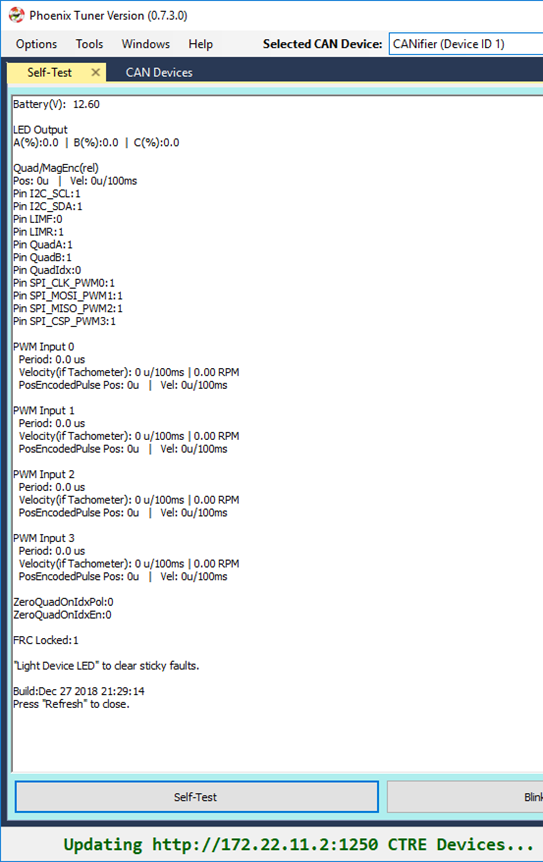

Bring Up: CANifier
==================

Phoenix Tuner
~~~~~~~~~~~~~~~~~~~~~~~~~~~~~~~~~~~~~~~~~~~~~~~~~~~~~~~~~~~~~~~~~~~~~~~~~~~~~~~~~~~~~~

Using self-test, confirm all sensor inputs required by the robot application.

If using Limit switches, assert each switch one at time.  Self-test after each transition to confirm wiring.

If using Quadrature or Pulse width sensor, rotate sensor while performing self-test to confirm sensor values.

LED Strip Control
~~~~~~~~~~~~~~~~~~~~~~~~~~~~~~~~~~~~~~~~~~~~~~~~~~~~~~~~~~~~~~~~~~~~~~~~~~~~~~~~~~~~~~

See CANifier user’s guide wiring and controlling LED Strip.