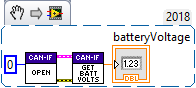

.. _ch12_BringUpCANifier:

Bring Up: CANifier
==================

Phoenix Tuner
~~~~~~~~~~~~~~~~~~~~~~~~~~~~~~~~~~~~~~~~~~~~~~~~~~~~~~~~~~~~~~~~~~~~~~~~~~~~~~~~~~~~~~

Using Self-test Snapshot, confirm all sensor inputs required by the robot application.

If using Limit switches, assert each switch one at time.  Self-test Snapshot after each transition to confirm wiring.

If using Quadrature or Pulse width sensor, rotate sensor while performing Self-test Snapshot to confirm sensor values.

.. image:: img/bring-15.png

LED Strip Control
~~~~~~~~~~~~~~~~~~~~~~~~~~~~~~~~~~~~~~~~~~~~~~~~~~~~~~~~~~~~~~~~~~~~~~~~~~~~~~~~~~~~~~

See `CANifier user’s guide <https://newsite.ctr-electronics.com/content/user-manual/CANifier%20User%27s%20Guide.pdf>`_ for wiring and controlling LED Strip.

CANifier API
~~~~~~~~~~~~~~~~~~~~~~~~~~~~~~~~~~~~~~~~~~~~~~~~~~~~~~~~~~~~~~~~~~~~~~~~~~~~~~~~~~~~~~
Create a CANifier object in your robot application and poll whatever sensor you have connected to it or the bus voltage

.. code-block:: java

    import com.ctre.phoenix.CANifier;
    public class Robot extends TimedRobot {
        CANifier _canifier = new CANifier(0);
        int _loopCount = 0;

        public void teleopPeriodic() {
            if(_loopCount++ > 10)
            {
                _loopCount = 0;
                System.out.println("Bus voltage is: " + _canifier.getBusVoltage());
            }
        }

Confirm output matches Self-test Snapshot results.