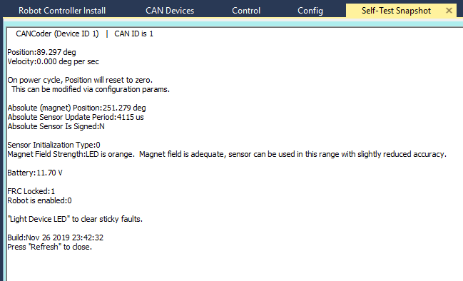
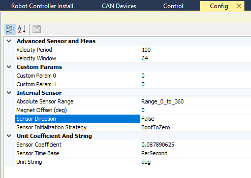
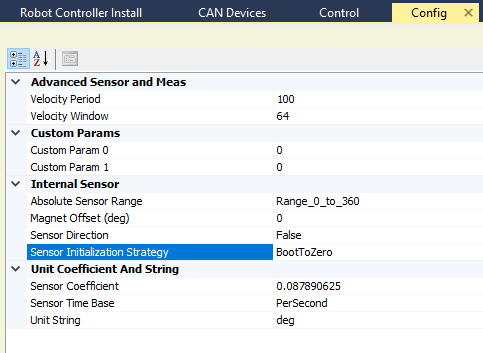
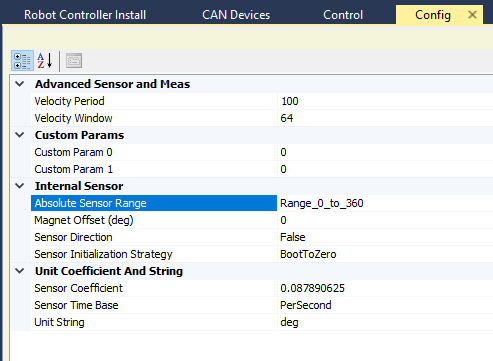
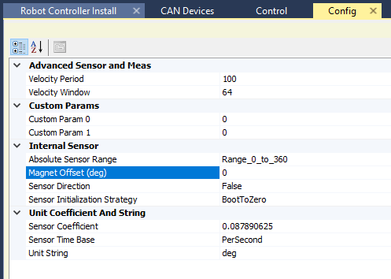
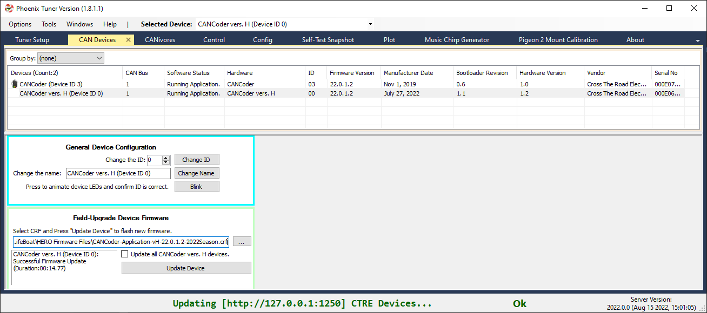
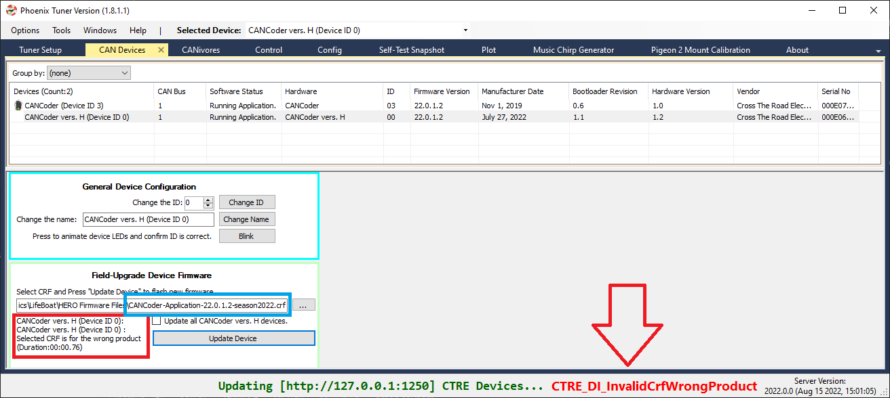

.. _ch12a_BringUpCANCoder:

Bring Up: CANCoder
==================

.. note:: As of late August 2022, there are multiple hardware versions of CANCoder available. This is due to the ongoing worldwide chip shortage causing CTR electronics to replace the original processor with a substitute. This new version of CANCoder requires a different firmware, but is otherwise functionally identical to the original. For details on how to determine what hardware version a CANCoder is, look at the :ref:`CANCoder Versions <Hardware_Versions>` section.

Magnet Placement
~~~~~~~~~~~~~~~~~~~~~~~~~~~~~~~~~~~~~~~~~~~~~~~~~~~~~~~~~~~~~~~~~~~~~~~~~~~~~~~~~~~~~~
Using the CANCoder User's Guide, verify that magnet placement is correct for the CANCoder.

Phoenix Tuner
~~~~~~~~~~~~~~~~~~~~~~~~~~~~~~~~~~~~~~~~~~~~~~~~~~~~~~~~~~~~~~~~~~~~~~~~~~~~~~~~~~~~~~
Open Phoenix tuner and use the Self-test Snapshot feature to confirm values.
By default, the position value is in units of degrees.

Choose Sensor Direction
~~~~~~~~~~~~~~~~~~~~~~~~~~~~~~~~~~~~~~~~~~~~~~~~~~~~~~~~~~~~~~~~~~~~~~~~~~~~~~~~~~~~~~
Choose which direction of the sensor is positive using the "Sensor Direction" config setting.

By default, positive direction is counter-clockwise rotation of the magnet when looking at the magnet side of the CANCoder.

Use the self-test snapshot to confirm the sensor value changes as expected for the chosen direction.

Choose Sensor Boot-Initialization Strategy
~~~~~~~~~~~~~~~~~~~~~~~~~~~~~~~~~~~~~~~~~~~~~~~~~~~~~~~~~~~~~~~~~~~~~~~~~~~~~~~~~~~~~~
Select whether the CANCoder position should initialize to 0 or initialize to the absolute position measurement.

Choose Absolute Sensor Range
~~~~~~~~~~~~~~~~~~~~~~~~~~~~~~~~~~~~~~~~~~~~~~~~~~~~~~~~~~~~~~~~~~~~~~~~~~~~~~~~~~~~~~
Select whether the absolute position value should range from 0 degrees to 360 degrees or -180 to +180.

Choose Absolute Sensor Offset
~~~~~~~~~~~~~~~~~~~~~~~~~~~~~~~~~~~~~~~~~~~~~~~~~~~~~~~~~~~~~~~~~~~~~~~~~~~~~~~~~~~~~~
Choose an offset for the 0 point of the absolute measurement.

By default, this 0 point is when the magnet's north aligns with the LED on the CANCoder.

.. note:: For mechanisms with a fixed range of motion, the offset should be set so that the discontinuity of the absolute measurement (ie, the rollover from 360 -> 0 or 180 -> -180) does not occur in the mechanism's range of motion.

CANCoder API
~~~~~~~~~~~~~~~~~~~~~~~~~~~~~~~~~~~~~~~~~~~~~~~~~~~~~~~~~~~~~~~~~~~~~~~~~~~~~~~~~~~~~~

Create a CANCoder object in your robot project and poll the position value.

.. code-block:: java

    import com.ctre.phoenix.sensors.CANCoder;
    public class Robot extends TimedRobot {

    CANCoder _coder = new CANCoder(1);
    int _loopCount = 0;

    public void teleopPeriodic() {
            if(_loopCount++ > 10)
            {
                _loopCount = 0;
                int degrees = _coder.getPosition();
                System.out.println("CANCoder position is: " + degrees);
            }
        }

Confirm that the output matches the self-test snapshot results.

.. _Hardware_Versions:

CANCoder Versions
~~~~~~~~~~~~~~~~~~~~~~~~~~~~~~~~~~~~~~~~~~~~~~~~~~~~~~~~~~~~~~~~~~~~~~~~~~~~~~~~~~~~~~

CANCoder has two hardware versions, the original "CANCoder" and the newer "CANCoder vers. H" or "CANCoder vH" for short.
Each hardware version has a unique crf that's associated with it, which means it is not possible to flash "CANCoder" firmware onto a "CANCoder vH" or vice versa.

Identification
----------------------------------------

Connect Tuner to the robot in order to identify what hardware version a CANCoder is, as the version is displayed in the Hardware column.
In addition, the Manufacture Date, Bootloader Revision, and Hardware Version columns will all be different between original CANCoders and CANCoder vH's.
Below is a screenshot of two CANCoders, one original CANCoder and another CANCoder vH, to better illustrate this.

Firmware Upgrade
----------------------------------------

Firmware upgrading the CANCoder vH is performed the same way as the original CANCoder.
Select the CRF and update the device.

.. note:: CANCoder vH's have a different firmware CRF than original CANCoders. Make sure the filename is correct.

If the wrong CRF is selected (such as an original CANCoder crf for a CANCoder vH), Tuner will fail with CTRE_DI_InvalidCrfWrongProduct in the bottom right of the screen, and the text box will report "Selected CRF is for the wrong product".
A screenshot of this state is below.

