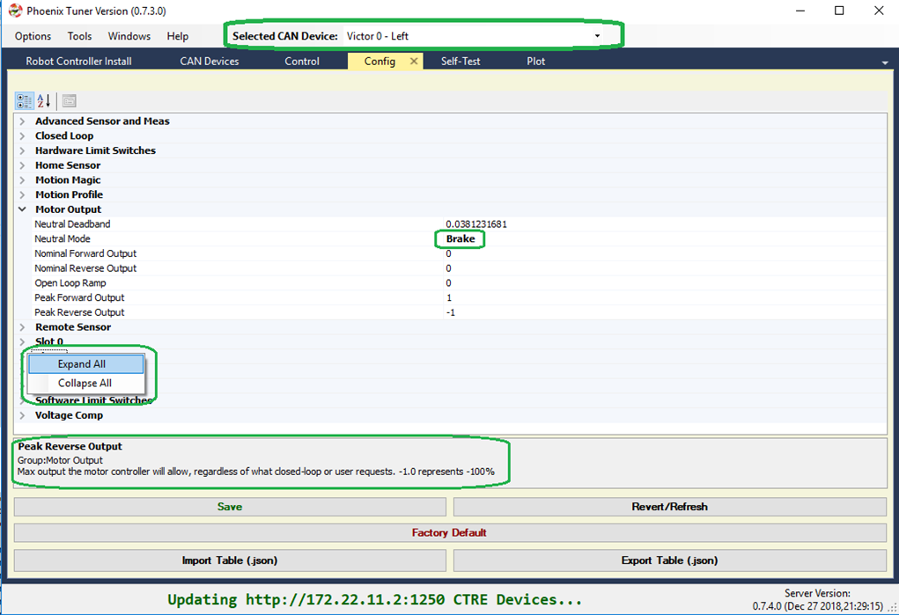
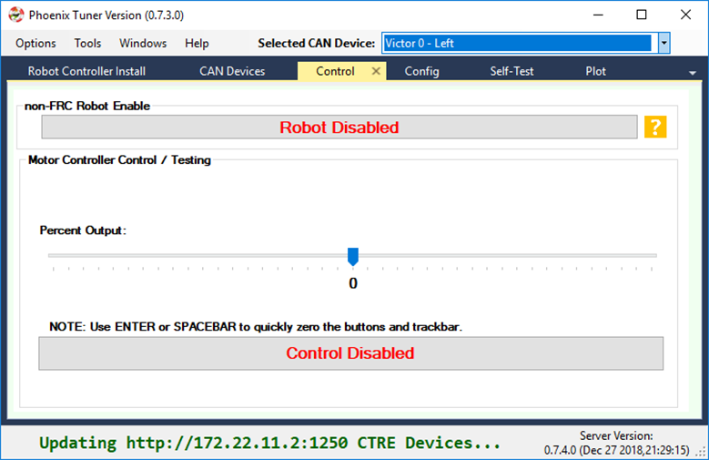
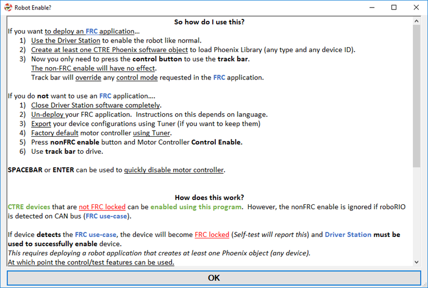
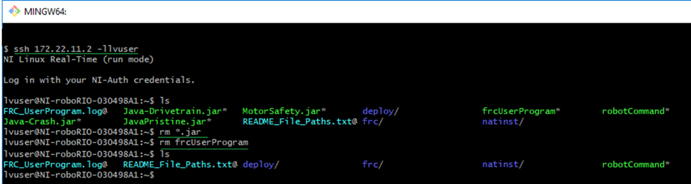
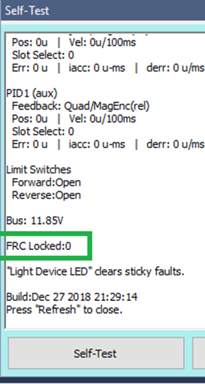
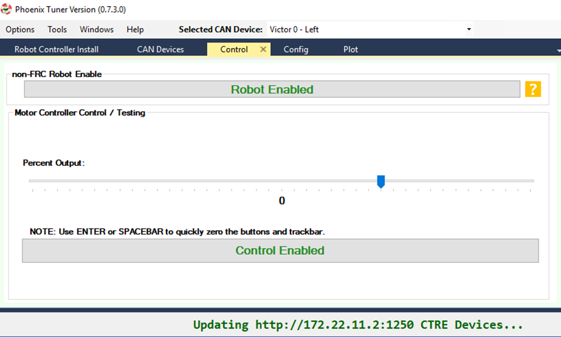
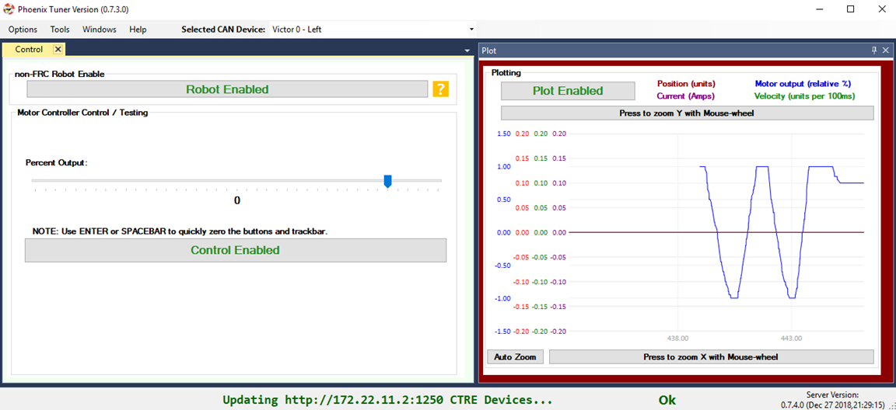
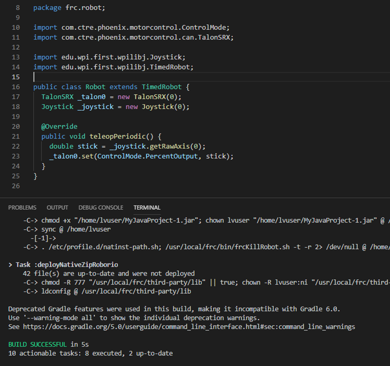
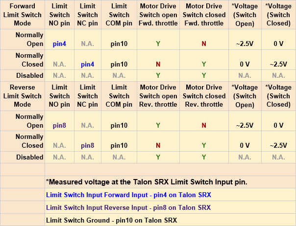

Bring Up: Talon SRX / Victor SPX
================================

At this point all Talon and Victors should appear in Tuner with up to date firmware.  The next goal is to drive the motor controller manually.  
This is done to confirm/test:

- Motor and motor wiring 
- Transmission/Linkage
- Mechanism design
- Motor Controller drive (both directions)
- Motor Controller sensor during motion

.. note:: Talon SRX and Victor SPX can be used with PWM or CAN bus. This document covers the CAN bus use-case.

Before we enable the motor controller, first check or reset the configs in the next section.

Factory Default Motor Controller
~~~~~~~~~~~~~~~~~~~~~~~~~~~~~~~~~~~~~~~~~~~~~~~~~~~~~~~~~~~~~~~~~~~~~~~~~~~~~~~~~~~~~~
Open the config view to see all persistent settings in the motor controller.
This can be done in the config tab (Windows => Config).

Select the Victor or Talon in the center-top dropdown.  This will reveal all persistent config settings.  

Press Factory Default to default the motor controller settings so that it has predicable behavior.  

.. tip:: Right-click anywhere in the property inspector and select Collapse-all to collapse each config group.

.. tip:: Other configs can be set in this view for testing purposes. For example, you may want to restrict the maximum output for testing via the Peak output settings under “Motor Output”.

.. tip:: When a setting is modified, it is set to bold to indicate that it is pending.  The bold state will clear after you Save.

.. tip:: If changing a config live in the robot controller, use the Refresh/Revert button to confirm setting in Tuner.

.. note:: CTRE devices can be factory defaulted via the API, and thru the B/C mechanical button.

.. note:: Neutral Mode will not change during factory default as it is stored separately from the other persistent configs.

Configuration
~~~~~~~~~~~~~~~~~~~~~~~~~~~~~~~~~~~~~~~~~~~~~~~~~~~~~~~~~~~~~~~~~~~~~~~~~~~~~~~~~~~~~~

Configurable settings are persistent settings that can be modified via the Phoenix API (from robot code) or via Tuner (Config tab).  They can also be factory defaulted using either method.

Configs are modified via the config* routines and LabVIEW Vis.  There are two general methods for robust operation of a robot.  Additionally you can modify the configs via Tuner.

Method 1 – Use the configAll API
------------------------------------------------------

Starting with 2019, there is a single routine/VI for setting all of the configs in a motor controller.
This ensures that your application does not need to be aware of every single config in order to reliably configure a fresh or unknown motor controller.  

**This is the recommend API for new robot projects.**

.. tip:: Config structure/object defaults all values to their factory defaults.  This means generally you only need to change the settings you care about.

.. tip:: When using C++/Java, leverage the IntelliSense (Auto-complete) features of the IDE to quickly discover the config settings you need.

Method 2 – Factory Default and config* routines
------------------------------------------------------
Phoenix provides individual config* routines for each config setting.
Although this is adequate when the number of configs was small, this can be difficult to manage due to the many features/configs in the CTRE motor controllers.

If using individual config routines, we recommend first calling the configFactoryDefault routine/VI to ensure motor controller is restored to a known state, thus allowing you to only config the settings that you intend to change.

**This is recommend for legacy applications to avoid porting effort.**

Method 3 – Use Tuner
------------------------------------------------------
Tuner can be used to get/set/export/import the configs.  

However, it is **highly recommended to ultimately set them via the software API**.  This way, in the event a device is replaced, you can rely on your software to properly configured the new device, without having to remember to use Tuner to apply the correct values.

A general recommendation is to:

- Configure all devices during robot-bootup using the API, 
- Use Tuner to dial values quickly during testing/calibration.  
- Export the settings so they are not lost.
- Update your software config values so that Tuner is no longer necessary.

Control Signals
------------------------------------------------------

The majority of the behavior in the Talon/Victor is controlled via configs, however there is a small number of control signals that are controlled via the API.  

This list includes:

- Current Limit **Enable** (though the thresholds are configs)
- Voltage Compensation **Enable** (though the nominal voltage is a config)
- Control Mode and Target/Output demand (percent, position, velocity, etc.)
- Invert direction and sensor phase
- Closed-loop slot selection [0,3] for primary and aux PID loops.
- Neutral mode override (convenient to temporarily override configs) 
- Limit switch override (convenient to temporarily override configs)
- Soft Limit override (convenient to temporarily override configs)
- Status Frame Periods

These control signals do not require periodic calls to ensure they “stick”.  All of the above signals are automatically restored even after motor controller is power cycled during use except for Status Frame Periods, which can be manually restore by polling for device resets via hasResetOccurred().

.. note:: WPI motor safety features may require periodic calls to Set() if team software has chosen to enable it.

.. note:: The override control signals are useful for applications that require temporarily disabling or changing behavior.  For example, overriding-disable the soft limits while performing a self-calibration routine to tare sensors, then restoring soft limits for robot operation.

.. note:: The routines to manipulate control signals are not prefixed with config* to highlight that they are not configs

Test Drive with Tuner
~~~~~~~~~~~~~~~~~~~~~~~~~~~~~~~~~~~~~~~~~~~~~~~~~~~~~~~~~~~~~~~~~~~~~~~~~~~~~~~~~~~~~~

Navigate to the control tab to view the control interface.  Notice there are two enable/disable buttons.  One is for non-FRC style robot-enable (alternative to the Driver Station enable), and one is for Motor Controller Control-Enable.

Press on the question mark next to the robot disabled/enabled button.

This will reveal the full explanation of how to safely enable your motor controller.
Follow the appropriate instructions depending on if you want to use Driver Station for your robot-enable.

Setting up non-FRC Control
------------------------------------------------------
In order to enable without the Driver Station and without a deployed FRC application, you must first ensure no FRC application is running in the roboRIO.  

Or alternatively you can deploy a simple application that does not create any Phoenix objects. 

Otherwise CTRE CAN devices will detect the FRC use case and FRC-lock (meaning they will again require the Driver Station).

Option 1 (easiest):  deploy a “dummy” FRC application 
------------------------------------------------------
This simply means create a small project from one of the available templates.
Do not create any Phoenix CAN objects.

Option 2: Un-deploy FRC application from your RIO
------------------------------------------------------
For C++/Java teams familiar with ssh, you can quickly un-deploy your roboRIO application by removing or naming your program jar file (Java) or frcUserProgram (C++). Power cycle after executing commands.  Then confirm Driver Station reads “No Code”.

Option 3 (slowest): Reimage the roboRIO
------------------------------------------------------
Re-imaging the RIO also will effectively remove the application, however this is a “sledge hammer” approach will take several minutes to perform.

Confirm FRC Unlock 
------------------------------------------------------
Close Driver Station software if it is running.  Do not allow DS to communicate with roboRIO, or CTRE devices will detect the FRC use case.

Self-Test Motor Controller to confirm device FRCLocked = 0.

If device is FRC Locked (=1), use factory default in the config tab to clear the state.

.. note:: Use the config export tool if you need to keep your config settings.
 

 
Control tab
------------------------------------------------------

Press both Robot Enabled and Control Enabled.  
At this point you can use the track bar to drive the Victor/Talon.

.. note:: If you do connect the driver station, the Talon/Victor will FRC Lock again.  At which point you can use the driver station to enable, and you no longer need to use the non-FRC Robot enable in Tuner.

.. note:: Spacebar or enter can be used to clear the control tab and neutral the selected motor controller.

Plot tab
------------------------------------------------------

Now open the Plot window.  Drive the motor controller while observing the plot.  
Confirm the blue motor output curve matches LED behavior and trackbar.
Confirm motor movement follows expectations.

.. note:: Press the Plot enable button to effectively pause the plot for review

.. note:: Use the Zoom buttons to select whether the mouse adjust the Y or X axis.

.. note:: If using a Victor SPX, current-draw will always read zero (SPX does not have current-measurement features).

.. tip:: Plot can be used anytime, regardless of what is commanding the motor controller (FRC or non-FRC).

Test Drive with Robot Controller
~~~~~~~~~~~~~~~~~~~~~~~~~~~~~~~~~~~~~~~~~~~~~~~~~~~~~~~~~~~~~~~~~~~~~~~~~~~~~~~~~~~~~~

Next we will create control software in the roboRIO.  Currently this is necessary for more advanced control.  This is also required for controlling your robot during competition.

.. note:: Future features of Tuner will likely provide greater granularity of control – closed-loops, invert/follower, etc..  Initial release is meant to help teams get started and learn the subtleties of testing without developing robot software first.

Java: Sample driving code
^^^^^^^^^^^^^^^^^^^^^^^^^
Below is a simple example that reads the Joystick and drives the Talon

.. code-block:: java

  package frc.robot;
  
  import com.ctre.phoenix.motorcontrol.ControlMode;
  import com.ctre.phoenix.motorcontrol.can.TalonSRX;
  
  import edu.wpi.first.wpilibj.Joystick;
  import edu.wpi.first.wpilibj.TimedRobot;
  
  public class Robot extends TimedRobot {
    TalonSRX _talon0 = new TalonSRX(0);
    Joystick _joystick = new Joystick(0);
  
    @Override
    public void teleopPeriodic() {
      double stick = _joystick.getRawAxis(1);
      _talon0.set(ControlMode.PercentOutput, stick);
    }
  }

Deploy the project, and confirm success.  

.. note:: WPI's terminal output may read “Build” successful despite the project was deployed.

.. note:: Before you enable the DS, spin the Joystick axis so it reaches the X and Y extremities are reached.  USB Gamepads calibrate on-the-fly so if the Gamepad was just inserted into the DS, it likely has not auto detected the max mechanical range of the sticks.

.. note:: Make sure joystick is detected by the DS before enabling.

.. note:: getRawAxis may not return a positive value on forward-stick.  Confirm this by watching Talon/Victor LED.  Green suggests a positive output. 

Enable the Driver Station and confirm: 

• motor drive in both directions using gamepad stick.
• motor controller LEDs show green for forward and red for reverse

Disable Driver Station after finished testing.

.. note:: If the LED is solid orange than use Tuner to determine the cause.  Self-Test will report the current state of the motor controller (do this while troubleshooting).  Confirm firmware is up to date.

Open-Loop Features
~~~~~~~~~~~~~~~~~~~~~~~~~~~~~~~~~~~~~~~~~~~~~~~~~~~~~~~~~~~~~~~~~~~~~~~~~~~~~~~~~~~~~~

After some rudimentary testing, you will likely need to configure several open-loop features of the Talon SRX and Victor SPX.  

.. note:: We recommend configuring Inverts and Followers first.

Inverts
------------------------------------------------------
To determine the desired invert of our motor controller, we will add two more lines of call.
SetInverted is added to decide if motor should spin clockwise or counter clockwise when told to move positive/forward (green LEDs). 

We also multiply the joystick so that forward is positive (intuitive).  This can be verified by watching the console print in the Driver Station.

.. code-block:: java

  package frc.robot;
  import com.ctre.phoenix.motorcontrol.*;
  import com.ctre.phoenix.motorcontrol.can.*;
  
  import edu.wpi.first.wpilibj.Joystick;
  import edu.wpi.first.wpilibj.TimedRobot;
  
  public class Robot extends TimedRobot {
    TalonSRX _talon0 = new TalonSRX(0);
    Joystick _joystick = new Joystick(0);
  
    @Override
    public void teleopInit() {
      _talon0.setInverted(false); // pick CW versus CCW when motor controller is positive/green
    }
  
    @Override
    public void teleopPeriodic() {
      double stick = _joystick.getRawAxis(1) * -1; // make forward stick positive
      System.out.println("stick:" + stick);
  
      _talon0.set(ControlMode.PercentOutput, stick);
    }
  }

Follower
------------------------------------------------------
If a mechanism requires multiple motors, than there are likely multiple motor controllers.   The Follower feature of the Talon SRX and Victor SPX is a convenient method to keep two or more motor controller outputs consistent.  If you have a sensor for closed-looping, connect that to the “master” Talon SRX (unless it is a remote sensor such as CANifier/Pigeon).

Below we’ve added a new Victor to follow Talon 0.  

Generally, a follower is intended to match the direction of the master, or drive in the opposite direction depending on mechanical orientation.  In previous seasons teams would have to update the bool true/false of the follower to match or oppose the master manually.

Starting in 2019, C++/Java users can set the setInverted(InvertType) to instruct the motor controller to either match or oppose the direction of the master instead.

.. code-block:: java

  package frc.robot;
  
  import com.ctre.phoenix.motorcontrol.*;
  import com.ctre.phoenix.motorcontrol.can.*;
  
  import edu.wpi.first.wpilibj.Joystick;
  import edu.wpi.first.wpilibj.TimedRobot;
  
  public class Robot extends TimedRobot {
    TalonSRX _talon0 = new TalonSRX(0);
    VictorSPX _victor0 = new VictorSPX(0);
    Joystick _joystick = new Joystick(0);
  
    @Override
    public void teleopInit() {
      _victor0.follow(_talon0);
  
      _talon0.setInverted(false); // pick CW versus CCW when motor controller is positive/green
      _victor0.setInverted(InvertType.FollowMaster); // match whatever talon0 is
      //_victor0.setInverted(InvertType.OpposeMaster); // opposite whatever talon0 is
    }
  
    @Override
    public void teleopPeriodic() {
      double stick = _joystick.getRawAxis(1) * -1; // make forward stick positive
      System.out.println("stick:" + stick);
  
      _talon0.set(ControlMode.PercentOutput, stick);
    }
  }

Enable the Driver Station and slowly drive both MCs from neutral.  Confirm both LEDs are blinking the same color.

Disable Driver Station when complete.

To confirm motor controllers are truly driving in the same direction, disconnect the master motor controller from its motor.

Enable the Driver Station and confirm follower motor direction matches previously measured master motor direction.

Disable Driver Station when complete.

Open Tuner and select the master motor controller.

Open plot tab and enable plotter while driving motor controller

Confirm current plot is appropriate. If motors are free-spinning, then current should be near 0 if motor output is constant.  When testing drive train, the robot should be rested on a crate/tote to ensure all wheels spin freely.

Select follower motor in Tuner, and confirm current via plot.
  
.. note:: Follower mode can be canceled by simple calling set()

.. note:: Calling follow() in the periodic loop is not required, but also does not affect anything in a negative way.

Neutral Mode
------------------------------------------------------
You may note that when the motor output transitions to neutral, the motors free spin (coast) in the last direction they were driven.  If the Talon/Victor is set to “coast” neutral mode, then this is expected.  The neutral mode can also be set to “brake” to electrically common the motor leads during neutral, causing a deceleration that combats the spinning motor motion.

.. note:: SetNeutralMode() can be used change the neutral mode on the fly.

Follower motor controllers have separate neutral modes than their masters, so you must choose both.  Additionally, you may want to mix your neutral modes to achieve a partial electric brake when using multiple motors.

Ramping
------------------------------------------------------
The Talon SRX can be set to honor a ramp rate to prevent instantaneous changes in throttle.
This ramp rate is in effect regardless of which mode is selected (throttle, slave, or closed-loop). 

Ramp can be set in time from neutral to full using configOpenLoopRampRate().

.. note:: configClosedLoopRampRate() can be used to select the ramp during closed-loop (sensor) operations.

.. note:: The slowest ramp possible is ten seconds (from neutral to full), though this is quite excessive.  

Peak/Nominal Outputs
Often a mechanism may not require full motor output.  The application can cap the output via the peak forward and reverse config setting (through Tuner or API).

Additionally, the nominal outputs can be selected to ensure that any non-zero requested motor output gets promoted to a minimum output.  For example, if the nominal forward is set to +0.10 (+10%), then any motor request within (0%, +10%) will be promoted to +10% assuming request is beyond the neutral dead band.  This is useful for mechanisms that require a minimum output for movement, and can be used as a simpler alternative to the kI (integral) component of closed-looping in some circumstances.

Voltage Compensation
------------------------------------------------------

Talon SRX and Victor SPX can be configured to adjust their outputs in response to the battery voltage measurement (in all control modes).  Use the voltage compensation saturation config to determine what voltage represents 100% output.  

Then enable the voltage compensation using enableVoltageCompensation().

Advanced users can adjust the Voltage Measurement Filter to make the compensation more or less responsive by increasing or decreasing the filter.  This is available via API and via Tuner

Current Limit
------------------------------------------------------
Talon SRX supports current limiting in all control modes.  

The limiting is characterized by three configs:

- Peak Current (Amperes), threshold that must be exceeded before limiting occurs.
- Peak Time (milliseconds), thresholds that must be exceed before limiting occurs
- Continuous Current (Amperes), maximum allowable current after limiting occurs.

If enabled, Talon SRX will monitor the supply-current looking for a conditions where current has exceeded the Peak Current for at least Peak Time.  If detected, output is reduced until current measurement is at or under Continuous Current.  

Once limiting is active, current limiting will deactivate if motor controller can apply the requested motor output and still measure current-draw under the Continuous Current Limit.

After setting the three configurations, current limiting must be enabled via enableCurrentLimit() or LabVIEW VI.

.. note:: Use Self-Test to confirm if Current Limiting is occurring

Reading status signals
~~~~~~~~~~~~~~~~~~~~~~~~~~~~~~~~~~~~~~~~~~~~~~~~~~~~~~~~~~~~~~~~~~~~~~~~~~~~~~~~~~~~~~

The Talon SRX transmits most of its status signals periodically, i.e. in an unsolicited fashion.  This improves bus efficiency by removing the need for “request” frames, and guarantees the signals necessary for the wide range of use cases Talon supports, are available.

These signals are available in API regardless of what control mode the Talon SRX is in.
Additionally the signals can be polled in the roboRIO Web-based Configuration (see Section 2.4. Self-Test).

Included in the list of signals are:

- Quadrature Encoder Position, Velocity, Index Rise Count, Pin States (A, B, Index)
- Analog-In Position, Analog-In Velocity, 10bit ADC Value,
- Battery Voltage, Current, Temperature
- Fault states, sticky fault states,
- Limit switch pin states
- Applied Throttle (duty cycle) regardless of control mode.
- Applied Control mode: Voltage % (duty-cycle), Position/Velocity closed-loop, or slave follower.
- Brake State (coast vs brake)
- Closed-Loop Error, the difference between closed-loop set point and actual position/velocity.
- Sensor Position and Velocity, the signed output of the selected Feedback device (robot must select a Feedback device, or rely on default setting of Quadrature Encoder). 

Limit Switches
~~~~~~~~~~~~~~~~~~~~~~~~~~~~~~~~~~~~~~~~~~~~~~~~~~~~~~~~~~~~~~~~~~~~~~~~~~~~~~~~~~~~~~
Talon SRX and Victor SPX have limit features that will auto-neutral the motor output if a limit switch activates.  

An “out of the box” Talon will default with the limit switch setting of “Normally Open” for both forward and reverse.  This means that motor drive is allowed when a limit switch input is not closed (i.e. not connected to ground).  When a limit switch input is closed (is connected to ground) the Talon SRX will disable motor drive and individually blink both LEDs red in the direction of the fault (red blink pattern will move towards the M+/white wire for positive limit fault, and towards M-/green wire for negative limit fault).

Since an “out of the box” Talon will likely not be connected to limit switches (at least not initially) and because limit switch inputs are internally pulled high (i.e. the switch is open), the limit switch feature is default to “normally open”.  This ensures an “out of the box” Talon will drive even if no limit switches are connected.

For more information on Limit Switch wiring/setup, see the Talon SRX User’s Guide.

Limit switch features can be disabled or changed to “Normally Closed” in Tuner and in API.

Remote Limit Switches
----------------------------------------------------------------
A Talon SRX or Victor SPX can use a remote sensor as the limit switch (such as another Talon SRX or CANifier).

Config the Limit Forward/Reverse Source from Gadgeteer Pins, to Remote Talon or Remote CANifier.  Then config the Limit Forward/Reverse Device ID for the remote Talon or CANifier.

Use self-test on the motor-driving motor controller to confirm limit switches are interpreted correctly.  If they are not correct, then self-test the remote device to determine the issue.

Soft Limits
~~~~~~~~~~~~~~~~~~~~~~~~~~~~~~~~~~~~~~~~~~~~~~~~~~~~~~~~~~~~~~~~~~~~~~~~~~~~~~~~~~~~~~
Soft limits can be used to disable motor drive when the “Sensor Position” is outside of a specified range.  Forward throttle will be disabled if the “Sensor Position” is greater than the Forward Soft Limit.  Reverse throttle will be disabled if the “Sensor Position” is less than the Reverse Soft Limit.  The respective Soft Limit Enable must be enabled for this feature to take effect.

The settings can be set and confirmed in the roboRIO Web-based Configuration.

