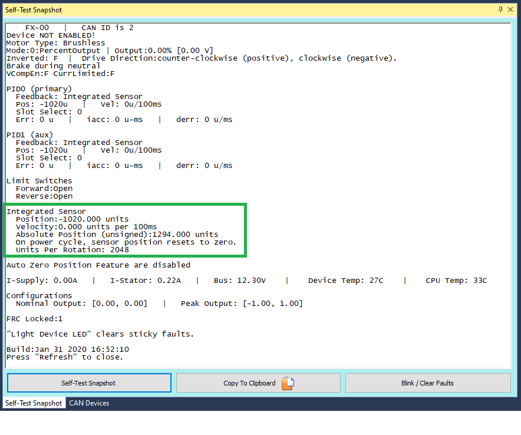
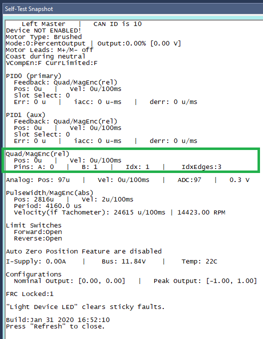
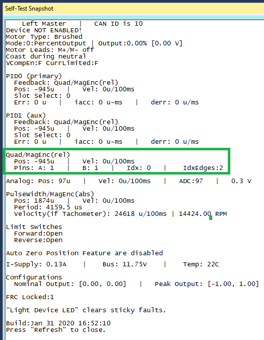
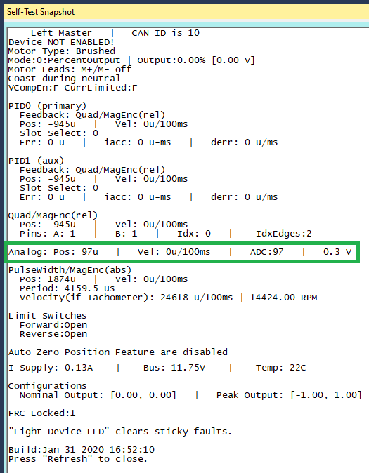
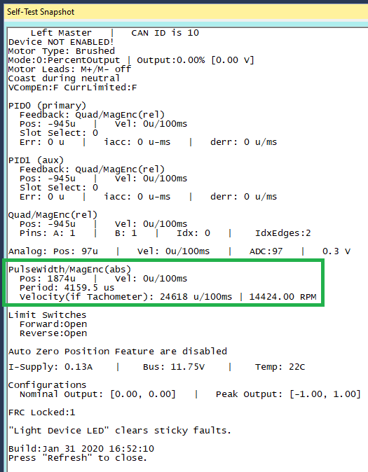
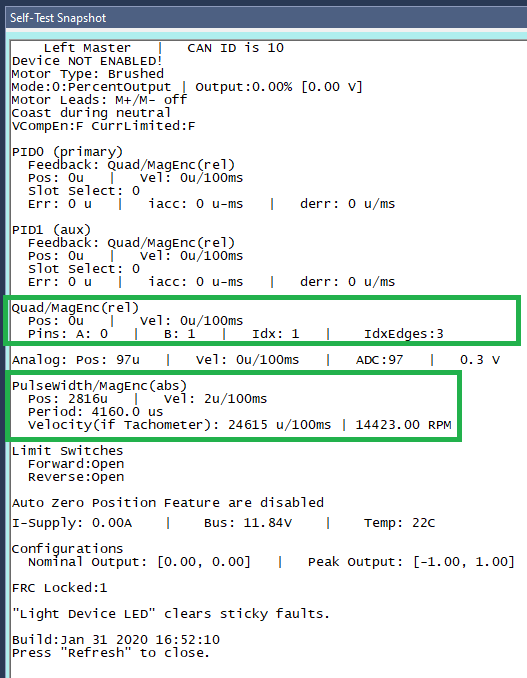

.. _mc-sensors-label:

Bring Up: Talon FX/SRX Sensors
======================================

This section is dedicated to validating any rotary sensor attached to the Talon SRX and the integrated sensor on the Talon FX.
Generally attaching a sensor is necessary for:

- Close-Loop control modes (Position, MotionMagic, Velocity, MotionProfile)
- Soft limits (auto neutral motor if out of range)

Sensor Options
~~~~~~~~~~~~~~~~~~~~~~~~~~~~~~~~~~~~~~~~
Many feedback interfaces are supported.  The complete list is below.

Talon FX Integrated Sensor
----------------------------------------
The Talon FX has a sensor integrated into the controller. This is necessary for the brushless commutation and allows the user to use the Talon FX with a high resolution sensor without attaching any extra hardware.

In order to verify the Integrated Sensor is working, select the Talon FX in the dropdown.

.. image:: img/sensor-3.png

And take a self-test snapshot of the Talon FX. Focus on the integrated sensor section of the snapshot and verify that rotating the shaft results in a change of position.

CANCoder
----------------------------------------
CANCoder is a great sensor to use for applications that require an absolute measurement of a mechanism or would otherwise require a long wire run back to a Talon SRX, CANifier, RIO, etc. If you are using a CANCoder, look at the :ref:`ch12a_BringUpCANCoder` document.

Talon SRX External Ribbon Cabled Sensors
----------------------------------------
There are many external sensors that are compatible with the Talon SRX in order to utilize its closed-loop functionality or read inside your robot code.

Quadrature
^^^^^^^^^^^^^^^^^^^^^^^^^^^^^^^^^^^^^^^^
The Talon directly supports quadrature sensors.
The decoding is done in 4x mode (every edge on A and B are counted).
This is available via the Gadgeteer feedback port.

.. tip:: Quadrature resets to 0 on power boot.

To verify your quadrature sensor is properly connected to the Talon SRX, select it in the dropdown and take a self-test snapshot of the Talon. Notice the Quadrature section displays all the relevant information about the quadrature sensor.

Move the mechanism and take another self test. The position should have changed. If it didn't, there's an issue between the sensor and the Talon SRX.

Analog (Potentiometer or Encoder)
^^^^^^^^^^^^^^^^^^^^^^^^^^^^^^^^^^^^^^^^
Analog feedback sensors are sensors that provide a variable voltage to represent position.  Some devices (such as the MA3 US Digital encoder) are continuous and wrap around from 3.3V back to 0V.  In such cases the overwrap is tracked, and Talon continues counting 1023 => 1024.  

This feature can be disabled by setting the config via API or Tuner.

.. image:: img/sensor-22.png

To check that the analog sensor is working, select your Talon in the drop down and take a self-test snapshot. The Analog section of the snapshot displays all relevant information regarding your analog sensor.

.. tip:: Analog should read ~100 units if floating. If an analog sensor is meant to be in-circuit, recheck sensor signal/power/harness/etc.

Pulse Width Decoder
^^^^^^^^^^^^^^^^^^^^^^^^^^^^^^^^^^^^^^^^
For sensors that encode position as a pulse width this mode can be used to decode the position.
The pulse width decoder is <1us accurate and the maximum time between edges is 120 ms.

To check that the pulse width sensor is working, select your Talon in the drop down and take a self-test snapshot. The PulseWidth section displays all information regarding the pulse width sensor.

.. tip:: If using a Talon Tach, focus on the "Velocity (if Tachometer)" value

Cross The Road Electronics Magnetic Encoder (Absolute and Relative)
^^^^^^^^^^^^^^^^^^^^^^^^^^^^^^^^^^^^^^^^^^^^^^^^^^^^^^^^^^^^^^^^^^^^^^
The CTRE Magnetic Encoder is actually two sensor interfaces packaged into one (pulse width and quadrature encoder).
Therefore the sensor provides two modes of use: absolute and relative.  Each mode provides 4096 units per rotation.

.. image:: img/sensor-23.png

.. tip:: Inspect the ribbon cable for any frayed or damaged sections.

.. tip:: Confirm the green LED.  When using Versa-Planetary Sensor Slice, orange LED is acceptable.

.. warning:: When using a contactless sensor on a rolling mechanism (shooter / roller / intake), care should be taken to ensure spinning mechanism is electrically common to the remainder of the robot chassis.  Otherwise ESD strikes can occur between mechanism and the contactless sensor (due to its proximity to the mechanism).

The advantage of absolute mode is having a solid reference to where a mechanism is without re-tare-ing or re-zero-ing the robot.  The advantage of the relative mode is the faster update rate.  However both values can be read/written at the same time.  So a combined strategy of seeding the relative position based on the absolute position can be used to benefit from the higher sampling rate of the relative mode and still have an absolute sensor position.

======================     ===================================  =======================================
Parameter                  Absolute Mode                        Relative Mode
======================     ===================================  =======================================
Update rate (period)       4 ms                                 100 us
Max RPM                    7,500 RPM                            15,000 RPM
Accuracy                   12 bits (4096 units per rotation)    12 bits (4096 units per rotation)
Software API               Select Pulse Width                   Select Quadrature
======================     ===================================  =======================================

In circumstances where the absolute pulse width wraps from one extremity to the other (due to overflow), the Talon continues counting 4095 => 4096.  

This feature can be disabled by setting the config via API or Tuner.

.. image:: img/sensor-22.png

In order to test that the Mag Encoder is connected properly to the Talon SRX and verify that it is working, you should first select the Talon SRX using the drop down, and take a self-test snapshot of the Talon. The Mag Encoder uses both Quadrature and Pulse Width, so the relevant information for the Mag Encoder will be in both of those sections in the self-test.

Software-Select Sensor
~~~~~~~~~~~~~~~~~~~~~~~~~~~~~~~~~~
Once you have decided what sensor you are going to use, you have to select that sensor in the software. 

.. note:: It is imperative that this step is done regardless of if you wish to use the device's closed-looping features or not.

This step is done for a number of reasons:
 - It allows the device to use the selected sensor in its closed looping.
 - It allows the user to use the getSelected* API
 
    - This is updated faster than the sensor-specific gets inside the Sensor Collection.
    - This obeys the sensor phase that's been set.
    - This obeys any sensor coefficient that's been configured.

Selecting the sensor is done with either Phoenix API or Tuner. In order to select the sensor using Tuner, choose your device in the drop down, access the Config Tab, and select the sensor you are using.

.. note:: The selected "Feedback Device" defaults to *Quadrature Encoder* for Talon SRX, *None* for Victor SPX, and *Integrated Sensor* for Talon FX.

.. image:: img/sensor-5.png

To select it using Phoenix API, call configSelectedFeedbackSensor.

.. code-block:: java

  _tal.configSelectedFeedbackSensor(FeedbackDevice.CTRE_MagEncoder_Relative, 0, 10);

Verify the sensor has been selected by taking another self-test snapshot of the device and confirming PID0's Feedback is the selected sensor

.. image:: img/sensor-7.png

Because the sensor is now “selected”, turn on the plot and hand rotate sensor back and forth. 
Disable plot to pause after capturing several seconds.

.. image:: img/sensor-10.png

Checks:

- Focus the velocity and position curves and look for any discontinuities in the plot.
- Shake the sensor harness while hand-turning mechanism.
- This is also a good opportunity to confirm the resolution of the sensor.

.. _mc-Sensor-Check:

Sensor Check – With Motor Drive
~~~~~~~~~~~~~~~~~~~~~~~~~~~~~~~~~~~~~~~~~~~~~~~~~~~~~~~~~~~~~~~~~~~~~~~~~~~~~~~~~~~~~~
In this step we will attempt to drive motor while monitoring sensor value.
Motor controller can be controlled using Control-tab (see previous relevant section) or controlled from robot application via Phoenix API (see previous relevant section).

Sensor Phase
----------------------------------------
Sensor phase describes the relationship between the motor output direction (positive vs negative) and sensor velocity (positive vs negative).  For soft-limits and closed-loop features to function correctly, the sensor measurement and motor output must be “in-phase”.

.. note:: Talon FX automatically phases your sensor for you. It will always be correct, provided you use the getSelected* API and have configured the selected feedback type to be integrated sensor.

.. note:: Sensor phase is **not** the same as sensor direction. When SetInverted is called on a motor controller, the values reported by the selected sensor are **also inverted**. As a result, changing the SetInverted input does **not** require changing the sensor phase.

Measure Sensor Phase
^^^^^^^^^^^^^^^^^^^^^^^^^^^^^^^^^^^^^^^^

Take another measurement using your preferred control method and check the sensor phase using any of the following methods.

Here we sweep the motor output forward and reverse.  Notice that sensor velocity (green) and motor output (blue) are out of phase.

.. image:: img/sensor-11.png

In this capture we use the Self-test Snapshot to observe the motor output and selected (PID0) sensor velocity are signed in opposite directions.  Additionally the Talon SRX noticed this and reported a live fault of “Sensor Out of Phase”.

.. image:: img/sensor-12.png

.. note:: Talon SRX will check sensor direction versus output direction once motor output and velocity exceeds a minimum threshold.

Adjust Sensor Phase
^^^^^^^^^^^^^^^^^^^^^^^^^^^^^^^^^^^^^^^^
If the sensor is out of phase with the motor drive, you can use any method below to align them:

- **Recommended**: **Use setSensorPhase routine/VI to adjust the sensor phase**.  If already called, toggle the input so that the sensor phase becomes aligned with motor output.
- Exchange/flip the green/white motor leads.  **This is generally not recommended** as this makes maintaining motor controller orientation across multiple robots difficult (practice versus competition).

.. warning:: **Do not use setInverted** to correct sensor orientation with respect to motor output.  setInverted synchronously inverts both signals, ensuring that sensor phase is maintained.  **This is a feature** that allows you to choose what direction is considered positive without breaking closed-looping features.

Confirm Sensor Phase using API
^^^^^^^^^^^^^^^^^^^^^^^^^^^^^^^^^^^^^^^^
The next test is to control the motor controller using Phoenix API on the robot controller.

This is ultimately how you will leverage the motor controller in competition.

.. code-block:: java

  package frc.robot;
  
  import com.ctre.phoenix.motorcontrol.*;
  import com.ctre.phoenix.motorcontrol.can.*;
  import edu.wpi.first.wpilibj.*;
  
  public class Robot extends TimedRobot {
    TalonSRX _talon = new TalonSRX(0); /* make a Talon */
    Joystick _joystick = new Joystick(0); /* make a joystick */
    Faults _faults = new Faults(); /* temp to fill with latest faults */
  
    @Override
    public void teleopInit() {
      /* factory default values */
      _talon.configFactoryDefault();
  
      /*
       * choose whatever you want so "positive" values moves mechanism forward,
       * upwards, outward, etc.
       * 
       * Note that you can set this to whatever you want, but this will not fix motor
       * output direction vs sensor direction.
       */
      _talon.setInverted(false);
  
      /*
       * flip value so that motor output and sensor velocity are the same polarity. Do
       * this before closed-looping
       */
      _talon.setSensorPhase(false); // <<<<<< Adjust this
    }
  
    @Override
    public void teleopPeriodic() {
      double xSpeed = _joystick.getRawAxis(1) * -1; // make forward stick positive
  
      /* update motor controller */
      _talon.set(ControlMode.PercentOutput, xSpeed);
      /* check our live faults */
      _talon.getFaults(_faults);
      /* hold down btn1 to print stick values */
      if (_joystick.getRawButton(1)) {
        System.out.println("Sensor Vel:" + _talon.getSelectedSensorVelocity());
        System.out.println("Sensor Pos:" + _talon.getSelectedSensorPosition());
        System.out.println("Out %" + _talon.getMotorOutputPercent());
        System.out.println("Out Of Phase:" + _faults.SensorOutOfPhase);
      }
    }
  }

Confirm sensor velocity is in phase with motor output using any of the methods documented above.

Below is an example screenshot of a successfully phased sensor and motor output.  Both are negative (good).

.. image:: img/sensor-13.png

Below is an example screenshot of a successfully phased sensor and motor output.  Both are negative (in green).  

.. image:: img/sensor-14.png

.. note:: The natural sensor measurement (purple) under Quad is opposite of the Selected sensor value.  This is proof-positive that setSensorPhase(true) was used to adjust the sensor phase to better match the motor voltage direction.

What if the sensor Phase is already correct?
............................................
The recommendation is to **always call setSensorPhase routine/VI**.  If the phase is naturally correct, then pass false.  The reasons to do this are:

- During competition, you may find the pit-crew / repair-team wired a replacement motor/harness incorrectly and must resolve this with a “quick software fix”.  
- During competition, you may find the pit-crew / repair-team wired a replacement sensor/harness incorrectly and must resolve this with a “quick software fix”.
- This provides the means of changing the sensor phase to the “wrong value” during hardware-bring up, so you can demonstrate to other team members what an out of phase sensor looks like in your telemetry.

Confirm Sensor Resolution/Velocity
~~~~~~~~~~~~~~~~~~~~~~~~~~~~~~~~~~~~~~~~~~~~~~~~~~~~~~~~~~~~~~~~~~~~~~~~~~~~~~~~~~~~~~
After correcting the sensor phase, the next step is to confirm sensor resolution matches your expectations.  This is an important step in sensor validation. 

Listed below are the typical sensor resolutions for common sensors.  Lookup your sensor type and note the expected resolution.  Call this kSensorUnitsPerRotation.

Sensor Resolution
------------------------------------------------------
=======================================================  ==========================================================
Sensor Type                                              Units per rotation
=======================================================  ==========================================================
Quadrature Encoder : US Digital 1024 CPR                 4096 (Talon SRX / CANifer counts every edge)
CTRE Magnetic Encoder (relative/quadrature)              4096
CTRE Magnetic Encoder (absolute/pulse width)             4096
Talon FX Integrated Sensor                               2048
CANCoder                                                 4096
Any pulse width encoded position                         4096 represents 100% duty cycle
AndyMark CIMcoder                                        80 (because 20 pulses => 80 edges)
Analog                                                   1024
=======================================================  ==========================================================

.. note:: Sensor are typically reported in the raw sensor units to ensure all of the available sensor resolution is utilized.  However future releases will allow user to choose how sensor position is interpreted (for example: degrees, radians, inches, legacy raw units, etc.).  Users can review the CANCoder API as a reference to how this will work.

Lookup the kMaxRPM of your motor.  This will be advertised as the free-speed or max-velocity of your motor.

Determine if your mechanism has a gear-ratio between the motor and your sensor.  Typically this is a reduction, meaning that there are several motor rotations per single sensor rotation.  Call this kGearRatio.

Calculate the expect peak sensor velocity (sensor units per 100ms) as:

.. code-block:: html

  (kMaxRPM  / 600) * (kSensorUnitsPerRotation / kGearRatio)

Knowing the maximum possible sensor velocity, compare this against the sensor velocity report in any of the following:

- Self-test Snapshot under selected sensor (PID0).
- getSelectedSensorVelocity() API
- Tuner plotter sensor velocity

You will likely find your ideal value is greater than your measured value due to load.  In the case of testing a drive train, it is recommend to place robot on a tote/crate so that wheels can spin free.

If your mechanism does not allow for full motor output due to its design, choose a slower duty cycle and scale by the expected velocity.

Setting Sensor Position
~~~~~~~~~~~~~~~~~~~~~~~~~~~~~~~~~~~~~~~~~~~~~~~~~~~~~~~~~~~~~~~~~~~~~~~~~~~~~~~~~~~~~~
Depending on the sensor selected, the user can modify the “Sensor Position”.  This is particularly useful when using a Quadrature Encoder (or any relative sensor) which needs to be “zeroed” or “home-ed” when the robot is in a known position.

Auto Clear Position using Index Pin Or Limit Switches
------------------------------------------------------

In addition to manually changing the sensor position, the Talon SRX supports automatically resetting the Selected Sensor Position to zero whenever a digital edge is detected.

This can be activated via config API or config tab in Tuner.

Clear Pos event can be triggered by:

- Falling edge on Forward Limit (pin 4)
- Falling edge on Reverse Limit (pin 8)
- Rising edge on Quadrature Index (pin 9)

.. code-block:: java

	talon.configClearPositionOnLimitF(true, timeoutMs);
	talon.configClearPositionOnLimitR(true, timeoutMs);
	talon.configClearPositionOnQuadIdx(true, timeoutMs);

.. image:: img/sensor-20.png

Self-test Snapshot can also be used to confirm the enabling of auto zero features.

.. image:: img/sensor-21.png

Velocity Measurement Filter
~~~~~~~~~~~~~~~~~~~~~~~~~~~~~~~~~~~~~~~~~~~~~~~~~~~~~~~~~~~~~~~~~~~~~~~~~~~~~~~~~~~~~~
The Talon SRX measures the velocity of all supported sensor types as well as the current position.  Every 1ms a velocity sample is measured and inserted into a rolling average.  

The velocity sample is measured as the change in position at the time-of-sample versus the position sampled 100ms-prior-to-time-of-sample.  The rolling average is sized for 64 samples.
Though these settings can be modified, the (100ms, 64 samples) parameters are default.

Changing Velocity Measurement Parameters.
------------------------------------------------------
The two configs for the Talon Velocity Measurement are:

• Sample Period (Default 100ms)
• Rolling Average Window Size (Default 64 samples).

Each can be modified through programming API, and through Tuner.

.. note:: When the sample period is reduced, the units of the native velocity measurement is still change-in-position-per-100ms.  In other words, the measurement is up-scaled to normalize the units.  Additionally, a velocity sample is always inserted every 1ms regardless of setting selection.

.. note:: The Velocity Measurement Sample Period is selected from a fixed list of pre-supported sampling periods [1, 5, 10, 20, 25, 50, 100(default)] milliseconds.

.. note:: The Velocity Measurement Rolling Average Window is selected from a fixed list of pre-supported sample counts: [1, 2, 4, 8, 16, 32, 64(default)]. If an alternative value is passed into the API, the firmware will truncate to the nearest supported value.

Recommended Procedure
------------------------------------------------------

The general recommended procedure is to first set these two parameters to the minimal value of ‘1’ (Measure change in position per 1ms, and no rolling average).  Then plot the measured velocity while manually driving the Talon SRX(s) with a joystick/gamepad.  Sweep the motor output to cover the expected range that the sensor will be expected to cover.

Unless the sensor velocity is considerably fast (hundreds of sensor units per sampling period) the measurement will be very coarse (visual stair-stepping as the motor output is increased).
Increase the sampling period until the measured velocity is sufficiently granular.

At this point the sensor velocity will have minimal stair-stepping (good) but will be quite noisy.  Increase the rolling average window until the velocity plot is sufficiently smooth, but still responsive enough to meet the timing requirements of the mechanism.

Next Steps
~~~~~~~~~~~~~~~~~~~~~~~~~~~~~~~~~~~~~~~~~~~~~~~~~~~~~~~~~~~~~~~~~~~~~~~~~~~~~~~~~~~~~~
Additionally if you need to use **WPI features** such as the **drivetrain classes**, or **motor safety**, move on to :ref:`ch15_WPIDrive`.

Now that you have a reliable sensor, you can setup a closed-loop.
This is for use cases where you want your mechanism to automatically **move towards a target position**, or **hold a target velocity**.
This is covered in :ref:`ch16_ClosedLoop`.
