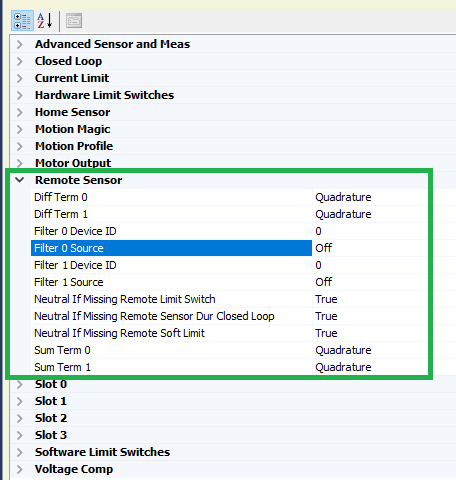
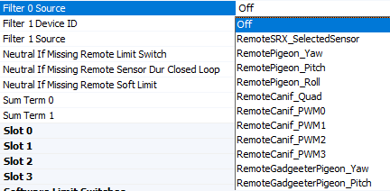
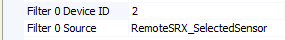
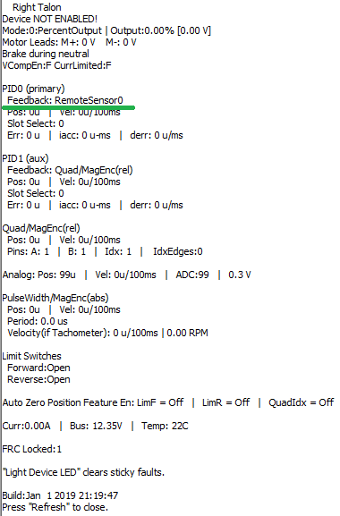
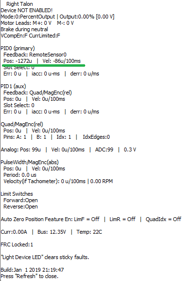
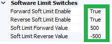
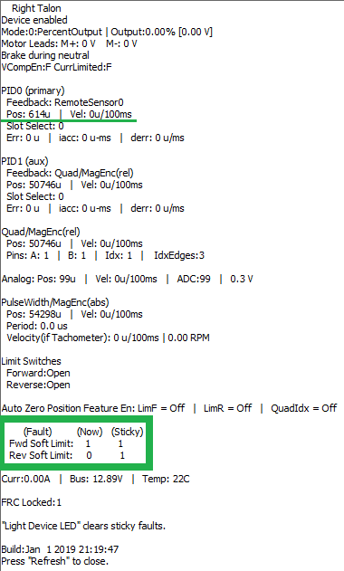

.. _remote-sensors-label:

Bring Up: Remote Sensors
==========================================

This section provides direction for **configuring and validating remote sensor** setups.
The remote sensor filter feature of the Talon SRX/Victor SPX allows for the processing of sensor values provided from other *remote* CAN bus devices.
In other words, a Talon SRX or Victor SPX can **execute closed-loop modes with sensor values sourced by other Talons, CANifiers, or Pigeon IMUs** on the same CAN-bus.

This is useful for two general reasons:

- Victor SPX does not have a Gadgeteer feedback port, so it must rely on *remote* sensors for sensor data.
- Situations where the sensor is physically located too far from the motor controller for reliable/robust wiring.

As a result, the remote sensor feature enables:

- Close-Loop control modes (Position, MotionMagic, Velocity, MotionProfile) when the sensor **cannot be directly connected to the motor controller**.
- Soft limits (auto neutral motor if out of range) when the sensor **cannot be directly connected to the motor controller**.
- **Auxiliary PID1 Closed-Loop** (differential mechanisms) that **requires more than one sensor source** (including MotionProfileArc, and all other Closed-Loop control modes).

.. note:: To use Pigeon IMU as a remote sensor over gadgeteer ribbon cable you must use Pigeon firmware 4.13 or higher. There is a bug that prevents Pigeon from appearing as a remote sensor in some cases over gadgeteer ribbon cable that has been fixed in 4.13

Bring up the sensor on the remote CTRE CAN device
~~~~~~~~~~~~~~~~~~~~~~~~~~~~~~~~~~~~~~~~~~~~~~~~~~~~~~~~~~~~~~~~

In order to use remote sensors, **the sensor must first be validated by the device wired to the sensor**.
**If the sensor is not reliable at the remote device, then it will not function when utilized remotely.**

This is done by following the sensor bring up instructions for that particular device type:

.. toctree::
   :maxdepth: 1

   ch11_BringUpPigeon
   ch12_BringUpCANifier
   ch14_MCSensor

.. warning:: In order for a motor controller to use another Talon sensor as a remote source, that Talon must have the correct sensor type selected.
   In other words, if Victor X is going to use Talon Y's analog sensor, Talon Y must have a *selected sensor type* set to *analog*.

.. _RemoteFilter:

Filter configuration
~~~~~~~~~~~~~~~~~~~~~~~~~~~~~~~~~~~~~~~~~~~~~~~~~~~~~~~~~~~~~~~~~

Inside Phoenix Tuner select the motor controller that will be utilizing the remote sensor data and go to the config tab.
Inside the tab go to the remote sensor portion and expand it, where you will see filter sources and filter device IDs.

Select the dropdown for filter source 0, and you will see a list of the possible sources of a remote sensor

Select the option that you wish to use, for the purpose of this example we will select a RemoteSRX_SelectedSensor that has configured a quadrature encoder, but any of these will work.

.. warning:: When selecting a Pigeon IMU data, there are **two** separate options for Pigeon - one for connection via CAN bus and one for connection to a remote Talon via ribbon cable.

As well as this, select Filter 0 Device ID and set it to the CAN device ID of the remote sensor. Press save, making sure the text goes from bold to non-bold.

.. note:: If the filter source is a RemoteGadgeteerPigeon type, the filter Device ID should be the device ID of the remote Talon SRX hosting the Pigeon IMU.

Sensor Check - No Motor Drive
~~~~~~~~~~~~~~~~~~~~~~~~~~~~~~~~~~~~~~~~~~~~~~~~~~~~~~~~~~~~~~~~~~

After having the filter configured, it is important to check that it is behaving properly. Under the closed loop section of the configs, configure PID 0 Primary Feedback Sensor to be Remote Sensor 0 and press save.

.. image:: img/remote-4.png

And perform a Self-test Snapshot to make sure the configuration took place.

Move the mechanism and perform self test snapshots to check the remote sensor is configured correctly

.. tip:: If something is not behaving correctly, double check the sensor setup for that device. If the sensor setup behaves correctly, the error is somewhere in the filter configuration

Sensor Check - With Motor Drive
~~~~~~~~~~~~~~~~~~~~~~~~~~~~~~~~~~~~~~~~~~~~~~~~~~~~~~~~~~~~~~~~~

See :ref:`mc-Sensor-Check` for the guide on checking the sensor with motor drive.

Remote Features Check
~~~~~~~~~~~~~~~~~~~~~~~~~~~~~~~~~~~~~~~~~~~~~~~~~~~~~~~~~~~~~~~~~

With the sensor being properly configured, now we can test the remote features.
A simple way of testing this is by configuring soft limits and checking to make sure those soft limits are upheld by the controller

First, we configure the soft limits on the motor controller so that they're enabled and have values for the forward and reverse limits

Then, we drive the motor to one of the limits. 
It will probably overshoot a bit, but the important piece is that the motor controller's output is neutral after hitting the soft limit, which we can check in the Self-test Snapshot and looking at the faults.

Next Steps
~~~~~~~~~~~~~~~~~~~~~~~~~~~~~~~~~~~~~~~~~~~~~~~~~~~~~~~~~~~~~~~~~
Now that the remote sensor is configured, it can be used for :ref:`ch16_ClosedLoop` or :ref:`ch14b_DiffSensors`.