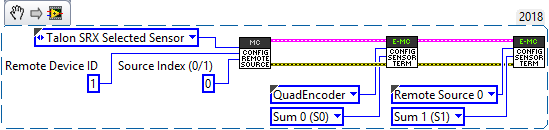

.. _ch14b_DiffSensors:

Bring Up: Differential Sensors
=====================================

This section is dedicated to validating differential sensors for any CTRE motor controller.
Generally a differential sensor is necessary for:

- Closed-Loop control modes (Position, MotionMagic, Velocity, MotionProfile) when the mechanism has more than one sensor attached.
- Auxiliary Closed-Loop control modes (MotionProfileArc, and all other Closed-Loop control modes) for mechanisms that require a differential component (Such as an elevator where the two sides are not linked mechanically, or a drive train).

Bring up Sensors as Remote/Local sensors
~~~~~~~~~~~~~~~~~~~~~~~~~~~~~~~~~~~~~~~~~~~~~~~~~~~~~~~~~~~~~~~~~~~~~
In order to use differential sensors, you must bring up all relevant sensors  on their local controller devices.

See relevant BringUp sections below:

   - :ref:`ch07_InitHardTesting`
   - :ref:`ch08_BringUpCAN`
   - :ref:`ch09_BringUpPCM`
   - :ref:`ch10_BringUpPDP`
   - :ref:`ch11_BringUpPigeon`
   - :ref:`ch12_BringUpCANifier`
   - :ref:`ch13_MC`
   - :ref:`mc-sensors-label`

After each sensor is brought up on its local device, all remote sensors should be configured as a remote filter on the master device.  See :ref:`remote-sensors-label`.

Configure sensors as Sum/Diff terms
~~~~~~~~~~~~~~~~~~~~~~~~~~~~~~~~~~~~~~~~~~~~~~~~~~~~~~~~~~~~~~~~~~~~~
Once the sensors are brought up and checked, we can move on to configuring them as the sum difference (diff) terms. 

The sum of two sensors is used primarily to calculate the overall movement of the mechanism.  For example, in the case of a differential lift the sum of two sensors is used to calculate the height of the lift.

.. tip:: When using the sum of two sensors for total movement, you can also set the Feedback Coefficient to 0.5 on order to scale the value back to the original units.

The difference of two sensors, however, is mostly used to calculate the differential portion of the mechanism.  For example, for a differential lift the difference represents how level the lift is.

The sum and diff terms will almost always be the same sensors, and will almost always be a local sensor and a remote sensor (or two remote sensors).

.. code-block:: java

        /* Below shows setting the member variables of a motor controller Config object.  */
        /* Remote Sensor 0 is the other talon's quadrature encoder */
        remoteFilter0.remoteSensorSource = RemoteSensorSource::RemoteSensorSource_TalonSRX_SelectedSensor;
        remoteFilter0.remoteSensorDeviceID = otherTalon->GetDeviceID();

        /* Configure sensor sum to be this quad encoder and the other talon's encoder */
        sum0Term = FeedbackDevice::QuadEncoder;
        sum1Term = FeedbackDevice::RemoteSensor0;

Auxiliary PID Polarity
~~~~~~~~~~~~~~~~~~~~~~~~~~~~~~~~~~~~~~~~~~~~~~~~~~~~~~~~~~~~~~~~~~~~~

The Auxiliary PID Polarity flag configures whether the master motor controller uses the addition of the two PID's and the auxiliary follower uses the subtraction, or if the master uses the subtraction and the auxiliary follower uses the addition.

Setting this to false will cause the master/follower pair to behave like this:
 - Master Motor Controller Output = PID[0] + PID[1]
 - Auxiliary Follower Output = PID[0] - PID[1]

Setting this to true will cause the master/follower pair to behave like this:
 - Master Motor Controller Output = PID[0] - PID[1]
 - Auxiliary Follower Output = PID[0] + PID[1]

Using the differential sensor setup
~~~~~~~~~~~~~~~~~~~~~~~~~~~~~~~~~~~~~~~~~~~~~~~~~~~~~~~~~~~~~~~~~~~~~
This is covered in :ref:`ch16_ClosedLoop`