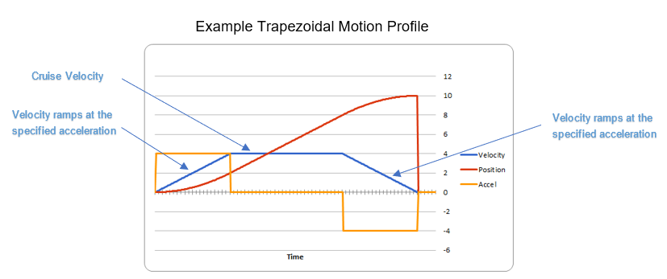
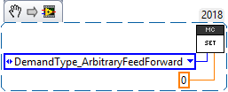
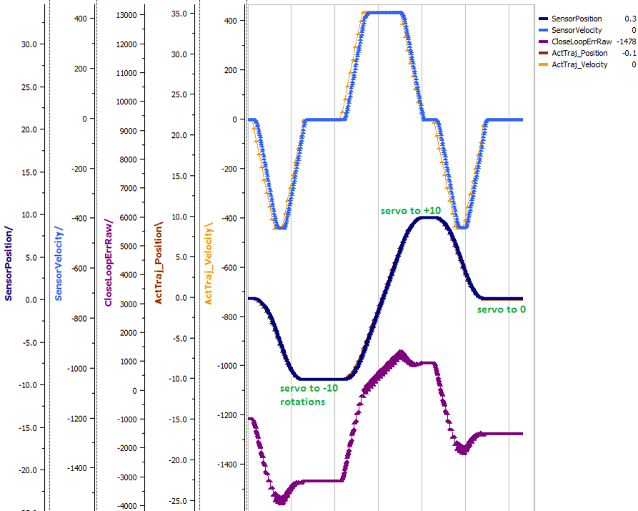
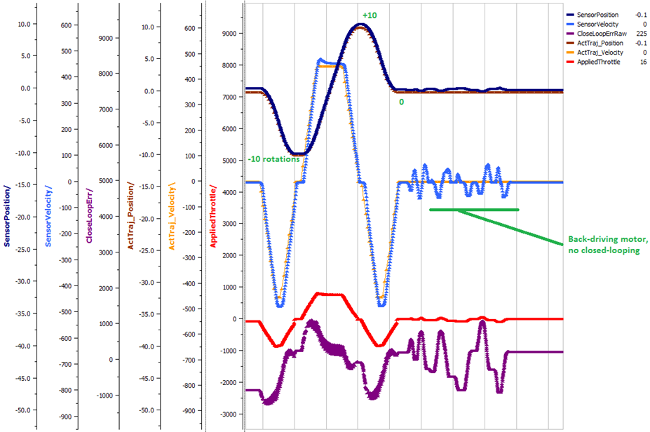
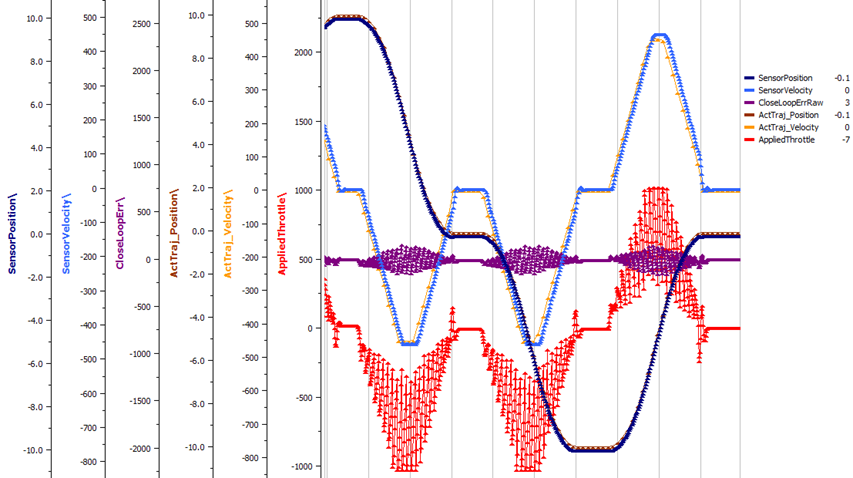
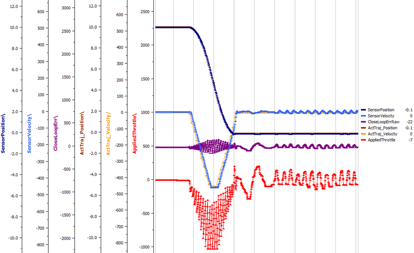
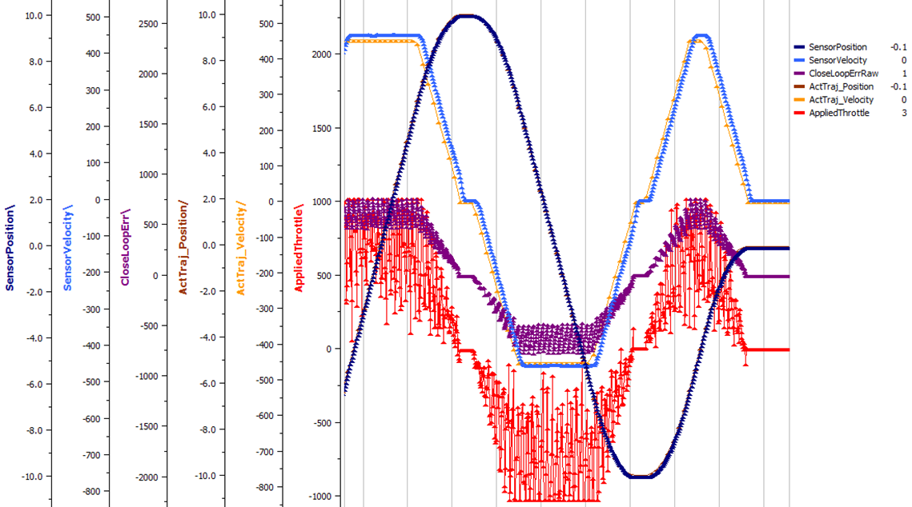
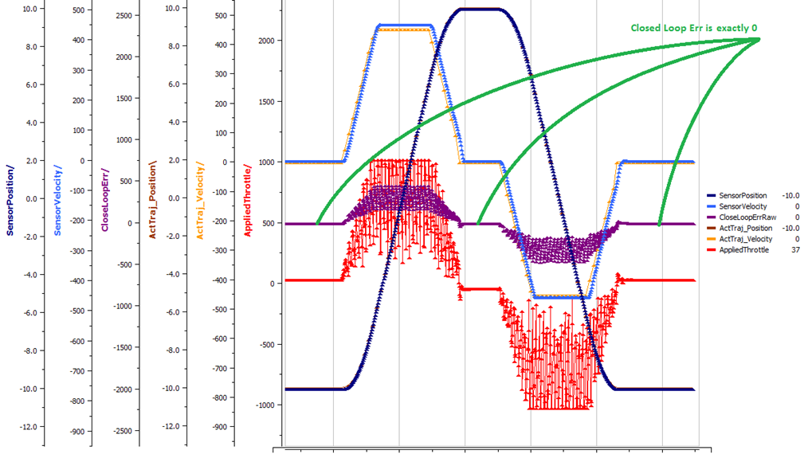
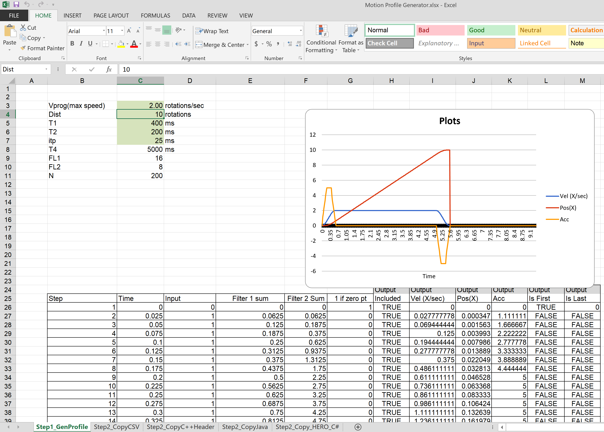
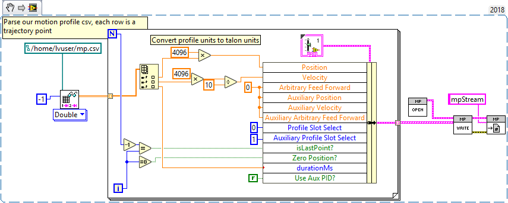

.. _ch16_ClosedLoop:

Motor Controller Closed Loop
============================

.. note: Talon SRX and Victor SPX can be used with PWM or CAN bus. However, the features below require CAN bus.

Primer on Closed-loop
~~~~~~~~~~~~~~~~~~~~~~~~~~~~~~~~~~~~~~~~~~~~~~~~~~~~~~~~~~~~~~~~~~~~~~~~~~~~~~~~~~~~~~~~~~~~~~~~~~~~~~~~~~~~~~~~~~~~

Talon SRX and Victor SPX supports a variety of closed-loop modes including position closed-loop, velocity closed-loop, Motion Profiling, and Motion Magic.  Talon SRX additionally supports current closed-loop. 

.. note:: All closed-loop modes update every 1ms (1000Hz) unless configured otherwise.

.. tip:: While tuning the closed-loop, use the Tuner configuration tab to quickly change the gains “on the fly”. Once the PID is stable, set the gain values in code so that Talons can be swapped/replaced easily.  

Regardless of which closed-loop control mode is used, the following statements apply:

- Current limit and voltage compensation selections are honored (just like in open-loop PercentOutput mode)
- “Ramping” can be configured using configClosedloopRamp (routine or VI)
- All other open-loop features are honored during closed loop (neutral mode, peaks, nominal outputs, etc.).
- Closed Loop controller will pull closed-loop gain/setting information from a selected slot.  There are four slots to choose from (for gain-scheduling).
- PIDF controller takes in target and sensor position measurements in “raw” sensor units.  This means a CTRE Mag Encoder will count 4096 units per rotation.
- PIDF controller takes in target and sensor velocity measurements in “raw” sensor units per 100ms.  
- PIDF controller calculates the motor output such that, 1023 is interpreted as “full”.  This means a closed loop error of 341 (sensor units) X kP of 3.0 will produce full motor output (1023).

.. warning:: Although the velocity kF config of the Talon-SRX/Victor-SPX assumes 1023 is full output, do not confuse this with the arbitrary feed-forward parameter of the Set routine/VI, which accepts a value within [-1,+1]

.. note:: A target goal of 2020 is to normalize the PID controller to interpret sensor using normalized units, and adjusting the PID output such that  ‘1’ is interpreted as full.  This will likely be a “back-breaking” change.  This also means 2019 will likely be the last time you see “1023” used anywhere.

Below are descriptions for the various control modes.

Closed-Loop Control Modes
----------------------------------------------------------------------------------

Position Closed-Loop Control Mode
^^^^^^^^^^^^^^^^^^^^^^^^^^^^^^^^^^^^^^^^^^^^^^^^^^^^^^^^^^^^^^^^^^^^^^^^^^

The Position Closed-Loop control mode can be used to abruptly servo to and maintain a target position. 

A simple strategy for setting up a closed loop is to zero out all Closed-Loop Control Parameters and start with the Proportional Gain.  

For example if you want your mechanism to drive 50% throttle when the error is 4096 (one rotation when using CTRE Mag Encoder), then the calculated Proportional Gain would be (0.50 X 1023) / 4096 = ~0.125.  

Tune this until the sensed value is close to the target under typical load.  Many prefer to simply double the P-gain until oscillations occur, then reduce accordingly.

If the mechanism accelerates too abruptly, Derivative Gain can be used to smooth the motion.  Typically start with 10x to 100x of your current Proportional Gain.  
If application requires a controlled (smooth) deceleration towards the target, we strongly recommend motion-magic.

If the mechanism never quite reaches the target and increasing Integral Gain is viable, start with 1/100th of the Proportional Gain.

Current Closed-Loop Control Mode
^^^^^^^^^^^^^^^^^^^^^^^^^^^^^^^^^^^^^^^^^^^^^^^^^^^^^^^^^^^^^^^^^^^^^^^^^^
The Talon’s Closed-Loop logic can be used to approach a target current-draw.  Target and sampled current is passed into the PIDF controller in milliamperes.  However the robot API expresses the target current in amperes.

.. note:: Current Control Mode is separate from Current Limit.  

.. tip:: A simple strategy for setting up a current-draw closed loop is to zero out all Closed-Loop Control Parameters and start with the Feed-Forward Gain.  Tune this until the current-draw is close to the target under typical load.  Then start increasing P gain so that the closed-loop will make up for the remaining error.  If necessary, reduce Feed-Forward gain and increase P Gain so that the closed-loop will react more strongly to the ClosedLoopError.

.. warning:: This feature is not available on Victor SPX.

Velocity Closed-Loop Control Mode
^^^^^^^^^^^^^^^^^^^^^^^^^^^^^^^^^^^^^^^^^^^^^^^^^^^^^^^^^^^^^^^^^^^^^^^^^^
The Talon’s Closed-Loop logic can be used to maintain a target velocity.  
Target and sampled velocity is passed into the equation in native sensor units per 100ms.  

.. tip:: A simple strategy for setting up a closed loop is to zero out all Closed-Loop Control Parameters and start with the Feed-Forward Gain.  Tune this until the sensed value is close to the target under typical load.  Then start increasing P gain so that the closed-loop will make up for the remaining error.  If necessary, reduce Feed-Forward gain and increase P Gain so that the closed-loop will react more strongly to the ClosedLoopError.

.. tip:: Velocity Closed-Loop tuning is similar to Current Closed-Loop tuning in their use of feed-forward.  Begin by measuring the sensor velocity while driving the Talon at a large throttle.

 
Motion Magic Control Mode
^^^^^^^^^^^^^^^^^^^^^^^^^^^^^^^^^^^^^^^^^^^^^^^^^^^^^^^^^^^^^^^^^^^^^^^^^^
Motion Magic is a control mode for Talon SRX that provides the benefits of Motion Profiling without needing to generate motion profile trajectory points.
When using Motion Magic, Talon SRX / Victor SPX will move to a set target position using a motion profile, while honoring the user specified acceleration, maximum velocity (cruise velocity), and optional S-Curve smoothing.

.. tip:: Motion Magic in firmware >= 4.17 (Talon SRX and Victor SPX) now supports an S-Curve parameter, allowing you to create a continuous velocity profile.

The benefits of this control mode over “simple” PID position closed-looping are:

• Control of the mechanism throughout the entire motion (as opposed to racing to the end target position).  
• Control of the mechanism’s inertia to ensure smooth transitions between set points. 
• Improved repeatability despite changes in battery voltage.
• Improved repeatability despite changes in motor load.

After gain/settings are determined, the robot-application only needs to periodically set the target position.  

There is no general requirement to “wait for the profile to finish”, however the robot application can poll the sensor position and determine when the motion is finished if need be.

Motion Magic functions by generating a trapezoidal/S-Curve velocity profile that does not exceed the specified acceleration or cruise velocity.
This is done automatically as the Talon SRX / Victor SPX determines on-the-fly when to modify its velocity to accomplish this.

.. note:: If the remaining sensor distance to travel is small, the velocity may not reach cruise velocity as this would overshoot the target position.  This is often referred to as a “triangle profile”.

If the S-Curve strength [0,8] is set to a nonzero value, the generated velocity profile is no longer trapezoidal, but instead is continuous (corner points are smoothed).

An S-Curve profile has the following advantages over a trapezoidal profile:

- Control over the Jerk of the mechanism.
- Reducing oscillation of the mechanism.
- Maneuver is more deliberate and reproducible.

.. tip:: The S-Curve feature, by its nature, will increase the amount of time a movement requires.  This can be compensated for by decreasing the configured acceleration value.

.. image:: img/s-curve-profile-1.png

Motion Magic utilizes the same PIDF parameters as Motion Profiling.  

Three additional parameters need to be set in the Talon SRX– Acceleration, Cruise Velocity, and Acceleration Smoothing.

The Acceleration parameter controls acceleration and deacceleration rates during the beginning and end of the trapezoidal motion.  
The Cruise Velocity parameter controls the cruising (peak) velocity of the motion.
The Acceleration smoothing parameter controls the "curve" of the velocity, a larger smoothing value will result in greater dampening of the acceleration.

Motion Profile Control Mode
^^^^^^^^^^^^^^^^^^^^^^^^^^^^^^^^^^^^^^^^^^^^^^^^^^^^^^^^^^^^^^^^^^^^^^^^^^
Talon SRX and Victor SPX support other closed-loop modes that allow a “Robot Controller” to specify/select a target value to meet.  The target can simply be the percent output motor drive, or a target current-draw.  When used with a feedback sensor, the robot controller may also simply set the target position, or velocity to servo/maintain.   

However, for advanced motion profiling, the Talon SRX / Victor SPX additionally supports a mode whereby the robot controller can *stream* a sequence of trajectory points to express an *entire motion profile*.

Each trajectory point holds the desired velocity, position, arbitrary feedforward, and time duration to honor said point until moving on to the next point.  The point also holds targets for both the primary and auxiliary PID controller, allowing for differential control (drivetrain, differential mechanisms).

Alternatively, the trajectory points can be streamed into the motor controller *as the motor controller is executing the profile*, so long as the robot controller sends the trajectory points faster than the Talon consumes them.  This also means that there is no practical limit to how long a profile can be.

.. tip :: Starting in 2019, the Talon and Victor will linearly interpolate targets between two buffer points every 1ms.  This means you can send points with larger time durations, but still have a smooth continuous motion.  This features default on.

What is the benefit? 
Leveraging the Motion Profile Control Mode in the Talon SRX has the following benefits:

• Direct control of the mechanism throughout the entire motion (as opposed to a single PID closed-loop which directly servos to the end target position). 
• Accurate scheduling of the trajectory points that is not affected by the performance of the primary robot controller.
• Improved repeatability despite changes in battery voltage.
• Improved repeatability despite changes in motor load. 
• Provides a method to synchronously gain-schedule.

Additionally, this mode could be used to schedule several position servos in advance with precise time outs.  For example, one could map out a collection of positions and timeouts, then stream the array to the Talon SRX to execute them.

Motion Profile Arc Control Mode
^^^^^^^^^^^^^^^^^^^^^^^^^^^^^^^^^^^^^^^^^^^^^^^^^^^^^^^^^^^^^^^^^^^^^^^^^^

Motion Profile Arc utilizes the Auxiliary Closed Loop features to profile the motion of not just *one* degree of freedom, but of *two*.

In the example of trying to profile the movement of the robot on a field, the primary PID can be used to ensure the robot is a specified distance (sum or average of both sides), and at the same time the Auxiliary PID can be used to ensure the robot is facing the right direction (difference of both sides or heading from a pigeon), allowing the robot to follow a spline.

The benefits of this are the same as for the Motion Profile control mode, and at the same time expands on the possibilities this can be used for.

.. _auxPID-label:

Auxiliary Closed Loop PID[1]
----------------------------------------------------------------------------------

Along with the above control modes, the Talon SRX / Victor SPX has the ability to run a second PID loop, called the auxiliary PID[1] loop.  This is typically used in differential mechanisms where application must maintain two process variables (e.g. sum/average of two sensors, along with the differenence or IMU heading).

When used, the motor controller will simultaneously calculate:
- PID[0] + PID[1] (this is applied to the motor output)
- PID[0] - PID[1] (this is sent to a follower)

.. note:: The follower Talon / Victor must have a followType of AuxOutput1.  Use the follow routine/VI to accomplish this.

.. note:: The signage of the PID[1] term can be modified allowing the master Talon to subtract the term instead of adding it.

.. note:: In order to use Auxiliary Closed Loop, a remote sensor will need to have been configured for PID[0] or PID[1]. Look at :ref:`remote-sensors-label` to see how to do this  

.. note:: The Control Mode of Auxiliary Closed Loop is *always* position closed-loop.

Some example setups are provided below, with a step-by-step walkthrough provided after the PID tuning sections.  See :ref:`auxPID-walkthrough-label`.

Example 1 - Differential Drivetrain
^^^^^^^^^^^^^^^^^^^^^^^^^^^^^^^^^^^^^^^^^^^^^^^^^^^^^^^^^^^^^^^^^^^^^^^^^^
Consider the application of controlling the position of a drive train with Position Control Mode, given an encoder on the left and right side.

PID[0] will use the sum (or average if sensor coefficient is set to 0.5) of the left and right sensor to produce the *traveled robot distance*.  
Given a target distance, the PID[0] output will move the robot closer to the target distance.
PID[1] will use the difference between the left and right sensor to produce the *robot heading*.  Alternatively the Pigeon IMU can be used to remotely provide this.
The PID[1] output will then maintain the robot's heading throughout the maneuver.

.. note:: If Velocity control mode is used, the aux PID[1] loop still uses the position value of its respective sensor source.  This is convenient for controling the robot-velocity while maintaining robot-heading.

.. note:: When using the Motion Magic control mode, the target for PID[1] is smoothed identically to PID[0], and both targets should be reached at approxamitely the same time.

.. note:: Sensor difference (and not sum) may represent the distance traveled depending on the signage of the sensors involved.

Example 2 - Lift Mechanism
^^^^^^^^^^^^^^^^^^^^^^^^^^^^^^^^^^^^^^^^^^^^^^^^^^^^^^^^^^^^^^^^^^^^^^^^^^
Consider a lifting mechanism composed of two closed-loops (one for each side) and no mechanical linkage between them.
In other words, the left and right side each have a unique motor controller and sensor.
The goal in this circumstance is to closed-loop the elevation while keeping the left and right side reasonably synchronised.

This can be accomplished by using the sum of the each side as the elevator height, and the difference as the level deviation between the left and right, which must be kept near zero.

Aux PID[1] can then be used to apply a corrective difference component (adding to one side and subtracting from the other) to maintain a synchronous left and right position, while employing Position/Velocity/Motion-Magic to the primary axis of control (the elevator height).

Sensor Preparation
~~~~~~~~~~~~~~~~~~~~~~~~~~~~~~~~~~~~~~~~~~~~~~~~~~~~~~~~~~~~~~~~~~~~~~~~~~~~~~~~~~~~~~~~~~~~~~~~~~~~~~~~~~~~~~~~~~~~

Before invoking any of the closed loop modes, the following must be done:

• Complete the sensor bring up procedure to ensure sensor phase and general health.
• Record the maximum sensor velocity (position units per 100ms) at 100% motor output.
• Calculate an Arbitrary Feed Forward if necessary (gravity compensation, custom system characterization).
• Calculating Velocity Feed-Forward (kF) gain if applicable (Velocity Closed Loop, Motion Profile, Motion Magic).

The first two are covered in section “Confirm Sensor Resolution/Velocity”.
Calculating feed forward is done in the next section.

Arbitrary Feed Forward
~~~~~~~~~~~~~~~~~~~~~~~~~~~~~~~~~~~~~~~~~~~~~~~~~~~~~~~~~~~~~~~~~~~~~~~~~~~~~~~~~~~~~~~~~~~~~~~~~~~~~~~~~~~~~~~~~~~~
The Arbitrary Feed Forward is a strategy for adding any arbitrary values to the motor output regardless of control mode.
It can be used for gravity compensation, custom velocity and acceleration feed forwards, static offsets, and any other term desired.

.. note:: When setting and tuning closed-loop gains, Arbitrary Feed Forward should be set *first*, before any other values.  The Arbitrary Feed Forward will change the relationship between your closed-loop gains and the output of your system, and thus result in different gains needed for a well-tuned mechanism.

.. note:: Unlike other closed-loop gains, the Arbitrary Feed Forward is passed in as an additional set() parameter instead of as a persistent configuration parameter.  This is because typical use-cases for Arbitrary Feed Forward frequently change the value dynamically.

.. warning:: Arbitrary Feed Forward and Auxiliary Closed Loop cannot be used simultaneously *except* when using Motion Profile Arc.

Do I need to use Arbitrary Feed Forward?
----------------------------------------------------------------------------------
We recommend using Arbitrary Feed Forward in any of the following scenarios:

- A mechanism affected by gravity (elevator, arm, etc.).
- Custom system characterization (such as acceleration feed forward).
- Any scenario requiring a static offset.

.. note:: Units for the arbitrary feedforward term are [-1,+1].

Setting Arbitrary Feed Forward
----------------------------------------------------------------------------------
Arbitrary Feed Forward is passed as an optional parameter in a set() call or VI.  The value must be set on every call, just like the primary set value.

Example code:

.. code-block:: java

    _motorcontroller.set(ControlMode.MotionMagic, targetPos, DemandType.ArbitraryFeedForward, feedforward);

LabVIEW snippet (drag and drop):

Common Feed Forward Uses/Calculations
----------------------------------------------------------------------------------
Below are some common uses and calculations for Arbitrary Feed Forward.

Gravity Offset (Elevator)
^^^^^^^^^^^^^^^^^^^^^^^^^^^^^^^^^^^^^^^^^^^^^^^^^^^^^^^^^^^^^^^^^^^^^^^^^^
In the case of a traditional elevator mechanism, there is a constant force due to gravity affecting the mechanism. Because the force is constant, we can determine a constant offset to keep the elevator at position when error is zero.

Use either the Phoenix Tuner Control Tab or Joystic control in your robot code to apply output to the elevator until it stays at a position without moving.  Use Phoenix Tuner (plotter or self-test snapshot) to measure the output value - this is the Arbitrary Feed Forward value needed to offset gravity.

If we measure a motor output of 7% to keep position, then our java code for Arbitrary Feed Forward with Motion Magic would look like this:

.. code-block:: java

    double feedforward = 0.07;
    _motorcontroller.set(ControlMode.MotionMagic, targetPos, DemandType.ArbitraryFeedForward, feedforward);

.. tip:: If your elevator mechanism will change weight while in use (ie, pick up a heavy game piece), it is helpful to measure gravity offsets at each expected weight and switch between Arbitrary Feed Forward values as needed.

Gravity Offset (Arm)
^^^^^^^^^^^^^^^^^^^^^^^^^^^^^^^^^^^^^^^^^^^^^^^^^^^^^^^^^^^^^^^^^^^^^^^^^^
In the case of an arm mechanism, the force due to gravity will change as the arm moves through its range of motion.  In order to compensate for this, we will need to measure a gravity offset at the highest force (arm at horizontal position) and then scale the value with trigonometry.

To start, use either the Phoenix Tuner Control Tab or Joystic control in your robot code to apply output to the arm until it stays at the horizontal position without moving.  Use Phoenix Tuner (plotter or self-test snapshot) to measure the output value - this is the base component of our Arbitrary Feed Forward value.

For scaling the value, the cosine term of trigonometry_ matches the scaling we need for our rotating arm.  The cosine term is at maximum value (+1) when at horizontal (0 degrees or radians) and is at 0 when the arm is vertical (90 degrees or pi/2 radians).
To use this cosine value as a scalar, we will need to determine our current angle.  This requires knowing the current arm position and number of position ticks per degree, then converting to units of radians.

.. _trigonometry: https://en.wikipedia.org/wiki/Trigonometry

.. note:: Trigonometry uses 0 for the angle at horizontal.  To account for this, we need to subtract the measured horizontal position value before we calculate our angle.  This means we will have a positive angle above horizontal and a negative angle below horizontal.

.. warning:: The java cosine function requires units to be in radians.

.. code-block:: java

    int kMeasuredPosHorizontal = 840; //Position measured when arm is horizontal
    double kTicksPerDegree = 4096 / 360; //Sensor is 1:1 with arm rotation
    int currentPos = _motorcontroller.getSelectedSensorPosition();
    double degrees = (currenPos - kMeasuredPosHorizontal) / kTicksPerDegree;
    double radians = java.lang.Math.toRadians(degrees);
    double cosineScalar = java.lang.Math.cos(radians);

    double maxGravityFF = 0.07;
    _motorcontroller.set(ControlMode.MotionMagic, targetPos, DemandType.ArbitraryFeedForward, maxGravityFF * cosineScalar);

Calculating Velocity Feed Forward gain (kF)
~~~~~~~~~~~~~~~~~~~~~~~~~~~~~~~~~~~~~~~~~~~~~~~~~~~~~~~~~~~~~~~~~~~~~~~~~~~~~~~~~~~~~~~~~~~~~~~~~~~~~~~~~~~~~~~~~~~~
A typical strategy for estimating the necessary motor output is to take the target velocity and multiplying by a tuned/calculated scalar.
More advanced feed forward methods (gravity compensation, custom velocity and acceleration feed forwards, static offsets, etc.) can be done with the arbitrary feed forward features from the previous section..

.. note:: The velocity feed forward (kF) is different from the Arbitrary Feed Forwad in that it is a specialized feed forward designed to approximate the needed motor output to achieve a specified velocity.

Do I need to calculate kF?
----------------------------------------------------------------------------------
If using any of the control modes, we recommend calculating the kF:

- Velocity Closed Loop: kF is multiplied by target velocity and added to output.
- Current (Draw) Closed Loop: kF is multiplied by the target current-draw and added to output.
- MotionMagic/ MotionProfile / MotionProfileArc: kF is multiplied by the runtime-calculated target and added to output.

.. note:: When using position closed loop, it is generally desired to use a kF of ‘0’.  During this mode target position is multiplied by  kF and added to motor output.  If providing a feedforward is necessary, we recommend using the arbitrary feed forward term (4 param Set) to better implement this.

How to calculate kF
----------------------------------------------------------------------------------
Using Tuner (Self-Test or Plotter), we’ve measured a peak velocity of **9326** native units per 100ms at 100% output.  This can also be retrieved using getSelectedSensorVelocity (routine or VI).

However, many mechanical systems and motors are not perfectly linear (though they are close).  To account for this, we should calculate our feed forward using a measured veloctiy around the percent output we will usually run the motor.

For our mechanism, we will typically be running the motor aroun 75% output.  We then use Tuner (Self-Test Snapshot or Plotter) to measure our velocity - in this case, we measure a velocity of **7112** native units per 100ms.

Now let’s calculate a Feed-forward gain so that 75% motor output is calculated when the requested speed is **7112** native units per 100ms.

F-gain = (75% X 1023) / **7112**
F-gain = 0.1079

Let’s check our math, if the target speed is **7112** native units per 100ms, Closed-loop output will be (0.1079 X **7112**) => 767.38 (75% of full forward).

.. note:: The output of the PIDF controller in Talon/Victor uses 1023 as the “full output".
   However the 2020 software release will likely normalize this so that a value of ‘1’ yields “full output”.
   This will likely be a “back-breaking” change.  This also means 2019 will likely be the last time you see “1023” used anywhere.

.. note:: The kF feature and arbitrary feed-forward feature are not the same.
   Arbitrary feed-forward is a supplemental term [-1,1] the robot application can provide to add to the output via the set() routine/VI.

Motion Magic / Position / Velocity / Current Closed Loop Closed Loop
~~~~~~~~~~~~~~~~~~~~~~~~~~~~~~~~~~~~~~~~~~~~~~~~~~~~~~~~~~~~~~~~~~~~~~~~~~~~~~~~~~~~~~~~~~~~~~~~~~~~~~~~~~~~~~~~~~~~

Closed-looping the position/velocity value of a sensor is explained in this section.  
This section also applies to the current (draw) closed loop mode.

Relevant source examples can be found at:

- https://github.com/CrossTheRoadElec/Phoenix-Examples-Languages
- https://github.com/CrossTheRoadElec/Phoenix-Examples-LabVIEW

The general steps are:

- Selecting the sensor type (see previous Bring-Up sections)
- Confirm motor and sensor health (see previous Bring-Up section on sensor)
- Confirm sensor phase (see previous Bring-Up sections)
- Collect max sensor velocity information (see calculating kF section)
- Bring up plotting interface so you can visually see sensor position and motor output.  This can be done via Tuner Plotter, or through LabVIEW/SmartDash/API plotting.
- Configure gains and closed-loop centric configs.

.. note :: If you are using current closed-loop, than a sensor is not necessary.

.. note :: Current closed loop is not available on Victor SPX, it is only available on Talon SRX.

Once these previous checks are done, continue down to the gain instructions.

.. note:: This assumes all previous steps have been followed correctly.

1. Checkout the relevant example from CTREs GitHub.

2. Set all of your gains to zero.  Use either API or Phoenix Tuner.

3. If not using Position-Closed loop mode, set the kF to your calculated value (see previous section).

4. If using Motion Magic, set your initial cruise velocity and acceleration (section below).

5. Deploy the application and use the joystick to adjust your target.  Normally this requires holding down a button on the gamepad (to enter closed loop mode).

6. Plot the sensor-position to assess how well it is tracking.  This can be done with WPI plotting features, or with Phoenix Tuner.

In this example the mechanism is the left-side of a robot’s drivetrain.  
The robot is elevated such that the wheels spin free.  
In the capture below we see the sensor position/velocity (blue) and the Active Trajectory position/velocity (brown/orange).  
At the end of the movement the closed-loop error (which is in raw units) is sitting at ~1400.units.  
Given the resolution of the sensor this is approximately 0.34 rotations (4096 units per rotation).  
Another note is that when the movement is finished, you can freely back-drive the mechanism without motor-response (because PID gains are zero).

Setting Motion Magic Cruise Velocity And Acceleration
----------------------------------------------------------------------------------
The recommended way to do this is to take your max sensor velocity (previous section).

Suppose your kMaxSensorVelocity is **9326** units per 100ms.  A reasonable initial cruise velocity may be half of this velocity, which is **4663**.

Config **4663** to be the cruiseVelocity via configMotionCruiseVelocity routine/VI.

Next lets set the acceleration, which is in velocity units per second (where velocity units = change in sensor per 100ms).  This means that if we choose the same value of **4663** for our acceleration, than Motion Magic will ensure it takes one full second to reach peak cruise velocity.

In short set the acceleration to be the same **4663** value via configMotionAcceleration routine/VI. 

Later you can increase these values based on the application requirements.

Dialing kP
----------------------------------------------------------------------------------

Next we will add in P-gain so that the closed-loop can react to error.  In the previous section, after running the mechanism with just F-gain, the servo appears to settle with an error or ~1400.

Given an error of (~1400.), suppose we want to respond with another 10% of throttle.  Then our starting kP would be….

(10% X 1023) / (1400) = 0.0731
Now let’s check our math, if the Talon SRX sees an error of 1400 the P-term will be
1400 X 0.0731= 102 (which is about 10% of 1023)
kP = 0.0731

 Apply the P -gain programmatically using your preferred method.  Now retest to see how well the closed-loop responds to varying loads.  

 
Retest the maneuver by holding button 1 and sweeping the gamepad stick.
At the end of this capture, the wheels were hand-spun to demonstrate how aggressive the position servo responds.
Because the wheel still back-drives considerably before motor holds position, the P-gain still needs to be increased.

Double the P-gain until the system oscillates (by a small amount) or until the system responds adequately.

After a few rounds the P gain is at 0.6.

Scope captures below show the sensor position and target position follows visually, but back-driving the motor still shows a minimal motor response.

After several rounds, we’ve landed on a P gain value of 3.  The mechanism overshoots a bit at the end of the maneuver.  Additionally, back-driving the wheel is very difficult as the motor-response is immediate (good).

Once settles, the motor is back-driven to assess how firm the motor holds position.

The wheel is held by the motor firmly.

Dialing kD
----------------------------------------------------------------------------------

To resolve the overshoot at the end of the maneuver, D-gain is added.  D-gain can start typically at 10 X P-gain.

With this change the visual overshoot of the wheel is gone.  The plots also reveal reduced overshoot at the end of the maneuver.

Dialing kI
----------------------------------------------------------------------------------

Typically, the final step is to confirm the sensor settles very close to the target position.  If the final closed-loop error is not quite close enough to zero, consider adding I-gain and I-zone to ensure the Closed-Loop Error ultimately lands at zero (or close enough).  

In testing the closed-loop error settles around 20 units, so we’ll set the Izone to 50 units (large enough to cover the typical error), and start the I-gain at something small (0.001).

Keep doubling I-gain until the error reliably settles to zero.

With some tweaking, we find an I-gain that ensures maneuver settles with an error of 0.

If using Motion Magic, the acceleration and cruise-velocity can be modified to hasten/dampen the maneuver as the application requires.

^^^^^^^^^^^^^^^^^^^^^^^^^^^^^^^^^^^^^^^^^^^^^^^^^^^^^^^^^^^^^^^^^

.. _auxPID-walkthrough-label:

Auxiliary Closed Loop PID[1] Walkthrough
~~~~~~~~~~~~~~~~~~~~~~~~~~~~~~~~~~~~~~~~~~~~~~~~~~~~~~~~~~~~~~~~~~~~~~~~~~~~~~~~~~~~~~~~~~~~~~~~~~~~~~~~~~~~~~~~~~~~

The auxiliary closed loop can be used to provide a differential output component to a multi motor controller system.  See :ref:`auxPID-label` for an explanation of the Auxiliary Closed Loop feature - below is a step-by-step walkthrough.

.. tip:: Be sure to look at the examples that are provided. Any example that has Auxiliary in the name or is named "RemoteClosedLoop" makes use of these features.

    Examples can be found here: https://github.com/CrossTheRoadElec/Phoenix-Examples-Languages

    We *strongly* encourage using the examples first, then only implementing PID[1] in your robot code once comfortable with the examples.

As an example, we will use a differential drive train with 2 encoders on each side and a pigeon.

 1. Decide which side's master motor controller is the *ultimate master*, i.e. the Talon/Victor that will calculate both the linear (PID0) and turn (PID1) component. This example will use the right side as the ultimate master side.
 
 2. Configure all remaining motor controllers on the right side to follow the *ultimate master* motor controller.

 3. Configure all motor controllers on the left side to **auxiliary follow** the master motor controller

  .. note:: Alternatively, you can configure one motor controller on the left side to auxiliary follow the master motor controller, and the remaining to follow the auxiliary follower.  Note this will introduce additional lag (typically 10ms).

  Example below on how to follow the ultimate master.

  .. code-block:: java

     _slave.follow(_ultimateMasterTalon, FollowerType.AuxOutput1); // follower will apply PID[0] - PID[1] while master applies PID[0] + PID[1], or vice versa

 4. Configure PID[0] of the ultimate master motor controller. The example will use the sensor sum of the local encoder and of the other side's encoder.

   - This requires having Sum0 Term configured to use the local encoder and Sum1 Term configured to use a RemoteFilter0.

  .. note:: RemoteFilter 0 or 1 has to be configured to capture the other side's encoder using either a RemoteSRX or CANifier.

  See :ref:`ch14b_DiffSensors` for information on bringing up the sensors for differential setups.

 5. Configure PID[1] of the ultimate master motor controller. The example will use RemoteSensor1 configured to capture the Pigeon's Yaw value.

  See :ref:`ch14b_DiffSensors` for information on bringing up the sensors for differential setups, and :ref:`remote-sensors-label` for bringing up Pigeon IMU as a remote sensor.

 6. Determine if the master controller should use the output of PID[0] + PID[1] or if it should use PID[0] - PID[1].  This will depend on the polarity of the sensors, which side of the drivetrain is the ultimate master, and the desired corrective motion.

  The auxiliary follower will use whichever sign the master does not use in order to control the differential.

 7. When closed-looping the drive train, utilize the 4 parameter set method, specifying a setpoint for the sum of the encoders and a setpoint for the Pigeon IMU yaw.

  .. code-block:: java

     _rightMaster.set(ControlMode.Position, forward, DemandType.AuxPID, _targetAngle); // _targetAngle is in Pigeon units, 8192 units per 360'

  LabVIEW snippet below that uses 4 param set.

  .. image:: img/lv-4-param-1.png

 8. Tune the PID for both the primary and auxiliary PID using the above methods.

.. tip:: Primary and Auxiliary PID can initially be tuned independently to simplify the tuning process.  Tune the primary PID gains while keeping the Auxiliary target constant, then tune the auxiliary PID gains while keeping the primary target constant (ie. using zero-turn movement).  The primary and auxiliary gain sets can then be further tuned when exuting motion using both PID loops simultaneously.

Motion Profiling Closed Loop
~~~~~~~~~~~~~~~~~~~~~~~~~~~~~~~~~~~~~~~~~~~~~~~~~~~~~~~~~~~~~~~~~~~~~~~~~~~~~~~~~~~~~~~~~~~~~~~~~~~~~~~~~~~~~~~~~~~~

The above guide shows how to dial PID gains for all closed looping, this guide will talk about how to utilize Motion Profiling using a BufferedStream object.

.. note:: It is strongly recommended to use the MotionProfiling example first to become familiar with Motion Profiling, and only after having used the example should you try to implement it in your own robot code

.. tip:: The Buffered stream object is a new object introduced in 2019 designed to make motion profiling easier than ever. The legacy API and the examples that use it are still available.

Create a motion profile
----------------------------------------------------------------------------------

Using Excel or a path generating program, you need to create a series of points that specify the target position, velocity, and the time to the next point.
If you are using an example, there is an excel sheet inside the example folder that does this for you named *Motion Profile Generator*. 
Use this to get started on creating motion profiles.

Upload it to the robot
----------------------------------------------------------------------------------

This can be done either by copy-pasting all the points into the robot application as an array or by copy-pasting the file onto the Robot Controller and using a File operation to read it.
The Java/C++ examples show copy-pasting the points into an array, and the excel document we provide has a page that automatically generates the array for you to copy paste.

.. code-block:: java

	public static double [][]Points = new double[][]{		
		{0,	0	,25},
		{0.000347222222222222,	1.666666667	,25},
		{0.0015625,	4.166666667	,25},
		{0.00399305555555556,	7.5	,25},
		.
		.
		.
		{9.99756944444445,	5	,25},
		{9.99913194444445,	2.5	,25},
		{9.99982638888889,	0.833333333	,25},
		{10,	0	,25}
	};

LabVIEW, on the other hand, uses the file operations to read a csv file and feed the points read from it into an array.

.. tip:: Drag and drop the image above into your Begin.vi block diagram

.. note:: The above image also has the next step, *Write the points to a Buffered Stream* included in it

Write the points to a Buffered Stream
----------------------------------------------------------------------------------

Now you need to write all the points onto a buffered stream object. This is done by calling the *Write* method and passing a trajectory point that has the specified position and velocity into the object.
Be sure that the first point has zeroPos set to true if you wish to zero the position at the start of the profile and that the last point has isLast set to true so the profile recognizes when it's done.

Java example:

.. sphynx note: the comments are not arranged perfecty due to tabs=8 on RTD while VSCode uses tabs=4

.. code-block:: java

	/* Insert every point into buffer, no limit on size */
	for (int i = 0; i < totalCnt; ++i) {

		double direction = forward ? +1 : -1;
		double positionRot = profile[i][0];
		double velocityRPM = profile[i][1];
		int durationMilliseconds = (int) profile[i][2];

		/* for each point, fill our structure and pass it to API */
		point.timeDur = durationMilliseconds;
		point.position = direction * positionRot * Constants.kSensorUnitsPerRotation; 		// Convert Revolutions to Units
		point.velocity = direction * velocityRPM * Constants.kSensorUnitsPerRotation / 600.0;   // Convert RPM to Units/100ms
		point.auxiliaryPos = 0;
		point.auxiliaryVel = 0;
		point.profileSlotSelect0 = Constants.kPrimaryPIDSlot; /* which set of gains would you like to use [0,3]? */
		point.profileSlotSelect1 = 0; /* auxiliary PID [0,1], leave zero */
		point.zeroPos = (i == 0); /* set this to true on the first point */
		point.isLastPoint = ((i + 1) == totalCnt); /* set this to true on the last point */
		point.arbFeedFwd = 0; /* you can add a constant offset to add to PID[0] output here */

		_bufferedStream.Write(point);
	}

Call startMotionProfile
----------------------------------------------------------------------------------

With the Buffered Stream object fully written to, call startMotionProfile and the motor controller will begin executing once the specified number of points have been buffered into it.
Do **not** call *Set* after this, the motor controller will execute on its own.

.. note:: Ensure MotorSafety is **Disabled**. Using the new API with MotorSafety enabled causes undefined behavior. If you wish to use MotorSafety with motion profiling, use the Legacy API.

Check isMotionProfileFinished
----------------------------------------------------------------------------------

After having started the motion profile, you should check when the profile is done by polling *IsMotionProfileFinished* until it returns true.
Once it is true, you know the profile has reached its last point and is complete, so you can move on to the next action.

.. code-block:: java

	if (_master.isMotionProfileFinished()) {
		Instrum.printLine("MP finished");
	}

Motion Profiling Arc Closed Loop
~~~~~~~~~~~~~~~~~~~~~~~~~~~~~~~~~~~~~~~~~~~~~~~~~~~~~~~~~~~~~~~~~~~~~~~~~~~~~~~~~~~~~~~~~~~~~~~~~~~~~~~~~~~~~~~~~~~~
In addition to the motion profile mode, there is a similar control mode that integrates auxiliary closed loop features.
This is called Motion Profile Arc control mode, and utilizes everything that's been covered in the previous sections.

Below is a guide on how to get Motion Profiling Arc up and running, using the new Buffered Stream API.

.. note:: This is also an example that is available on `our examples repo <https://github.com/CrossTheRoadElec/Phoenix-Examples-Languages/tree/master/Java/MotionProfileArc_Simple>`_

.. note:: The steps for using motion profile arc are very similar and reference the steps for creating a normal motion profile. Read them first

Steps for using Motion Profile Arc:
 1. Configure all the motor controllers to use the correct sensors

   - This involves bringing up all the sensors on their respective CAN devices

    - :ref:`remote-sensors-label`
    - :ref:`mc-sensors-label`

   - This also requires setting up remote sensors and auxiliary closed loops, as detailed in the sections above

 2. Create a motion profile. This is the most unique step from a normal motion profile because it will integrate the auxiliary position variable in some way with the profile. If you wish to just make sure the robot is driving straight, generate a normal profile and zero the auxiliary position.
 3. Upload the points to the robot. This is done the same way as for a normal motion profile
 4. Write the points to a Buffered Stream object. This is also done the same way, but be sure to include the **auxiliary position** and **auxiliary velocity** points as well as setting **useAuxPID** to *true*
 5. Call startMotionProfile. Everything regarding normal motion profile is the same as motion profile arc, except that you also need to pass ControlMode.MotionProfileArc as the motion profile control mode
 6. Wait until isMotionProfileFinished returns true. This is the same as a normal motion profile.

Mechanism is Finished Command
~~~~~~~~~~~~~~~~~~~~~~~~~~~~~~~~~~~~~~~~~~~~~~~~~~~~~~~~~~~~~~~~~~~~~~~~~~~~~~~~~~~~~~~~~~~~~~~~~~~~~~~~~~~~~~~~~~~~
Often it is necessary to move a mechanism to a setpoint and ensure that it has properly reached its final position before moving on to the next command.
A proper implementation requires the following:

- waiting long enough to ensure CAN framing has provided fresh data. See setStatusFramePeriod() to modify update rates.
- waiting long enough to ensure mechanism has physically settled.  Otherwise closed-loop overshoot (due to interia) will not be corrected.

.. warning:: If using Motion Magic control mode, robot code should additionally poll getActiveTrajectoryPosition() routine/VI to determine when final target position has been reached.
   This is because the closed-loop error corresponds how well the position profile is tracking, not when profiled manuever is complete.

The general requirements are to periodically monitor the closed-loop error provided the following:

- The latest closed-loop error (via API).
- The **threshold that the closed-loop error must be within** to be considered *acceptable*.
- *How long* the *closed-loop error* has been *acceptable*.
- The **threshold of how long the error must** be *acceptable* before moving on to the next command.

An example of this is shown below in Java, within a class that implements the Command interface

.. code-block:: java

    int kErrThreshold = 10; // how many sensor units until its close-enough
    int kLoopsToSettle = 10; // how many loops sensor must be close-enough
    int _withinThresholdLoops = 0;

    // Called repeatedly when this Command is scheduled to run
    @Override
    protected void execute() {
        /* Check if closed loop error is within the threshld */
        if (talon.getClosedLoopError() < +kErrThreshold && 
            talon.getClosedLoopError() > -kErrThreshold) {

            ++_withinThresholdLoops;
        } else {
            _withinThresholdLoops = 0;
        }
    }

    // Make this return true when this Command no longer needs to run execute()
    @Override
    protected boolean isFinished() {
        return (_withinThresholdLoops > kLoopsToSettle);
    }

.. warning:: If using Motion Magic control mode, robot code should additionally poll getActiveTrajectoryPosition() routine/VI to determine when final target position has been reached.
   This is because the closed-loop error corresponds how well the position profile is tracking, not when profiled manuever is complete.

Closed-Loop Configurations
~~~~~~~~~~~~~~~~~~~~~~~~~~~~~~~~~~~~~~~~~~~~~~~~~~~~~~~~~~~~~~~~~~~~~~~~~~~~~~~~~~~~~~~~~~~~~~~~~~~~~~~~~~~~~~~~~~~~
The remaining closed-loop centric configs are listed below.  

General Closed-Loop Configs
----------------------------------------------------------------------------------
+----------------------------------------+------------------------------------------------------------------------+
|                Name                    |                         Description                                    |
+----------------------------------------+------------------------------------------------------------------------+
| PID 0 Primary Feedback Sensor          |  | Selects the sensor source for PID0 closed loop, soft limits, and    |
|                                        |  | value reporting for the SelectedSensor API.                         |
+----------------------------------------+------------------------------------------------------------------------+
| PID 0 Primary Sensor Coefficient       |  | Scalar (0,1] to multiply selected sensor value before using.        |
|                                        |  | Note this will reduce resolution of the closed-loop.                |
+----------------------------------------+------------------------------------------------------------------------+
| PID 1 Aux Feedback Sensor              |  Select the sensor to use for Aux PID[1].                              |
+----------------------------------------+------------------------------------------------------------------------+
| PID 1 Aux Sensor Coefficient           |  | Scalar (0,1] to multiply selected sensor value before using.        |
|                                        |  | Note that this will reduce the resolution of the closed-loop.       |
+----------------------------------------+------------------------------------------------------------------------+
| PID 1 Polarity                         |  | False: motor output = PID[0] + PID[1],  follower = PID[0] - PID[1]. |
|                                        |  | True : motor output = PID[0] - PID[1],  follower = PID[0] + PID[1]. |
|                                        |  | This only occurs if follower is an auxiliary type.                  |
+----------------------------------------+------------------------------------------------------------------------+
| Closed Loop Ramp                       |  | How much ramping to apply in seconds from neutral-to-full.          |
|                                        |  | A value of 0.100 means 100ms from neutral to full output.           |
|                                        |  | Set to 0 to disable.                                                |
|                                        |  | Max value is 10 seconds.                                            |
+----------------------------------------+------------------------------------------------------------------------+

Closed-Loop configs per slot (four slots available)
----------------------------------------------------------------------------------
=======================================     =========================================================================================================================================================================================================================================================================================================================  
Name										Description							
=======================================     =========================================================================================================================================================================================================================================================================================================================  
kF 											Feed Fwd gain for Closed loop.  
											See documentation for calculation details.  
											If using velocity, motion magic, or motion profile, 
											use (1023 * duty-cycle / sensor-velocity-sensor-units-per-100ms)
kP 											Proportional gain for closed loop.  This is multiplied by closed loop error in sensor units.  Note the closed loop output interprets a final value of 1023 as full output.  So use a gain of '0.25' to get full output if err is 4096u (Mag Encoder 1 rotation)
kI 											Integral gain for closed loop.  This is multiplied by closed loop error in sensor units every PID Loop.  Note the closed loop output interprets a final value of 1023 as full output.  So use a gain of '0.00025' to get full output if err is 4096u (Mag Encoder 1 rotation) after 1000 loops
kD 											Derivative gain for closed loop.  This is multiplied by derivative error (sensor units per PID loop).  Note the closed loop output interprets a final value of 1023 as full output.  So use a gain of '250' to get full output if derr is 4096u per  (Mag Encoder 1 rotation) per 1000 loops (typ 1 sec)
Loop Period Ms 								Number of milliseconds per PID loop.  Typically, this is 1ms.
Allowable Error 							If the closed loop error is within this threshold, the motor output will be neutral.  Set to 0 to disable.  Value is in sensor units.
I Zone 										Integral Zone can be used to auto clear the integral accumulator if the sensor pos is too far from the target.  This prevent unstable oscillation if the kI is too large.  Value is in sensor units.
Max Integral Accum 							Cap on the integral accumulator in sensor units.  Note accumulator is multiplied by kI AFTER this cap takes effect.
Peak Output 								Absolute max motor output during closed-loop control modes only.  A value of '1' represents full output in both directions.
=======================================     =========================================================================================================================================================================================================================================================================================================================  

Motion Magic Closed-Loop Configs
----------------------------------------------------------------------------------
=======================================     =========================================================================================================================================================================================================================================================================================================================  
Name										Description							
=======================================     =========================================================================================================================================================================================================================================================================================================================  
Acceleration								Motion Magic target acceleration in (sensor units per 100ms) per second.
Cruise Velocity                   			Motion Magic maximum target velocity in sensor units per 100ms.
S-Curve Strength                   			Zero to use trapezoidal motion during motion magic.  [1,8] for S-Curve, higher value for greater smoothing.
=======================================     =========================================================================================================================================================================================================================================================================================================================  

Motion Profile Configs
----------------------------------------------------------------------------------
+----------------------------------------+------------------------------------------------------------------------+
|                Name                    |                         Description                                    |
+----------------------------------------+------------------------------------------------------------------------+
| Base Trajectory Period                 | | Base value (ms) ADDED to every buffered trajectory point.            |
|                                        | | Note that each trajectory point has an individual duration (0-127ms).|
|                                        | | This can be used to uniformly delay every point.                     |
+----------------------------------------+------------------------------------------------------------------------+
| Trajectory Interpolation Enable        | | Set to true so Motion Profile Executor to linearize the target       |
|                                        | | position and velocity every 1ms. Set to false to match 2018 season   |
|                                        | | behavior (no linearization). This feature allows sending less        |
|                                        | | points over time and still having resolute control                   |
|                                        | | Default is set to true.                                              |
+----------------------------------------+------------------------------------------------------------------------+
