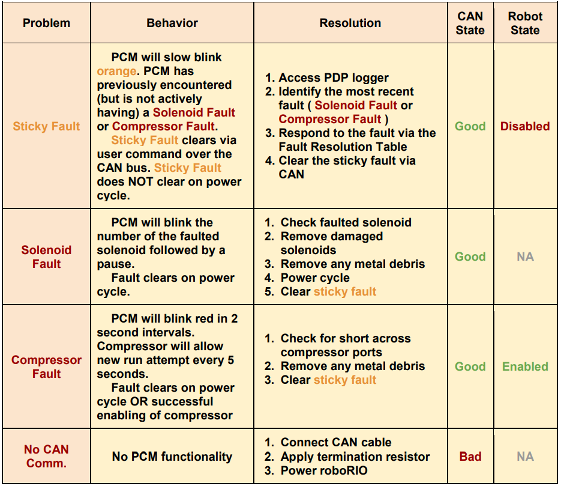

.. _Faults:

Faults
======

"Faults" are status indicators on CTRE CAN Devices that indicate a certain behavior or event has occurred.  Faults do not directly affect the behavior of a device, rather they indicate the device's current status and highlight potential issues.

Faults are stored in two fashions.  There are “live” faults that are reported in real-time, and “sticky” faults which assert persistently and stay asserted until they are manually cleared (like trouble codes in a vehicle).

.. note:: Sticky Faults can be cleared in Tuner and via API.

.. note:: Faults and Sticky Faults can be polled using Tuner-Self-Test or via API.

.. tip:: Motor Controllers have a sticky fault to detect if device reset during robot-enable.  This is useful for detecting breaker events.

Polling Faults in the API
--------------------------------------

LabVIEW
^^^^^^^^^^^^^^^^^^^^^^^^^^^^^^^^^^^^^
The GET STATUS VI can be used to retrieve sticky flags, and clear them.

.. image:: img/lv-faults.png

C++/Java
^^^^^^^^^^^^^^^^^^^^^^^^^^^^^^^^^^^^^
The APIs getFaults() and getStickyFaults() can be used to check the latest received faults.  
clearStickyFaults() can be used to clear all sticky fault flags.

.. _Faults-pcm:

PCM Faults
--------------------------------------
Below is the list of common PCM Faults and Resolutions.

