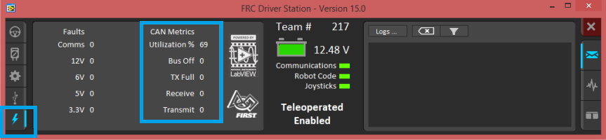

Common Device API
=================

Setting Status Frame Periods
~~~~~~~~~~~~~~~~~~~~~~~~~~~~~~~~~~~~~~~~~~~~~~~~~~~~~~~~~~~~~~~~~~~~~~~~~~~~~~~~~~~~~~
All Phoenix devices have a setStatusFramePeriod() routine/VI that allows for tweaking the frame periods of each status group.
The status group contents and default updates rates are listed below.

Status Groups
------------------------------------------------------

Motor Controllers
''''''''''''''''''''''''''''''''''''''''''''''''
Status 1 (Default Period 10ms):

- Applied Motor Output
- Fault Information
- Limit Switch Information

.. tip:: Motor controllers that are followers can have slower update rates for this group without impacting performance.

Status 2 (Default Period 20ms):

- Selected Sensor Position (PID 0)
- Selected Sensor Velocity (PID 0)
- Brushed Supply Current Measurement
- Sticky Fault Information

.. tip:: Motor controllers that are followers can have slower update rates for this group without impacting performance.

Status 3 (Default Period >100ms):

- Quadrature Information

Status 4 (Default Period >100ms):

- Analog Input
- Supply Battery Voltage
- Controller Temperature

Status 8 (Default Period >100ms):

- Pulse Width Information

Status 10 (Default Period >100ms):

- Motion Profiling/Motion Magic Information

Status 12 (Default Period >100ms):

- Selected Sensor Position (Aux PID 1)
- Selected Sensor Velocity (Aux PID 1)

Status 13 (Default Period >100ms):

- PID0 (Primary PID) Information

Status 14 (Default Period >100ms):

- PID1 (Auxiliary PID) Information

Status Brushless Current (Default Period 50ms):

- Brushless Supply Current Measurement
- Brushless Stator Current Measurement

Pigeon IMU
''''''''''''''''''''''''''''''''''''''''''''''''
General Status 1 (Default Period >100ms):

- Calibration Status
- IMU Temperature

Conditioned Status 9 (Default Period 10ms):

- Six degree fused Yaw, Pitch, Roll

Conditioned Status 6 (Default Period 10ms):

- Nine degree fused Yaw, Pitch, Roll (requires magnetometer calibration).

Conditioned Status 11 (Default Period 20ms):

- Accumulated Gyro Angles

Conditioned Status 3 (Default Period >100ms):

- Accelerometer derived angles

Conditioned Status 10 (Default Period >100ms):

- Six degree fused Quaternion

Raw Magnetometer Status 4 (Default Period 20ms):

- Unprocessed magnetometer values (x,y,z)

Biased Status 2 Gyro (Default Period >100ms):

- Biased gyro values (x,y,z)

Biased Status 6 Accelerometer (Default Period >100ms):

- Biased accelerometer values (x,y,z)

CANifier
''''''''''''''''''''''''''''''''''''''''''''''''
General Status 1 (Default Period >100ms):

- Applied LED Duty Cycles

Conditioned Status 2 (Default Period 10ms):

- Quadrature Information
- General Inputs

Conditioned Status 3 (Default Period >100ms):

- PWM input 0 Information

Conditioned Status 4 (Default Period >100ms):

- PWM input 1 Information

Conditioned Status 5 (Default Period >100ms):

- PWM input 2 Information

Conditioned Status 6 (Default Period >100ms):

- PWM input 3 Information

CANCoder
''''''''''''''''''''''''''''''''''''''''''''''''
General Status 1 (Default Period 10ms):

- Position

- Velocity

- Absolute Position

CAN bus Utilization/Error metrics
------------------------------------------------------
The **driver station** provides various **CAN bus metrics** under the **lightning bolt** tab.

Utilization is the *percent of bus time that is in use* relative to the total bandwidth available of the 1Mbps Dual Wire CAN bus. 
So at 100% there is no idle bus time (no time between frames on the CAN bus).

.. tip: We recommend keeping the bus utilization below 90

Demonstrated here is **70% bus use** when controlling **16 Talon SRXs**, along with **1 Pneumatics Control Module (PCM) and the Power Distribution Panel (PDP)**.

.. note: This is using the default status frame periods.

The "Bus Off" counter increments every time the CAN Controller in the roboRIO enters “bus-off”, a state where the controller “backs off” transmitting until the CAN bus is deemed “healthy” again.

A good method for watching it increment is to short/release the CAN bus High and Low lines together to watch it enter and leave “Bus Off” (counter increments per short).
The “TX Full” counter tracks how often the buffer holding outgoing CAN frames (RIO to CAN device) drops a transmit request. This is another common symptom when the roboRIO no longer is connected to the CAN bus.

The “Receive” and “Transmit” signal is shorthand for “Receive Error Counter” and “Transmit Error Counter”. 

These signals are straight from the CAN bus, and track the error instances occurred “on the wire” during reception and transmission respectively. 
These counts should always be zero. Attempt to short the CAN bus and you can confirm that the error counts rise sharply, then decrement back down to zero when the bus is restored (remove short, reconnect daisy chain).

When starting out with the FRC control system and Talon SRXs, it is recommended to watch how these CAN metrics change when CAN bus is disconnected from the roboRIO and other CAN devices to learn what to expect when there is a harness or a termination resistor issue.
Determining hardware related vs software related issues is key to being successful when using many CAN devices.

Followers
''''''''''''''''''''''''''''''''''''''''''''''''
Motor controllers that are followers can set Status 1 and Status 2 to 255ms(max) using setStatusFramePeriod.

The Follower relies on the master status frame allowing its status frame to be slowed without affecting performance.

This is a useful optimization to manage CAN bus utilization.

Detecting device resets
~~~~~~~~~~~~~~~~~~~~~~~~~~~~~~~~~~~~~~~~~~~~~~~~~~~~~~~~~~~~~~~~~~~~~~~~~~~~~~~~~~~~~~
All Phoenix devices have a hasResetOccurred()/VI routine that will return true if device reset has been detected since previous call.

Detecting this is useful for two reasons:

- Reapply any custom status frame periods that were set using setStatusFramePeriod().
- Telemetry / general troubleshooting (in addition to sticky fault, see tip below).

.. tip:: Motor Controllers have a sticky fault to detect if device reset during robot-enable.  This is useful for detecting breaker events.
