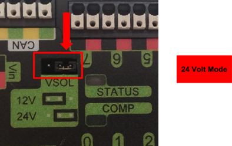
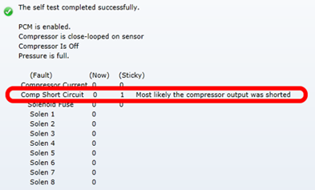
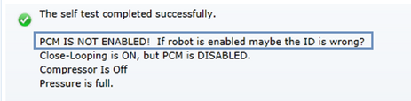
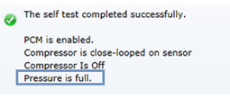

Troubleshooting and Frequently Asked Questions
========================================================================================================

Driver Station Messages
~~~~~~~~~~~~~~~~~~~~~~~~~~~~~~~~~~~~~~~~~~~~~~~~~~~~~~~~~~~~~~~~~~~~~

What do I do when I see errors in Driver Station?
------------------------------------------------------------------------------------------------
DS Errors should be addressed as soon as they appear. This is because:

- Phoenix API will report if a device is missing, not functioning, has too-old firmware, etc.
- If errors are numerous and typical, then users cannot determine if there is a new problem to address.
- A large stream of errors can bog down the DriverStation/roboRIO. Phoenix Framework has a debouncing strategy to ensure this does not happen, but not all libraries do this.

Phoenix DS errors occur on call. Meaning VIs/API functions must be called in robot code for any errors to occur.
When an error does occur, a stack trace will report where in the robot code to look.

The Debouncing Strategy that Phoenix uses is 3 seconds long. 
Phoenix keys a new error on device ID & function. This is to ensure that all unique errors are logged while making sure the DriverStation/roboRIO does not generate excessive errors.

Driver Station says the firmware is too old.
------------------------------------------------------------------------------------------------

.. image:: img/faq-1.png

Use Phoenix Tuner to update the firmware of the device.

Note that the robot application must be restarted for the firmware version check to clear. This can be done by redeploying the robot application or simply restarting the robot.

Driver Station says the firmware could not be retrieved and to check the firmware and ID.
------------------------------------------------------------------------------------------------

.. image:: img/faq-2.png

This usually indicates that your **device ID is wrong** in your robot software, or your firmware is **very old**.

Use Phoenix Tuner to check your device IDs and make sure your firmware is up-to-date.

Driver Station Says Variant To Data in ...
------------------------------------------------------------------------------------------------

.. image:: img/faq-3.png

This is usually caused by a diagram disable structure around a MotorController or EnhancedMotorController VI

.. image:: img/faq-4.png

In order to fix this, you must wire the device reference through the enabled state of the diagram disabled block

.. image:: img/faq-5.png

.. image:: img/faq-6.png

PCM
~~~~~~~~~~~~~~~~~~~~~~~~~~~~~~~~~~~~~~~~~~~~~~~~~~~~~~~~~~~~~~~~~~~~~

My compressor turns on and I have air pressure, but why isn't my solenoid turning on?
------------------------------------------------------------------------------------------------

Check the red LED for the Solenoid channel.  If the LED turns on as expected, make sure the Solenoid Voltage Jumper is set to the proper voltage (12 or 24 volts).

.. warning:: If you attempt to drive 12V Solenoids with 24V, you will damage the solenoids.  If you attempt to drive 24V Solenoids with 12V, you *may* damage the solenoids.

Why isn’t the Compressor turning on? Why does the PCM COMP LED not turn on? 
------------------------------------------------------------------------------------------------

In order for the compressor output to activate, certain conditions have to be met.

- The robot must be enabled.
- Robot software must have a pneumatics related object (compressor or solenoid).
- PCM must be powered/wired to CAN bus.
- PCM’s device ID must match robot software.

If any of these conditions are not met, the compressor will not activate. The best method for root-causing wiring or software issues is to check the following conditions and symptoms in **sequential order**. 

PCM must be powered.
^^^^^^^^^^^^^^^^^^^^^^^^^^^^^^^^^^^^^^^^^^^^^^^^^^^^^^^^^^^^^^^^^^^^^^^^^^

This can be checked by ensuring the STATUS LED is illuminated. If the STATUS LED is off, recheck the power path from the PDP to the PCM. If using the fused output of the PDP, check the fuse. This can be done by removing the fuse and checking its continuity/DC-resistance, or simply by measuring the voltage across the power/ground wires that connect into the PCM’s Vin Weidmuller input (should be approximately battery voltage or ~12V).

PCM must be on CAN Bus
^^^^^^^^^^^^^^^^^^^^^^^^^^^^^^^^^^^^^^^^^^^^^^^^^^^^^^^^^^^^^^^^^^^^^^^^^^
The PCM must be connected to the CAN bus chain. If a PCM does not see a healthy CAN bus it will blink the STATUS LED red (See User's Guide for LED States).

Additionally the PCM will not appear in Phoenix Tuner or will report loss of communication. This is important to check because a red STATUS LED pattern may also reflect a fault condition (if robot is enabled). To distinguish a fault condition, confirm the PCM does appear in the configuration page, and use the Self-test Snapshot to identify which fault condition is occurring.

If these negative symptoms are noticed, recheck CAN bus harness and termination resistors. If several CAN devices are also blinking red then check the CANH/CANL chain. If it’s just the PCM then inspect the Weidmuller CAN contacts on the PCM.

If the PCM CAN connection is healthy, then it should slowly blink green (when robot is disabled). It may blink orange instead to signal that a sticky fault has been logged. Use the Self-test Snapshot in Phoenix Tuner to inspect and clear sticky faults.

More information on faults and sticky faults is available under :ref:`Faults-pcm`.

Confirm PCM is not faulting.
^^^^^^^^^^^^^^^^^^^^^^^^^^^^^^^^^^^^^^^^^^^^^^^^^^^^^^^^^^^^^^^^^^^^^^^^^^
At this point the PCM should appear in the Phoenix Tuner CAN Devices tab. Using the Self-test Snapshot, determine if any faults are occurring “Now”. Checking the sticky faults can also be helpful for identifying recent faults. 

More information on faults and sticky faults is available under :ref:`Faults-pcm`.

The Robot must be enabled, Robot Software must create a pneumatics related object.
^^^^^^^^^^^^^^^^^^^^^^^^^^^^^^^^^^^^^^^^^^^^^^^^^^^^^^^^^^^^^^^^^^^^^^^^^^^^^^^^^^^^^^^^^^^^^^^^^^^^^^^^^^^^^^
The PCM should appear in the Phoenix Tuner CAN Devices tab, however when enabling the robot, the STATUS LED may not transition to strobe green. Additionally, when performing the Self-test Snapshot, the report may read “PCM IS NOT ENABLED”

This is typical if the robot is not enabled OR if the robot application did not create any Solenoid or Compressor objects. This is how the programming API signals the intent of using pneumatics, and thus enabling the PCM. 

Make sure the robot is truly enabled by looking at the Driver Station.

Instructions for creating a Solenoid, DoubleSolenoid or Compressor object in LabVIEW, C++, and Java can be found at https://docs.wpilib.org, (search for keyword “PCM”). Creating a single object of any pneumatics related type is sufficient for enabling the PCM (and therefore enabling compressor closed-loop).

.. note:: In order to create a software object for Solenoid or Compressor, typically the caller may specify the CAN Device ID (not specifying it typically defaults to selecting Device ID zero). This value must match what is specified in Phoenix Tuner. For more information see :ref:`can-bringup-setIDs`.

.. tip:: Since PCMs default with a device ID of zero, users only using one PCM may prefer to leave the default device ID. PCM Device ID range is allowed to overlap with the device ID of other non-PCM CAN devices.

Pressure Switch must be wired and must signal “not full”.
^^^^^^^^^^^^^^^^^^^^^^^^^^^^^^^^^^^^^^^^^^^^^^^^^^^^^^^^^^^^^^^^^^^^^^^^^^^^^^^^^^^^^^^^^^^^^^^^^^^^^^^^^^^^^^

Even though a robot and PCM are enabled, the compressor output will not activate if the pressure switch is not connected or is indicating full pressure. The only way to inspect this reliably is to perform the Self-test Snapshot in Phoenix Tuner.

If Self-test Snapshot is reading “pressure is full” when the pressure gauge clearly is not full, recheck the wiring on the pressure switch and PCM. 

The COMP LED must illuminate green.
^^^^^^^^^^^^^^^^^^^^^^^^^^^^^^^^^^^^^^^^^^^^^^^^^^^^^^^^^^^^^^^^^^^^^^^^^^^^^^^^^^^^^^^^^^^^^^^^^^^^^^^^^^^^^^
If the COMP LED is off then the PCM is not activating the compressor output. The Self-test Snapshot is the best method for determining why. If the PCM is not present in the Phoenix Tuner recheck section the first 2 steps of this process. If the PCM is present and not enabled, recheck the robot program. If the Compressor is not “close-looped on sensor”, then the robot application must be using programming API to disable it. If pressure is erroneously reading “full”, recheck the previous step.

Compressor must be wired and functional.
^^^^^^^^^^^^^^^^^^^^^^^^^^^^^^^^^^^^^^^^^^^^^^^^^^^^^^^^^^^^^^^^^^^^^^^^^^^^^^^^^^^^^^^^^^^^^^^^^^^^^^^^^^^^^^
If the COMP LED is illuminated green but the compressor still is not activating, then there may be a wiring issue between the PCM and the compressor. A voltmeter can be used to confirm that the PCM is applying 12V across the high and low side compressor output, and that 12V is reaching the compressor.