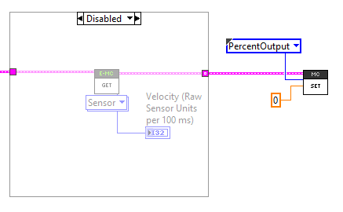
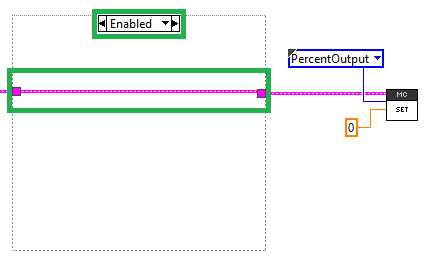

Frequently Asked Questions
==========================

What do I do when I see errors in Driver Station?
------------------------------------------------------------------------------------------------
DS Errors should be addressed as soon as they appear. This is because:

- Phoenix API will report if a device is missing, not functioning, has too-old firmware, etc.
- If errors are numerous and typical, then users cannot determine if there is a new problem to address.
- A large stream of errors can bog down the Driverstation/roboRIO. Phoenix Framework has a debouncing strategy to ensure this does not happen, but not all libraries do this.

Phoenix DS errors occur on call. Meaning VIs/API functions must be called in robot code for any errors to occur.
When an error does occur, a stack trace will report where in the robot code to look.

The Debouncing Strategy that Phoenix uses is 3 seconds long. 
Phoenix keys a new error on device ID & function. This is to ensure that all unique errors are logged while making sure the DriverStation/roboRIO does not generate excessive errors.

Driver Station says the firmware is too old.
------------------------------------------------------------------------------------------------

.. image:: img/faq-1.png

Use Phoenix Tuner to update the firmware of the device.

Note that the robot application must be restarted for the firmware version check to clear. This can be done by redeploying the robot application or simply restarting the robot.

Driver Station says the firmware could not be retrieved and to check the firmware and ID.
------------------------------------------------------------------------------------------------

.. image:: img/faq-2.png

This usually indicates that your **device ID is wrong** in your robot software, or your firmware is **very old**.

Use Phoenix Tuner to check your device IDs and make sure your firmware is up-to-date.

Driver Station Says Variant To Data in ...
------------------------------------------------------------------------------------------------

.. image:: img/faq-3.png

This is usually caused by a diagram disable structure around a MotorController or EnhancedMotorController VI

In order to fix this, you must wire the device reference through the enabled state of the diagram disabled block

.. image:: img/faq-5.png

