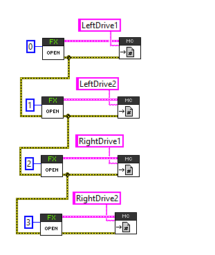

.. _Errata:

Errata
======

.. _pigeonimu-setfusedheading-units-errata:

PigeonIMU Set Fused Heading accepts 1/64th of a degree
-------------------------------------------------------
The input to ``setFusedHeading`` in PigeonIMU uses 64 units per degree instead of degrees.

To work around this, do one of the following:
 - Use ``setYaw`` instead of ``setFusedHeading`` and ``getYaw`` instead of ``getFusedHeading``.
 - Multiply the desired heading (in degrees) by 64 before calling ``setFusedHeading``.

.. _talonfx-neutral-brake-fault-errata:

“Neutral Brake Curr Limit” is often set
-------------------------------------------------------------------------------------

Sometimes TalonFX will fault "Neutral Break Curr Limit" on **bootup**.

"Neutral Break Curr Limit" means the TalonFX stator-current-limited *while it was neutral-braking*.
This does **not** represent a failure condition as stator-limiting during neutral-brake is an intended feature of the product.
Similar sticky faults exist for supply and stator current limits during motor output.

However, sometimes the TalonFX will trip "Neutral Break Curr Limit" when the Talon FX beeps during the boot up procedure.

**Workaround:** This sticky fault is harmless and *does not impact functionality*.
However, if monitoring this flag is required, user application can clear sticky faults after boot-up, then monitor them during operation.
Alternatively, user application can monitor the live fault flag during operation.

.. _talonfx-persis-storage-failure-errata:

“Persis Storage Failure” is often set
-------------------------------------------------------------------------------------

Sometimes TalonFX will fault "Persis Storage Failure".

"Persis Storage Failure" means there is a hardware issue with the persistent memory storage in the Talon FX.

However, "Persis Storage Failure" may be reported intermittently by the prom driver in the Talon FX.
This can occur due to a known hardware-limitation (errata) with the microcontroller.
The Talon firmware *already corrects for this hardware-limitation*, but the sticky fault may *still be reported for diagnostic purposes*.
This may change in a future release of firmware.

**Workaround:** There is no need to work around this issue.
Sticky fault can be ignored.

.. _motorcontrol-motionmagic-overflow-errata:

Motion Magic Target does not approach the API requested Target
-------------------------------------------------------------------------------------
Under very specific circumstances, the motion magic target position may not approach the final target position requested using Phoenix API. 
The requirements are:
 - Motor Controller firmware is <= 22.0
 - Motion Magic S-Curve is set to a non-zero value.
 - Must be in Motion Magic Control Mode
 - Robot application frequently calls the set() method with new values.
 - Set point changes exceed 16 bits

**Workaround:**
Any of the following will prevent the issue from occurring:
 - Turn off S-Curve OR
 - Update firmware to 22.1 OR
 - Ensure set point changes are within 16 bits.

.. tip:: This is fixed in all motor controller versions 22.1

.. _canivore-intermittent-connection-errata:

CANivore: Loss of communication under specific circumstances
-------------------------------------------------------------------------------------
Under a specific set of circumstances, CANivore will lose communications for 16 seconds and appear frozen (solid LEDs).
The requirements are:
 - CANivore must be using firmware 22.1.0.1.
 - CANivore must be initially connected to USB (Status LED orange or green).
 - After initial connection, CANivore must lose connection to **only** USB D+/D- **while maintaining connection** to USB 5V and Ground (Status LED fast-red strobe).
 - After loss of D+/D-, CANivore must regain connection to D+/D- while maintaining connection to USB 5V and Ground.

These circumstances do not reproduce the issue in every instance.

| The issue was discovered by CTRE staff during routine quality checks.
| No customers have reported this failure symptom to date.

.. tip:: This is fixed in CANivore firmware version 22.2.0.0

.. _labview-chainOpens-errata:

LabVIEW Phoenix Open VIs must be chained to guarantee sequential execution
---------------------------------------------------------------------------
When opening Phoenix objects in LabVIEW, the Open VIs must be chained together so that they execute sequentially.
See an example of chaining two Open VIs:

If the Open VIs are not chained together, this can result in:  

- Multiple Diagnostic Servers
- Multiple enable signals (enable and disable will conflict, motor controllers will appear to not enable)
- Occasional program crash on deploy

.. tip:: This is fixed in Phoenix version 5.21.1

.. _talonfx-remoteID-errata:

Talon FX Remote Filter Device ID Must be 15 or Less
---------------------------------------------------------------- 
When configuring Talon FX to have a remote sensor, the filter's device ID must be 15 or less.

Attempting to set a Remote Filter Device ID >15 in Phoenix Tuner will result in a "DI_Mismatch" error.

When running a robot program, the filter device ID will not be the expected value and so will generate an error that the remote sensor is missing on the bus.  
The associated fault will also be asserted and can be viewed in self-test snapshot of the Talon FX.

The actual filter device ID set will be truncated to the original set value modulo 15.

.. tip:: This is fixed in firmware version 21.0.1.0

Java Simulation: WPI_TalonSRX/WPI_VictorSPX Null Pointer Exception
-------------------------------------------------------------------------------------
When running simulation, the following error can occur:

::

    Error at com.ctre.phoenix.motorcontrol.can.WPI_TalonSRX$OnPeriodicCallback.run(WPI_TalonSRX.java:208): Unhandled exception: java.lang.NullPointerException
            at com.ctre.phoenix.motorcontrol.can.WPI_TalonSRX$OnPeriodicCallback.run(WPI_TalonSRX.java:208)
            at edu.wpi.first.hal.HAL.simPeriodicBefore(HAL.java:41)
            at edu.wpi.first.wpilibj.IterativeRobotBase.loopFunc(IterativeRobotBase.java:281)
            at edu.wpi.first.wpilibj.TimedRobot.startCompetition(TimedRobot.java:117)
            at edu.wpi.first.wpilibj.RobotBase.runRobot(RobotBase.java:335)
            at edu.wpi.first.wpilibj.RobotBase.lambda$startRobot$0(RobotBase.java:387)
            at java.base/java.lang.Thread.run(Thread.java:834)

This occurs when multiple WPI_TalonSRX objects have been created with the same device ID or multiple WPI_VictorSPX objects have been created with the same device ID. 
Find and remove the extra objects from your java code.

.. _Errata-hero:

HERO firmware compatibility with firmware 4.X
--------------------------------------------------------
The HERO robot controller still requires v11.X firmware in the motor controllers to function correctly.
This will addressed in a future release (which updates HERO).

The HERO robot controller also still requires v0.41 firmware for Pigeon IMU.
This will addressed in a future release (which updates HERO).

No S-Curve VI in LabVIEW
-----------------------------------------
Pass '412' as the parameter, and the desired S-Curve strength [0,8] as the value.

A value of 0 represents no S-Curving (trapezoidal profiling).

To set the S-Curve strength in LabVIEW, the following LV snippet can be used.

.. tip:: Drag and drop the bottom image into your LabVIEW Block Diagram.

.. image:: img/lv-scurve.png

Stator Current Limit Threshold Configs
-----------------------------------------
The trigger threshold current and time are not honored in 20.0.0 firmware.
Stator current limit will trigger when the measured current exceeds the limit (within 1ms).

CANCoder not a remote sensor source
-----------------------------------------
CANCoder is not available as a remote sensor source for Talon FX/SRX and Victor SPX.  This will be addressed in a future update.

.. tip:: This was added in Phoenix v5.17.6.  Motor Controller must be updated to 20.1 or newer.

Remote Sensors Not Working with Talon FX
-----------------------------------------
The remote sensor feature does not work with Talon FX.

.. tip:: This is fixed in firmware version 20.1

Kickoff Temporary Diagnostic Server may not work
----------------------------------------------------
The kickoff version of Tuner and temporary diagnostic server has a known issue where CAN bus devices may not show up. **This has been fixed in version 1.6.0.0 of Tuner.** This can be quickly checked by looking at the robot controller install tab of Tuner. If there is no purple "Restart LabVIEW Robot Code" button, Tuner is not up to date and may have this issue. Your version of Tuner should look like the following:

.. image:: img/tuner-proper.png

LabVIEW 2020 Deploys failing
-----------------------------------------
During our system level validation, we observed a circumstance where LabVIEW permanent deploys would fail ("Connection disconnected by peer").
We are currently investigating this, but we will tentatively report the following suggestions until we complete our assessment.

- When deploying LabVIEW, we recommend disconnecting Phoenix Tuner to ensure it doesn't influence LabVIEW's deploy process.
- If deploys are consistently failing, the running LabVIEW application can be cleared via SSH with ``/usr/local/frc/bin/frcKillRobot.sh -t -r`` or press the UnDeploy LabVIEW/Diag Server button in Tuner - Robot Controller Install.  This should bring the roboRIO into an empty state whereby deploy can be re-attempted.
- Alternatively roboRIO could also be reset using DriverStation "Reboot roboRIO" button.  This is effective if roboRIO is running a temporary deployed LV application or temporary diagnostic server.

.. tip:: This has been resolved in Phoenix v5.17.4.

LabVIEW 2020 Shared-Object Deployment Limitations
--------------------------------------------------
When a user hard-deploys an application **while a soft-deployed-session is running**, LabVIEW will sometimes cause deployed shared objects to become inoperable.
If this occurs in a project with Phoenix, the project will fail on the deploy step, citing *the network connection was closed by the peer*, and the robot application will be unable to use Phoenix.

To work around this, **press finish on the front panel of Robot Main** before you hard deploy your application.

TalonFX Current Reporting Status Frame Not Available
----------------------------------------------------
The Status Frame that TalonFX uses when reporting its supply and stator current is not available under the StatusFrame or StatusFrameEnhanced enum.
The enum will be modified to include this frame in a future update. 
Currently, the following can be done to modify the Current Measurement Status Frame period:

.. code-block:: java

    _fx.setStatusFramePeriod(0x1240, periodMs); //0x1240 is used to identify the Current Status Frame

.. tip:: This has been resolved in Phoenix v5.17.6.

Talon FX Thermal Limits Low when using PWM Out-of-the-Box
----------------------------------------------------------------
Talon FX's ship firmware has lower thermal limits that current firmware.
If using the Talon FX with PWM control, users may still want to update firmware over CAN to take advantage of the higher thermal limits.

Talon FX does not support Sensor Coefficient
---------------------------------------------
Configuring a sensor coefficient on Talon FX does not do anything.

.. tip:: This has been resolved in firmware version 20.2.3.0

Talon FX Continuous-Deadbands all the time
-------------------------------------------------
Talon FX will always follow a continuous deadband regardless of the mode it's in. This results in double-deadbanding for a follower, which is seen by the applied output of the follower being slightly different than the master. Read more about Continuous Deadbanding inside :ref:`ch13_MC`.

.. tip:: This has been resolved in firmware version 20.1.0.0
